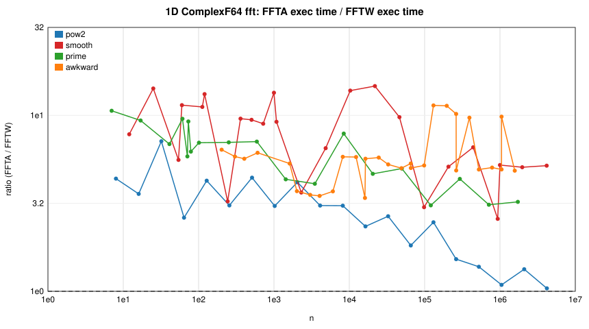
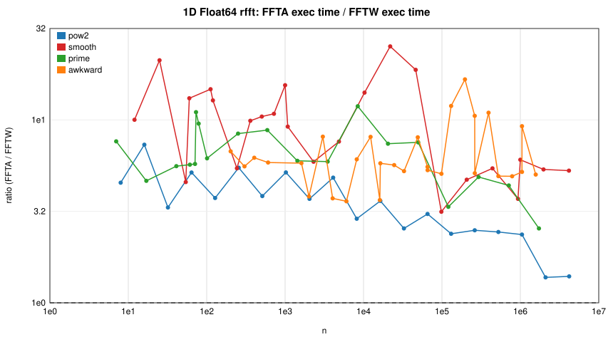
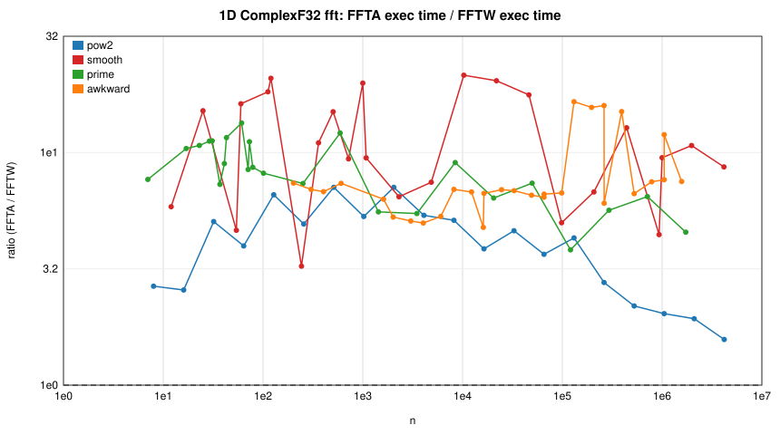
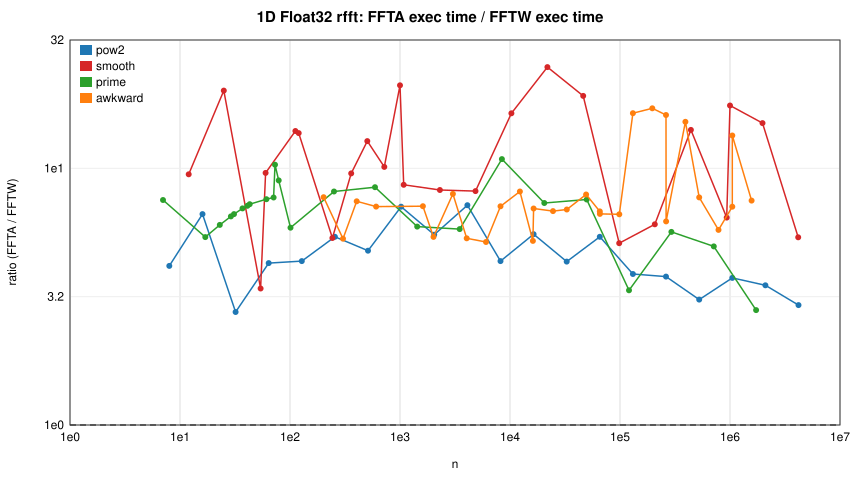
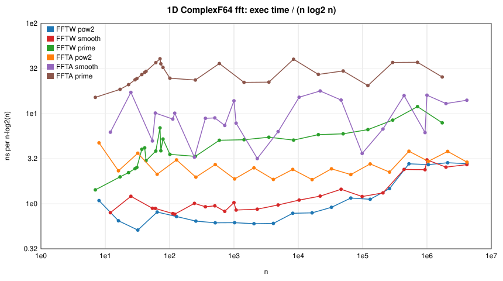
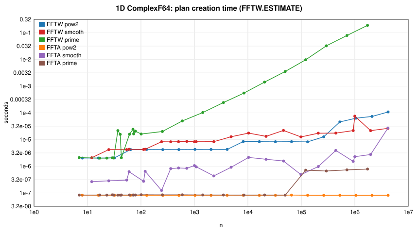

# FFTA.jl vs FFTW.jl benchmark report

Generated 2026-08-29 23:01 UTC by `benchmark/report.jl` from `results_suite.json`.

## Environment

| | |
|:--|:--|
| CPU | Neoverse-N1 (neoverse-n1) |
| Architecture | aarch64 |
| Cores | 80 |
| OS | Linux |
| Julia | 1.12.6 |
| Julia threads | 8 |
| FFTA version | 0.3.1 |
| FFTA commit | 7aeb327 |
| FFTW version | 3.3.11 |
| FFTW provider | fftw |
| Time budget per measurement (s) | 0.5 |
| Run date (UTC) | 2026-08-29T17:36:11.141 |

*Prime class note:* the prime column covers 24 sizes; the five in the
DFT/Bluestein crossover band (23, 29, 31, 37, 43) were added to the suite
later and measured in a separate run of the same `main` tree with the same
settings, so that this column and the after-optimisation report use the same
size set.

## After the optimisation PRs

[`after-optimisations/aarch64/REPORT.md`](after-optimisations/aarch64/REPORT.md)
is the same suite on the same machine against the fork's `integration/all`
branch (all optimisation PRs merged); [`COMPARE.md`](after-optimisations/aarch64/COMPARE.md)
gives the per-class baseline → after table (2.57× geometric-mean speedup
over 510 matched cases, none slower by more than 5%).

## Companion x86-64 run

The same suite was run on an x86-64 machine (Intel Core Ultra 7 165H,
AVX2 + FMA, no AVX-512, Julia 1.12.6, FFTW 3.3.11 provider `fftw`,
`-t 8`, identical settings): see [`x86-64/REPORT.md`](x86-64/REPORT.md),
its [`PROVENANCE.md`](x86-64/PROVENANCE.md) and the per-branch
before/after results under `x86-64/branches/`. Headline: FFTA's gap to
FFTW is 1.22× wider (geometric mean over the size classes) on AVX2 than
on NEON, concentrated on the non-radix-4 kernels (5/7-smooth composites)
rather than spread uniformly; with all optimisation PRs merged the x86-64
run gives a 3.24× geometric-mean speedup over 510 matched cases (one cell
at 0.91×, inside that machine's noise band). The calibration files
(`x86-64/calib_*.md`) show that the DFT/Bluestein crossover and the cost
of 3-smooth padding lengths are architecture dependent, and
`x86-64/codelet_*_x86.md` that 128/256-point straight-line codelets spill
registers on AVX2. The x86-64 report was regenerated from a band-merged
result file (24 prime sizes) and keeps the original run date in its
header.

## Methodology

* Both packages are loaded in one Julia process; FFTA plans are created via
  `invoke` on FFTA's `AbstractFFTs.plan_*` methods (FFTW's more specific
  `StridedArray` methods would otherwise be selected). Every FFTA result is
  compared with FFTW's (`rel. err` = ‖y_FFTA − y_FFTW‖ / ‖y_FFTW‖).
* **exec** = execution of a pre-built plan (`mul!(y, p, x)` where supported;
  if a plan only implements `p * x`, that is timed instead and includes the
  output allocation — see the *FFTA API* column of the allocation table). Times are the **minimum** over samples collected during the
  time budget (batched evals for sub-20 µs calls).
* **plan** = time to construct a plan (FFTW with `FFTW.ESTIMATE`, the
  FFTW.jl default, unless stated otherwise). **cold ratio** = (FFTA plan+exec)
  / (FFTW plan+exec), i.e. the one-shot `fft(x)` cost ratio.
* **exec ratio** = FFTA exec / FFTW exec — values > 1 mean FFTA is slower.
* **alloc/exec** = bytes allocated by one planned execution (`@allocated`).
* FFTW and FFTA are single-threaded (FFTA: one worker) except in the
  *Threading* section, where both are planned with the same thread count
  (FFTA versions with a `num_threads` keyword thread across the pencils of
  multidimensional and batched transforms).
* Size classes: `pow2` = 2^k; `smooth` = 2^a·3^b·5^c·7^d (not a power of 2);
  `prime`; `awkward` = (prime > 73) × small factor. Primes < 73 use FFTA's
  O(n²) DFT leaf, primes ≥ 73 use Bluestein.

## Summary: geometric-mean exec ratio (FFTA / FFTW), single-threaded

| type | pow2 | smooth | prime | awkward | 2D | 3D | batched dim=1 | batched dim=2 |
|:--|--:|--:|--:|--:|--:|--:|--:|--:|
| ComplexF64 fft | 2.59× (1.0–7.1) | 7.33× (2.6–14.7) | 6.36× (3.1–10.6) | 5.63× (3.4–11.4) | 5.18× (1.8–13.3) | 7.56× (3.5–15.1) | 3.08× (2.0–5.7) | 2.24× (1.2–5.8) |
| ComplexF32 fft | 3.77× (1.6–7.1) | 10.18× (3.2–21.5) | 8.04× (3.8–13.4) | 7.45× (4.8–16.5) | 6.06× (1.9–15.1) | 11.63× (8.1–17.1) | 5.07× (3.1–9.2) | 2.90× (1.4–9.7) |
| Float64 rfft | 3.29× (1.4–7.3) | 8.66× (3.1–25.3) | 6.06× (2.6–11.9) | 6.17× (3.6–16.7) | 11.83× (5.7–25.5) | ✗ unsupported | 4.90× (2.9–9.7) | 3.05× (1.4–10.3) |
| Float32 rfft | 4.47× (2.8–7.2) | 10.47× (3.4–24.8) | 6.59× (2.8–10.9) | 7.73× (5.2–17.1) | 13.23× (7.5–21.9) | ✗ unsupported | 6.39× (4.6–9.0) | 3.54× (1.6–9.4) |

Cells are `geomean (min–max)`. ✗ = FFTA threw (unsupported).

## Ratio plots (single-threaded, planned execution)

## 1D transforms

<b>1D ComplexF64 fft</b> (97 sizes)

| n | class | FFTW exec | FFTA exec | **exec ratio** | FFTW plan | FFTA plan | cold ratio | FFTA alloc/exec | rel. err |
|--:|:--|--:|--:|--:|--:|--:|--:|--:|--:|
| 7 | prime | 28 ns | 297 ns | **10.62×** | 2.10 µs | 84 ns | 0.18× | 0 | 6.0e-16 |
| 8 | pow2 | 26 ns | 114 ns | **4.37×** | 2.02 µs | 82 ns | 0.11× | 0 | 9.0e-17 |
| 12 | smooth | 34 ns | 267 ns | **7.81×** | 2.09 µs | 265 ns | 0.26× | 0 | 1.8e-16 |
| 16 | pow2 | 41 ns | 148 ns | **3.58×** | 2.03 µs | 82 ns | 0.11× | 0 | 2.4e-16 |
| 17 | prime | 138 ns | 1.29 µs | **9.35×** | 2.02 µs | 84 ns | 0.62× | 0 | 2.8e-15 |
| 23 | prime | 230 ns | 2.18 µs | **9.45×** | 2.02 µs | 83 ns | 1.00× | 0 | 2.2e-15 |
| 25 | smooth | 140 ns | 2.00 µs | **14.22×** | 4.20 µs | 284 ns | 0.53× | 0 | 7.5e-16 |
| 29 | prime | 345 ns | 3.34 µs | **9.68×** | 2.06 µs | 85 ns | 1.43× | 0 | 3.0e-15 |
| 31 | prime | 389 ns | 3.75 µs | **9.66×** | 2.04 µs | 84 ns | 1.57× | 0 | 2.4e-15 |
| 32 | pow2 | 82 ns | 581 ns | **7.12×** | 2.06 µs | 82 ns | 0.31× | 0 | 2.4e-16 |
| 37 | prime | 775 ns | 5.22 µs | **6.74×** | 21.64 µs | 83 ns | 0.23× | 0 | 5.0e-15 |
| 41 | prime | 914 ns | 6.28 µs | **6.87×** | 15.68 µs | 83 ns | 0.38× | 0 | 5.0e-15 |
| 43 | prime | 701 ns | 6.85 µs | **9.78×** | 2.09 µs | 84 ns | 2.41× | 0 | 5.7e-15 |
| 54 | smooth | 277 ns | 1.54 µs | **5.58×** | 4.22 µs | 304 ns | 0.43× | 0 | 5.6e-16 |
| 60 | smooth | 314 ns | 3.59 µs | **11.43×** | 4.32 µs | 622 ns | 0.91× | 0 | 6.6e-16 |
| 61 | prime | 1.39 µs | 13.28 µs | **9.56×** | 15.76 µs | 84 ns | 0.78× | 0 | 6.4e-15 |
| 64 | pow2 | 311 ns | 815 ns | **2.62×** | 4.22 µs | 82 ns | 0.20× | 0 | 2.7e-16 |
| 71 | prime | 3.03 µs | 17.70 µs | **5.84×** | 24.32 µs | 84 ns | 0.65× | 0 | 7.2e-15 |
| 73 | prime | 1.75 µs | 16.12 µs | **9.24×** | 16.32 µs | 84 ns | 0.92× | 12.2 KiB | 6.2e-16 |
| 79 | prime | 2.60 µs | 16.18 µs | **6.22×** | 20.56 µs | 84 ns | 0.72× | 12.2 KiB | 6.2e-16 |
| 101 | prime | 2.37 µs | 16.60 µs | **6.99×** | 16.12 µs | 86 ns | 0.91× | 12.2 KiB | 6.3e-16 |
| 112 | smooth | 593 ns | 6.63 µs | **11.17×** | 4.25 µs | 273 ns | 1.38× | 0 | 6.7e-16 |
| 120 | smooth | 634 ns | 8.37 µs | **13.21×** | 4.32 µs | 647 ns | 1.75× | 0 | 6.7e-16 |
| 128 | pow2 | 645 ns | 2.75 µs | **4.26×** | 4.26 µs | 82 ns | 0.58× | 0 | 2.9e-16 |
| 202 | awkward | 5.01 µs | 31.96 µs | **6.38×** | 20.56 µs | 421 ns | 1.29× | 12.2 KiB | 6.1e-16 |
| 243 | smooth | 1.94 µs | 6.31 µs | **3.25×** | 8.32 µs | 124 ns | 0.63× | 0 | 4.8e-16 |
| 251 | prime | 6.71 µs | 47.12 µs | **7.03×** | 20.00 µs | 85 ns | 1.78× | 24.2 KiB | 8.1e-16 |
| 256 | pow2 | 1.31 µs | 4.04 µs | **3.08×** | 4.21 µs | 81 ns | 0.70× | 0 | 3.3e-16 |
| 303 | awkward | 7.88 µs | 45.96 µs | **5.83×** | 20.56 µs | 489 ns | 1.64× | 12.2 KiB | 6.4e-16 |
| 360 | smooth | 2.83 µs | 27.08 µs | **9.58×** | 8.24 µs | 818 ns | 2.47× | 0 | 6.8e-16 |
| 404 | awkward | 10.46 µs | 59.32 µs | **5.67×** | 20.52 µs | 390 ns | 1.95× | 12.2 KiB | 6.4e-16 |
| 504 | smooth | 4.29 µs | 40.48 µs | **9.44×** | 8.36 µs | 861 ns | 3.18× | 0 | 7.6e-16 |
| 512 | pow2 | 2.83 µs | 12.52 µs | **4.43×** | 4.22 µs | 81 ns | 1.68× | 0 | 4.3e-16 |
| 593 | prime | 27.64 µs | 196.04 µs | **7.09×** | 49.72 µs | 85 ns | 2.49× | 96.2 KiB | 1.1e-15 |
| 606 | awkward | 16.04 µs | 98.32 µs | **6.13×** | 20.56 µs | 953 ns | 2.74× | 24.4 KiB | 7.6e-16 |
| 720 | smooth | 5.63 µs | 50.48 µs | **8.97×** | 8.56 µs | 840 ns | 3.47× | 0 | 7.1e-16 |
| 1000 | smooth | 10.26 µs | 137.96 µs | **13.45×** | 8.30 µs | 1.06 µs | 7.24× | 0 | 9.7e-16 |
| 1024 | pow2 | 6.31 µs | 19.28 µs | **3.06×** | 4.27 µs | 81 ns | 1.61× | 0 | 4.9e-16 |
| 1080 | smooth | 9.27 µs | 85.20 µs | **9.19×** | 8.32 µs | 951 ns | 4.81× | 0 | 8.0e-16 |
| 1433 | prime | 77.04 µs | 333.60 µs | **4.33×** | 103.00 µs | 84 ns | 1.84× | 192.2 KiB | 1.5e-15 |
| 1616 | awkward | 44.28 µs | 235.64 µs | **5.32×** | 20.68 µs | 373 ns | 3.60× | 12.2 KiB | 7.1e-16 |
| 2018 | awkward | 109.36 µs | 405.56 µs | **3.71×** | 84.68 µs | 367 ns | 2.14× | 96.2 KiB | 1.2e-15 |
| 2048 | pow2 | 13.52 µs | 56.36 µs | **4.17×** | 4.25 µs | 81 ns | 3.05× | 0 | 6.3e-16 |
| 2304 | smooth | 22.40 µs | 81.60 µs | **3.64×** | 8.34 µs | 435 ns | 2.64× | 0 | 5.1e-16 |
| 3027 | awkward | 168.04 µs | 593.85 µs | **3.53×** | 79.68 µs | 450 ns | 2.40× | 96.2 KiB | 1.2e-15 |
| 3491 | prime | 224.52 µs | 917.49 µs | **4.09×** | 242.44 µs | 84 ns | 1.95× | 384.2 KiB | 1.7e-15 |
| 4036 | awkward | 223.40 µs | 778.69 µs | **3.49×** | 79.48 µs | 356 ns | 2.55× | 96.2 KiB | 1.3e-15 |
| 4096 | pow2 | 29.76 µs | 91.40 µs | **3.07×** | 4.28 µs | 82 ns | 2.48× | 0 | 9.1e-16 |
| 4860 | smooth | 57.68 µs | 375.52 µs | **6.51×** | 12.74 µs | 916 ns | 5.21× | 0 | 1.1e-15 |
| 6054 | awkward | 339.76 µs | 1.257 ms | **3.70×** | 79.96 µs | 897 ns | 2.98× | 192.4 KiB | 1.3e-15 |
| 8192 | pow2 | 83.44 µs | 255.92 µs | **3.07×** | 8.42 µs | 82 ns | 2.50× | 0 | 9.9e-16 |
| 8198 | awkward | 515.49 µs | 2.998 ms | **5.82×** | 282.40 µs | 320 ns | 3.77× | 768.2 KiB | 2.5e-15 |
| 8443 | prime | 559.53 µs | 4.409 ms | **7.88×** | 551.09 µs | 84 ns | 3.85× | 1.50 MiB | 2.7e-15 |
| 10290 | smooth | 150.44 µs | 2.081 ms | **13.83×** | 17.48 µs | 2.15 µs | 11.90× | 0 | 1.6e-15 |
| 12297 | awkward | 777.93 µs | 4.512 ms | **5.80×** | 280.92 µs | 440 ns | 4.14× | 768.2 KiB | 2.9e-15 |
| 16144 | awkward | 926.13 µs | 3.144 ms | **3.39×** | 79.84 µs | 320 ns | 3.10× | 96.2 KiB | 1.4e-15 |
| 16384 | pow2 | 181.60 µs | 424.68 µs | **2.34×** | 8.36 µs | 81 ns | 1.93× | 0 | 1.6e-15 |
| 16396 | awkward | 1.045 ms | 5.921 ms | **5.67×** | 280.32 µs | 355 ns | 4.35× | 768.2 KiB | 2.6e-15 |
| 20507 | prime | 1.716 ms | 7.983 ms | **4.65×** | 1.421 ms | 84 ns | 2.53× | 3.00 MiB | 6.1e-15 |
| 21875 | smooth | 382.81 µs | 5.619 ms | **14.68×** | 13.20 µs | 1.83 µs | 12.45× | 0 | 1.5e-15 |
| 24594 | awkward | 1.613 ms | 9.280 ms | **5.75×** | 284.88 µs | 853 ns | 4.81× | 1.50 MiB | 4.4e-15 |
| 32768 | pow2 | 448.89 µs | 1.199 ms | **2.67×** | 8.30 µs | 81 ns | 2.36× | 0 | 1.7e-15 |
| 32822 | awkward | 2.992 ms | 15.739 ms | **5.26×** | 1.220 ms | 362 ns | 3.72× | 3.00 MiB | 6.0e-15 |
| 46305 | smooth | 1.038 ms | 10.141 ms | **9.77×** | 21.96 µs | 1.57 µs | 9.41× | 0 | 1.9e-15 |
| 49233 | awkward | 4.595 ms | 23.014 ms | **5.01×** | 1.211 ms | 469 ns | 3.95× | 3.00 MiB | 6.7e-15 |
| 49757 | prime | 4.627 ms | 23.066 ms | **4.98×** | 3.538 ms | 83 ns | 2.72× | 6.00 MiB | 7.6e-15 |
| 65536 | pow2 | 1.212 ms | 2.209 ms | **1.82×** | 8.34 µs | 83 ns | 1.66× | 0 | 3.8e-15 |
| 65584 | awkward | 4.446 ms | 23.695 ms | **5.33×** | 282.28 µs | 409 ns | 4.95× | 768.2 KiB | 2.8e-15 |
| 65644 | awkward | 6.235 ms | 31.309 ms | **5.02×** | 1.219 ms | 411 ns | 4.20× | 3.00 MiB | 6.0e-15 |
| 98304 | smooth | 1.960 ms | 5.891 ms | **3.01×** | 12.52 µs | 485 ns | 2.94× | 0 | 1.7e-15 |
| 98466 | awkward | 9.504 ms | 49.324 ms | **5.19×** | 1.215 ms | 893 ns | 4.87× | 6.00 MiB | 7.4e-15 |
| 120779 | prime | 13.538 ms | 41.695 ms | **3.08×** | 9.733 ms | 712 ns | 1.83× | 12.00 MiB | 1.4e-14 |
| 131072 | pow2 | 2.495 ms | 6.155 ms | **2.47×** | 8.22 µs | 82 ns | 2.14× | 0 | 4.4e-15 |
| 131074 | awkward | 7.570 ms | 86.253 ms | **11.39×** | 827.21 µs | 960 ns | 10.07× | 12.00 MiB | 1.4e-14 |
| 196611 | awkward | 10.995 ms | 124.612 ms | **11.33×** | 828.85 µs | 970 ns | 10.45× | 12.00 MiB | 1.5e-14 |
| 207360 | smooth | 4.828 ms | 24.667 ms | **5.11×** | 17.32 µs | 975 ns | 4.42× | 0 | 1.0e-15 |
| 262144 | pow2 | 6.947 ms | 10.582 ms | **1.52×** | 12.70 µs | 82 ns | 1.27× | 0 | 8.6e-15 |
| 262148 | awkward | 17.153 ms | 174.902 ms | **10.20×** | 826.85 µs | 980 ns | 10.04× | 12.00 MiB | 1.5e-14 |
| 262576 | awkward | 26.006 ms | 126.442 ms | **4.86×** | 1.238 ms | 456 ns | 4.68× | 3.00 MiB | 7.0e-15 |
| 293201 | prime | 45.072 ms | 196.347 ms | **4.36×** | 32.368 ms | 663 ns | 2.61× | 48.00 MiB | 2.0e-14 |
| 393222 | awkward | 25.327 ms | 245.827 ms | **9.71×** | 827.45 µs | 1.79 µs | 9.35× | 24.00 MiB | 1.5e-14 |
| 441000 | smooth | 19.858 ms | 130.781 ms | **6.59×** | 17.48 µs | 3.92 µs | 7.14× | 0 | 7.6e-15 |
| 524288 | pow2 | 27.628 ms | 38.092 ms | **1.38×** | 45.64 µs | 82 ns | 1.38× | 0 | 1.1e-14 |
| 524294 | awkward | 80.571 ms | 396.660 ms | **4.92×** | 29.449 ms | 1.34 µs | 3.69× | 48.00 MiB | 2.2e-14 |
| 711749 | prime | 165.234 ms | 512.948 ms | **3.10×** | 79.058 ms | 730 ns | 2.88× | 96.00 MiB | 3.0e-14 |
| 786441 | awkward | 115.000 ms | 580.498 ms | **5.05×** | 24.661 ms | 1.46 µs | 4.01× | 48.00 MiB | 2.2e-14 |
| 933120 | smooth | 44.111 ms | 113.834 ms | **2.58×** | 21.72 µs | 1.52 µs | 2.94× | 0 | 1.9e-15 |
| 1000000 | smooth | 61.058 ms | 318.661 ms | **5.22×** | 75.28 µs | 2.28 µs | 4.71× | 0 | 3.8e-15 |
| 1048576 | pow2 | 56.902 ms | 61.905 ms | **1.09×** | 63.00 µs | 81 ns | 1.03× | 0 | 1.2e-14 |
| 1048588 | awkward | 154.967 ms | 763.711 ms | **4.93×** | 24.354 ms | 1.41 µs | 4.24× | 48.00 MiB | 2.1e-14 |
| 1048592 | awkward | 68.646 ms | 675.042 ms | **9.83×** | 828.25 µs | 987 ns | 9.39× | 12.00 MiB | 1.5e-14 |
| 1572882 | awkward | 242.549 ms | 1.177 s | **4.85×** | 24.746 ms | 6.30 µs | 4.43× | 96.00 MiB | 2.6e-14 |
| 1727797 | prime | 282.696 ms | 911.693 ms | **3.22×** | 189.606 ms | 786 ns | 1.95× | 192.01 MiB | 5.0e-14 |
| 1975680 | smooth | 105.206 ms | 533.480 ms | **5.07×** | 21.60 µs | 2.76 µs | 4.71× | 0 | 3.9e-15 |
| 2097152 | pow2 | 125.482 ms | 167.561 ms | **1.34×** | 73.36 µs | 81 ns | 1.26× | 0 | 1.8e-14 |
| 4167450 | smooth | 248.793 ms | 1.288 s | **5.18×** | 26.28 µs | 27.08 µs | 5.20× | 0 | 1.5e-14 |
| 4194304 | pow2 | 256.645 ms | 266.655 ms | **1.04×** | 108.32 µs | 82 ns | 1.07× | 0 | 2.7e-14 |

<b>1D ComplexF32 fft</b> (97 sizes)

| n | class | FFTW exec | FFTA exec | **exec ratio** | FFTW plan | FFTA plan | cold ratio | FFTA alloc/exec | rel. err |
|--:|:--|--:|--:|--:|--:|--:|--:|--:|--:|
| 7 | prime | 39 ns | 299 ns | **7.67×** | 2.16 µs | 83 ns | 0.18× | 0 | 2.4e-07 |
| 8 | pow2 | 39 ns | 103 ns | **2.66×** | 2.06 µs | 81 ns | 0.10× | 0 | 9.8e-08 |
| 12 | smooth | 45 ns | 265 ns | **5.85×** | 2.13 µs | 277 ns | 0.26× | 0 | 1.2e-07 |
| 16 | pow2 | 54 ns | 139 ns | **2.57×** | 2.08 µs | 82 ns | 0.11× | 0 | 7.4e-08 |
| 17 | prime | 138 ns | 1.43 µs | **10.40×** | 2.11 µs | 84 ns | 0.68× | 0 | 1.2e-06 |
| 23 | prime | 231 ns | 2.48 µs | **10.73×** | 2.03 µs | 83 ns | 1.12× | 0 | 1.5e-06 |
| 25 | smooth | 128 ns | 1.94 µs | **15.12×** | 4.36 µs | 280 ns | 0.50× | 0 | 4.7e-07 |
| 29 | prime | 345 ns | 3.86 µs | **11.20×** | 2.04 µs | 83 ns | 1.64× | 0 | 2.1e-06 |
| 31 | prime | 390 ns | 4.38 µs | **11.23×** | 2.05 µs | 85 ns | 1.84× | 0 | 2.1e-06 |
| 32 | pow2 | 106 ns | 533 ns | **5.05×** | 2.09 µs | 81 ns | 0.29× | 0 | 1.1e-07 |
| 37 | prime | 834 ns | 6.09 µs | **7.30×** | 37.60 µs | 83 ns | 0.16× | 0 | 2.1e-06 |
| 41 | prime | 823 ns | 7.37 µs | **8.96×** | 25.44 µs | 83 ns | 0.28× | 0 | 2.2e-06 |
| 43 | prime | 702 ns | 8.13 µs | **11.59×** | 2.09 µs | 84 ns | 2.94× | 0 | 2.5e-06 |
| 54 | smooth | 327 ns | 1.51 µs | **4.63×** | 8.41 µs | 314 ns | 0.21× | 0 | 1.6e-07 |
| 60 | smooth | 217 ns | 3.52 µs | **16.21×** | 4.30 µs | 547 ns | 0.91× | 0 | 3.3e-07 |
| 61 | prime | 1.19 µs | 15.98 µs | **13.40×** | 25.48 µs | 84 ns | 0.60× | 0 | 4.0e-06 |
| 64 | pow2 | 198 ns | 784 ns | **3.97×** | 4.27 µs | 81 ns | 0.20× | 0 | 1.5e-07 |
| 71 | prime | 2.52 µs | 21.36 µs | **8.46×** | 23.52 µs | 84 ns | 0.82× | 0 | 3.9e-06 |
| 73 | prime | 1.34 µs | 14.94 µs | **11.13×** | 16.10 µs | 86 ns | 0.86× | 6.2 KiB | 3.4e-07 |
| 79 | prime | 1.75 µs | 15.12 µs | **8.64×** | 19.12 µs | 84 ns | 0.74× | 6.2 KiB | 2.8e-07 |
| 101 | prime | 1.94 µs | 15.78 µs | **8.15×** | 16.22 µs | 83 ns | 0.88× | 6.2 KiB | 3.2e-07 |
| 112 | smooth | 362 ns | 6.60 µs | **18.25×** | 4.42 µs | 243 ns | 1.43× | 0 | 3.6e-07 |
| 120 | smooth | 390 ns | 8.15 µs | **20.86×** | 4.24 µs | 590 ns | 1.87× | 0 | 3.6e-07 |
| 128 | pow2 | 392 ns | 2.58 µs | **6.59×** | 4.36 µs | 81 ns | 0.57× | 0 | 1.4e-07 |
| 202 | awkward | 4.13 µs | 30.52 µs | **7.39×** | 20.44 µs | 287 ns | 1.27× | 6.2 KiB | 3.4e-07 |
| 243 | smooth | 1.90 µs | 6.16 µs | **3.25×** | 8.44 µs | 134 ns | 0.61× | 0 | 2.3e-07 |
| 251 | prime | 6.00 µs | 44.16 µs | **7.36×** | 36.20 µs | 84 ns | 1.05× | 12.2 KiB | 4.1e-07 |
| 256 | pow2 | 809 ns | 3.98 µs | **4.93×** | 4.26 µs | 82 ns | 0.77× | 0 | 1.8e-07 |
| 303 | awkward | 6.37 µs | 44.24 µs | **6.95×** | 20.24 µs | 490 ns | 1.66× | 6.2 KiB | 4.0e-07 |
| 360 | smooth | 2.38 µs | 26.24 µs | **11.01×** | 8.60 µs | 792 ns | 2.42× | 0 | 3.6e-07 |
| 404 | awkward | 8.44 µs | 57.28 µs | **6.79×** | 20.28 µs | 400 ns | 1.98× | 6.2 KiB | 3.5e-07 |
| 504 | smooth | 2.68 µs | 40.08 µs | **14.98×** | 8.32 µs | 809 ns | 3.62× | 0 | 4.3e-07 |
| 512 | pow2 | 1.69 µs | 11.98 µs | **7.09×** | 4.29 µs | 82 ns | 1.81× | 0 | 2.2e-07 |
| 593 | prime | 15.24 µs | 184.80 µs | **12.13×** | 35.84 µs | 85 ns | 3.59× | 48.2 KiB | 7.3e-07 |
| 606 | awkward | 12.82 µs | 94.56 µs | **7.38×** | 20.24 µs | 968 ns | 2.85× | 12.4 KiB | 4.7e-07 |
| 720 | smooth | 5.27 µs | 49.52 µs | **9.40×** | 12.84 µs | 769 ns | 2.69× | 0 | 3.6e-07 |
| 1000 | smooth | 6.69 µs | 133.16 µs | **19.89×** | 8.50 µs | 985 ns | 8.23× | 0 | 6.1e-07 |
| 1024 | pow2 | 3.64 µs | 19.32 µs | **5.31×** | 4.38 µs | 82 ns | 1.96× | 0 | 4.1e-07 |
| 1080 | smooth | 8.77 µs | 83.24 µs | **9.49×** | 12.94 µs | 817 ns | 3.82× | 0 | 3.8e-07 |
| 1433 | prime | 57.72 µs | 320.92 µs | **5.56×** | 67.36 µs | 84 ns | 2.53× | 96.2 KiB | 9.1e-07 |
| 1616 | awkward | 36.20 µs | 228.08 µs | **6.30×** | 24.88 µs | 404 ns | 3.65× | 6.2 KiB | 4.0e-07 |
| 2018 | awkward | 73.44 µs | 387.76 µs | **5.28×** | 53.56 µs | 355 ns | 3.03× | 48.2 KiB | 7.6e-07 |
| 2048 | pow2 | 7.71 µs | 54.60 µs | **7.08×** | 4.36 µs | 82 ns | 3.77× | 0 | 4.2e-07 |
| 2304 | smooth | 12.42 µs | 80.16 µs | **6.45×** | 8.54 µs | 432 ns | 3.58× | 0 | 2.6e-07 |
| 3027 | awkward | 111.96 µs | 568.53 µs | **5.08×** | 53.28 µs | 457 ns | 3.42× | 48.2 KiB | 7.8e-07 |
| 3491 | prime | 158.92 µs | 868.93 µs | **5.47×** | 138.20 µs | 84 ns | 2.88× | 192.2 KiB | 1.2e-06 |
| 4036 | awkward | 149.32 µs | 743.09 µs | **4.98×** | 53.68 µs | 350 ns | 3.63× | 48.2 KiB | 8.1e-07 |
| 4096 | pow2 | 16.90 µs | 90.76 µs | **5.37×** | 4.29 µs | 81 ns | 3.75× | 0 | 5.5e-07 |
| 4860 | smooth | 49.80 µs | 371.28 µs | **7.46×** | 17.76 µs | 928 ns | 5.41× | 0 | 4.1e-07 |
| 6054 | awkward | 226.00 µs | 1.202 ms | **5.32×** | 54.12 µs | 907 ns | 4.26× | 96.4 KiB | 1.0e-06 |
| 8192 | pow2 | 48.64 µs | 248.60 µs | **5.11×** | 8.40 µs | 82 ns | 3.68× | 0 | 7.0e-07 |
| 8198 | awkward | 412.29 µs | 2.862 ms | **6.94×** | 177.36 µs | 348 ns | 4.79× | 384.2 KiB | 1.3e-06 |
| 8443 | prime | 414.52 µs | 3.752 ms | **9.05×** | 315.12 µs | 84 ns | 5.02× | 768.2 KiB | 2.0e-06 |
| 10290 | smooth | 97.56 µs | 2.098 ms | **21.50×** | 17.36 µs | 2.10 µs | 17.51× | 0 | 1.2e-06 |
| 12297 | awkward | 624.93 µs | 4.232 ms | **6.77×** | 177.88 µs | 450 ns | 5.19× | 384.2 KiB | 1.6e-06 |
| 16144 | awkward | 628.29 µs | 2.994 ms | **4.77×** | 58.32 µs | 343 ns | 4.29× | 48.2 KiB | 9.4e-07 |
| 16384 | pow2 | 110.28 µs | 425.08 µs | **3.85×** | 8.36 µs | 82 ns | 2.96× | 0 | 7.9e-07 |
| 16396 | awkward | 832.37 µs | 5.557 ms | **6.68×** | 176.72 µs | 335 ns | 5.37× | 384.2 KiB | 1.3e-06 |
| 20507 | prime | 1.114 ms | 7.098 ms | **6.37×** | 762.45 µs | 83 ns | 3.56× | 1.50 MiB | 2.1e-06 |
| 21875 | smooth | 264.32 µs | 5.382 ms | **20.36×** | 17.56 µs | 1.67 µs | 18.37× | 0 | 8.4e-07 |
| 24594 | awkward | 1.264 ms | 8.749 ms | **6.92×** | 176.92 µs | 875 ns | 5.94× | 768.4 KiB | 1.8e-06 |
| 32768 | pow2 | 241.64 µs | 1.114 ms | **4.61×** | 8.46 µs | 83 ns | 3.68× | 0 | 1.2e-06 |
| 32822 | awkward | 2.023 ms | 13.867 ms | **6.85×** | 721.09 µs | 336 ns | 4.65× | 1.50 MiB | 2.5e-06 |
| 46305 | smooth | 550.21 µs | 9.738 ms | **17.70×** | 17.32 µs | 1.49 µs | 15.96× | 0 | 8.8e-07 |
| 49233 | awkward | 3.132 ms | 20.528 ms | **6.56×** | 694.81 µs | 446 ns | 5.37× | 1.50 MiB | 2.6e-06 |
| 49757 | prime | 2.697 ms | 19.930 ms | **7.39×** | 1.746 ms | 84 ns | 4.53× | 3.00 MiB | 3.0e-06 |
| 65536 | pow2 | 548.97 µs | 2.004 ms | **3.65×** | 8.48 µs | 82 ns | 3.04× | 0 | 1.2e-06 |
| 65584 | awkward | 3.578 ms | 22.991 ms | **6.43×** | 182.32 µs | 350 ns | 6.03× | 384.2 KiB | 1.4e-06 |
| 65644 | awkward | 4.163 ms | 27.585 ms | **6.63×** | 702.61 µs | 344 ns | 5.54× | 1.50 MiB | 2.2e-06 |
| 98304 | smooth | 1.134 ms | 5.660 ms | **4.99×** | 12.86 µs | 465 ns | 4.70× | 0 | 1.2e-06 |
| 98466 | awkward | 6.401 ms | 42.934 ms | **6.71×** | 692.85 µs | 851 ns | 5.95× | 3.00 MiB | 2.7e-06 |
| 120779 | prime | 9.710 ms | 37.061 ms | **3.82×** | 5.706 ms | 713 ns | 2.38× | 6.00 MiB | 2.3e-06 |
| 131072 | pow2 | 1.360 ms | 5.844 ms | **4.30×** | 8.40 µs | 81 ns | 3.93× | 0 | 1.6e-06 |
| 131074 | awkward | 4.467 ms | 73.901 ms | **16.55×** | 827.81 µs | 892 ns | 12.99× | 6.00 MiB | 2.4e-06 |
| 196611 | awkward | 6.771 ms | 105.842 ms | **15.63×** | 828.41 µs | 1.02 µs | 13.94× | 6.00 MiB | 2.3e-06 |
| 207360 | smooth | 3.378 ms | 22.866 ms | **6.77×** | 22.12 µs | 960 ns | 6.61× | 0 | 5.3e-07 |
| 262144 | pow2 | 3.649 ms | 10.087 ms | **2.76×** | 12.98 µs | 82 ns | 2.68× | 0 | 1.5e-06 |
| 262148 | awkward | 8.974 ms | 142.889 ms | **15.92×** | 830.61 µs | 945 ns | 13.88× | 6.00 MiB | 2.4e-06 |
| 262576 | awkward | 18.645 ms | 112.881 ms | **6.05×** | 704.57 µs | 450 ns | 5.92× | 1.50 MiB | 2.4e-06 |
| 293201 | prime | 30.992 ms | 175.083 ms | **5.65×** | 16.522 ms | 662 ns | 3.97× | 24.00 MiB | 1.2e-05 |
| 393222 | awkward | 14.028 ms | 210.462 ms | **15.00×** | 828.25 µs | 1.73 µs | 14.74× | 12.00 MiB | 2.8e-06 |
| 441000 | smooth | 9.778 ms | 124.958 ms | **12.78×** | 17.60 µs | 3.85 µs | 12.46× | 0 | 1.8e-06 |
| 524288 | pow2 | 13.587 ms | 29.765 ms | **2.19×** | 45.48 µs | 83 ns | 2.25× | 0 | 2.2e-06 |
| 524294 | awkward | 56.185 ms | 373.928 ms | **6.66×** | 15.454 ms | 1.38 µs | 5.42× | 24.00 MiB | 1.2e-05 |
| 711749 | prime | 74.759 ms | 483.708 ms | **6.47×** | 52.720 ms | 730 ns | 3.85× | 48.00 MiB | 7.6e-05 |
| 786441 | awkward | 78.105 ms | 584.635 ms | **7.49×** | 14.455 ms | 1.48 µs | 5.36× | 24.00 MiB | 1.3e-05 |
| 933120 | smooth | 23.713 ms | 105.274 ms | **4.44×** | 21.96 µs | 1.11 µs | 4.28× | 0 | 9.8e-07 |
| 1000000 | smooth | 30.398 ms | 288.892 ms | **9.50×** | 75.32 µs | 2.22 µs | 8.95× | 0 | 1.9e-06 |
| 1048576 | pow2 | 29.397 ms | 59.669 ms | **2.03×** | 62.96 µs | 82 ns | 2.00× | 0 | 6.9e-06 |
| 1048588 | awkward | 103.378 ms | 790.251 ms | **7.64×** | 13.796 ms | 1.36 µs | 6.55× | 24.00 MiB | 1.4e-05 |
| 1048592 | awkward | 47.129 ms | 562.589 ms | **11.94×** | 831.65 µs | 963 ns | 13.17× | 6.00 MiB | 3.0e-06 |
| 1572882 | awkward | 161.770 ms | 1.215 s | **7.51×** | 14.061 ms | 3.85 µs | 6.30× | 48.00 MiB | 4.2e-05 |
| 1727797 | prime | 195.013 ms | 886.837 ms | **4.55×** | 119.523 ms | 788 ns | 2.86× | 96.00 MiB | 2.2e-04 |
| 1975680 | smooth | 48.439 ms | 519.360 ms | **10.72×** | 22.28 µs | 2.39 µs | 9.60× | 0 | 2.5e-06 |
| 2097152 | pow2 | 86.952 ms | 167.804 ms | **1.93×** | 73.44 µs | 82 ns | 1.89× | 0 | 4.8e-05 |
| 4167450 | smooth | 156.779 ms | 1.360 s | **8.67×** | 26.32 µs | 2.88 µs | 7.87× | 0 | 1.6e-04 |
| 4194304 | pow2 | 183.788 ms | 288.759 ms | **1.57×** | 108.16 µs | 82 ns | 1.66× | 0 | 1.3e-04 |

<b>1D Float64 rfft</b> (97 sizes)

| n | class | FFTW exec | FFTA exec | **exec ratio** | FFTW plan | FFTA plan | cold ratio | FFTA alloc/exec | rel. err |
|--:|:--|--:|--:|--:|--:|--:|--:|--:|--:|
| 7 | prime | 25 ns | 194 ns | **7.64×** | 2.09 µs | 84 ns | 0.13× | 304 B | 5.1e-16 |
| 8 | pow2 | 23 ns | 105 ns | **4.54×** | 2.02 µs | 82 ns | 0.09× | 144 B | 6.5e-17 |
| 12 | smooth | 28 ns | 281 ns | **10.02×** | 2.13 µs | 260 ns | 0.28× | 176 B | 1.8e-16 |
| 16 | pow2 | 32 ns | 238 ns | **7.32×** | 2.06 µs | 82 ns | 0.16× | 208 B | 9.8e-17 |
| 17 | prime | 139 ns | 646 ns | **4.64×** | 6.19 µs | 84 ns | 0.11× | 544 B | 8.5e-16 |
| 23 | prime | 209 ns | 1.05 µs | **5.05×** | 5.97 µs | 143.16 µs | 23.60× | 688 B | 1.3e-15 |
| 25 | smooth | 77 ns | 1.63 µs | **21.20×** | 2.06 µs | 292 ns | 0.91× | 752 B | 6.2e-16 |
| 29 | prime | 294 ns | 1.58 µs | **5.38×** | 5.95 µs | 145.08 µs | 23.76× | 832 B | 1.7e-15 |
| 31 | prime | 326 ns | 1.75 µs | **5.39×** | 6.08 µs | 145.60 µs | 23.49× | 896 B | 2.2e-15 |
| 32 | pow2 | 91 ns | 301 ns | **3.32×** | 8.10 µs | 82 ns | 0.05× | 336 B | 2.0e-16 |
| 37 | prime | 434 ns | 2.41 µs | **5.54×** | 6.00 µs | 144.92 µs | 23.11× | 1.0 KiB | 2.9e-15 |
| 41 | prime | 516 ns | 2.88 µs | **5.59×** | 5.99 µs | 83 ns | 0.45× | 1.1 KiB | 2.3e-15 |
| 43 | prime | 560 ns | 3.14 µs | **5.61×** | 5.97 µs | 145.56 µs | 22.91× | 1.2 KiB | 3.1e-15 |
| 54 | smooth | 169 ns | 771 ns | **4.58×** | 8.24 µs | 120 ns | 0.11× | 528 B | 4.2e-16 |
| 60 | smooth | 174 ns | 2.28 µs | **13.13×** | 8.44 µs | 563 ns | 0.34× | 576 B | 5.8e-16 |
| 61 | prime | 1.05 µs | 5.96 µs | **5.69×** | 6.04 µs | 84 ns | 0.84× | 1.6 KiB | 3.9e-15 |
| 64 | pow2 | 167 ns | 860 ns | **5.16×** | 8.12 µs | 82 ns | 0.11× | 608 B | 2.4e-16 |
| 71 | prime | 1.39 µs | 7.96 µs | **5.74×** | 6.07 µs | 84 ns | 1.07× | 1.8 KiB | 6.7e-15 |
| 73 | prime | 1.46 µs | 16.16 µs | **11.03×** | 5.96 µs | 83 ns | 2.15× | 14.1 KiB | 5.3e-16 |
| 79 | prime | 1.70 µs | 16.20 µs | **9.55×** | 5.92 µs | 84 ns | 2.11× | 14.3 KiB | 5.7e-16 |
| 101 | prime | 2.71 µs | 16.72 µs | **6.17×** | 6.12 µs | 85 ns | 1.89× | 14.9 KiB | 5.5e-16 |
| 112 | smooth | 298 ns | 4.38 µs | **14.72×** | 8.17 µs | 267 ns | 0.56× | 1.0 KiB | 6.9e-16 |
| 120 | smooth | 332 ns | 4.25 µs | **12.80×** | 8.25 µs | 639 ns | 0.57× | 1.0 KiB | 6.5e-16 |
| 128 | pow2 | 326 ns | 1.22 µs | **3.74×** | 8.06 µs | 82 ns | 0.15× | 1.1 KiB | 3.3e-16 |
| 202 | awkward | 2.60 µs | 17.48 µs | **6.74×** | 23.32 µs | 84 ns | 0.69× | 14.0 KiB | 6.3e-16 |
| 243 | smooth | 1.24 µs | 6.72 µs | **5.44×** | 22.40 µs | 124 ns | 0.29× | 5.9 KiB | 4.8e-16 |
| 251 | prime | 5.69 µs | 47.92 µs | **8.42×** | 94.76 µs | 84 ns | 0.48× | 30.3 KiB | 8.3e-16 |
| 256 | pow2 | 692 ns | 3.79 µs | **5.48×** | 8.12 µs | 82 ns | 0.43× | 2.1 KiB | 3.2e-16 |
| 303 | awkward | 8.41 µs | 46.88 µs | **5.57×** | 15.28 µs | 480 ns | 1.99× | 19.5 KiB | 6.7e-16 |
| 360 | smooth | 1.41 µs | 13.94 µs | **9.90×** | 18.72 µs | 827 ns | 0.73× | 2.9 KiB | 8.5e-16 |
| 404 | awkward | 5.44 µs | 33.80 µs | **6.21×** | 25.00 µs | 411 ns | 1.13× | 15.5 KiB | 6.6e-16 |
| 504 | smooth | 2.03 µs | 21.20 µs | **10.43×** | 12.36 µs | 860 ns | 1.51× | 4.1 KiB | 8.1e-16 |
| 512 | pow2 | 1.47 µs | 5.62 µs | **3.83×** | 8.15 µs | 82 ns | 0.53× | 4.1 KiB | 4.7e-16 |
| 593 | prime | 22.48 µs | 197.88 µs | **8.80×** | 65.36 µs | 83 ns | 2.27× | 110.4 KiB | 1.1e-15 |
| 606 | awkward | 8.28 µs | 48.44 µs | **5.85×** | 25.24 µs | 486 ns | 1.48× | 17.0 KiB | 7.1e-16 |
| 720 | smooth | 2.89 µs | 31.24 µs | **10.80×** | 18.64 µs | 819 ns | 1.47× | 5.8 KiB | 8.1e-16 |
| 1000 | smooth | 4.50 µs | 69.60 µs | **15.48×** | 18.92 µs | 1.05 µs | 2.94× | 7.9 KiB | 1.1e-15 |
| 1024 | pow2 | 3.13 µs | 16.14 µs | **5.16×** | 8.03 µs | 83 ns | 1.31× | 8.1 KiB | 5.3e-16 |
| 1080 | smooth | 4.72 µs | 43.40 µs | **9.19×** | 18.88 µs | 968 ns | 1.85× | 8.6 KiB | 9.1e-16 |
| 1433 | prime | 56.20 µs | 335.84 µs | **5.98×** | 121.12 µs | 84 ns | 1.88× | 226.0 KiB | 1.6e-15 |
| 1616 | awkward | 22.32 µs | 129.48 µs | **5.80×** | 25.12 µs | 383 ns | 2.75× | 25.0 KiB | 7.2e-16 |
| 2018 | awkward | 55.80 µs | 212.96 µs | **3.82×** | 83.04 µs | 84 ns | 1.52× | 112.1 KiB | 1.2e-15 |
| 2048 | pow2 | 6.68 µs | 24.72 µs | **3.70×** | 8.16 µs | 82 ns | 1.50× | 16.1 KiB | 6.0e-16 |
| 2304 | smooth | 9.79 µs | 57.80 µs | **5.91×** | 12.50 µs | 437 ns | 2.39× | 18.1 KiB | 8.6e-16 |
| 3027 | awkward | 73.60 µs | 596.37 µs | **8.10×** | 108.44 µs | 442 ns | 3.30× | 167.4 KiB | 1.2e-15 |
| 3491 | prime | 156.68 µs | 927.37 µs | **5.92×** | 151.20 µs | 84 ns | 3.00× | 466.2 KiB | 1.7e-15 |
| 4036 | awkward | 113.60 µs | 423.32 µs | **3.73×** | 85.20 µs | 360 ns | 2.13× | 127.8 KiB | 1.3e-15 |
| 4096 | pow2 | 14.52 µs | 70.24 µs | **4.84×** | 15.00 µs | 82 ns | 2.17× | 32.1 KiB | 9.1e-16 |
| 4860 | smooth | 29.04 µs | 221.12 µs | **7.61×** | 23.64 µs | 924 ns | 4.20× | 38.1 KiB | 1.2e-15 |
| 6054 | awkward | 171.92 µs | 617.09 µs | **3.59×** | 85.28 µs | 452 ns | 2.37× | 143.6 KiB | 1.3e-15 |
| 8192 | pow2 | 39.08 µs | 112.60 µs | **2.88×** | 12.08 µs | 82 ns | 1.89× | 64.1 KiB | 1.1e-15 |
| 8198 | awkward | 255.84 µs | 1.558 ms | **6.09×** | 284.76 µs | 84 ns | 2.82× | 832.3 KiB | 2.6e-15 |
| 8443 | prime | 370.40 µs | 4.401 ms | **11.88×** | 143.48 µs | 84 ns | 8.39× | 1.69 MiB | 2.7e-15 |
| 10290 | smooth | 74.84 µs | 1.056 ms | **14.11×** | 21.56 µs | 1.60 µs | 10.45× | 80.5 KiB | 1.7e-15 |
| 12297 | awkward | 550.93 µs | 4.452 ms | **8.08×** | 136.80 µs | 440 ns | 6.34× | 1.03 MiB | 2.8e-15 |
| 16144 | awkward | 461.09 µs | 1.682 ms | **3.65×** | 90.16 µs | 349 ns | 2.99× | 222.5 KiB | 1.7e-15 |
| 16384 | pow2 | 85.84 µs | 309.60 µs | **3.61×** | 18.80 µs | 82 ns | 2.50× | 128.1 KiB | 1.2e-15 |
| 16396 | awkward | 527.76 µs | 3.058 ms | **5.79×** | 287.64 µs | 355 ns | 3.69× | 896.4 KiB | 3.0e-15 |
| 20507 | prime | 1.084 ms | 8.036 ms | **7.42×** | 128.16 µs | 85 ns | 6.42× | 3.47 MiB | 5.9e-15 |
| 21875 | smooth | 202.44 µs | 5.113 ms | **25.26×** | 44.40 µs | 1.85 µs | 20.79× | 512.9 KiB | 1.5e-15 |
| 24594 | awkward | 798.45 µs | 4.524 ms | **5.67×** | 290.68 µs | 420 ns | 4.03× | 960.5 KiB | 3.6e-15 |
| 32768 | pow2 | 202.32 µs | 516.05 µs | **2.55×** | 12.14 µs | 82 ns | 2.13× | 256.1 KiB | 1.9e-15 |
| 32822 | awkward | 1.494 ms | 7.842 ms | **5.25×** | 1.226 ms | 84 ns | 2.87× | 3.25 MiB | 6.0e-15 |
| 46305 | smooth | 484.73 µs | 9.112 ms | **18.80×** | 48.20 µs | 1.59 µs | 17.04× | 1.06 MiB | 1.8e-15 |
| 49233 | awkward | 2.857 ms | 22.956 ms | **8.03×** | 209.68 µs | 458 ns | 7.32× | 4.13 MiB | 6.5e-15 |
| 49757 | prime | 3.056 ms | 23.042 ms | **7.54×** | 182.24 µs | 84 ns | 6.99× | 7.14 MiB | 7.6e-15 |
| 65536 | pow2 | 487.93 µs | 1.493 ms | **3.06×** | 12.36 µs | 82 ns | 2.74× | 512.1 KiB | 3.4e-15 |
| 65584 | awkward | 2.226 ms | 12.329 ms | **5.54×** | 290.80 µs | 365 ns | 4.84× | 1.25 MiB | 3.2e-15 |
| 65644 | awkward | 3.047 ms | 16.186 ms | **5.31×** | 1.225 ms | 363 ns | 3.72× | 3.50 MiB | 6.1e-15 |
| 98304 | smooth | 902.45 µs | 2.839 ms | **3.15×** | 23.20 µs | 470 ns | 2.86× | 768.1 KiB | 3.7e-15 |
| 98466 | awkward | 4.668 ms | 23.700 ms | **5.08×** | 1.228 ms | 468 ns | 3.98× | 3.75 MiB | 7.3e-15 |
| 120779 | prime | 13.352 ms | 44.692 ms | **3.35×** | 270.24 µs | 710 ns | 3.35× | 14.76 MiB | 1.4e-14 |
| 131072 | pow2 | 1.131 ms | 2.698 ms | **2.39×** | 19.12 µs | 82 ns | 2.02× | 1.00 MiB | 5.5e-15 |
| 131074 | awkward | 3.667 ms | 43.735 ms | **11.93×** | 831.45 µs | 336 ns | 9.37× | 13.00 MiB | 1.4e-14 |
| 196611 | awkward | 7.467 ms | 124.450 ms | **16.67×** | 907.21 µs | 960 ns | 14.73× | 16.50 MiB | 1.5e-14 |
| 207360 | smooth | 2.397 ms | 11.296 ms | **4.71×** | 28.64 µs | 840 ns | 4.22× | 1.58 MiB | 9.3e-15 |
| 262144 | pow2 | 2.740 ms | 6.829 ms | **2.49×** | 17.02 µs | 82 ns | 2.42× | 2.00 MiB | 6.9e-15 |
| 262148 | awkward | 7.675 ms | 80.796 ms | **10.53×** | 832.65 µs | 883 ns | 9.10× | 14.00 MiB | 1.5e-14 |
| 262576 | awkward | 13.073 ms | 66.837 ms | **5.11×** | 1.242 ms | 440 ns | 4.22× | 5.00 MiB | 9.8e-15 |
| 293201 | prime | 41.476 ms | 202.227 ms | **4.88×** | 351.40 µs | 661 ns | 4.93× | 54.71 MiB | 2.0e-14 |
| 393222 | awkward | 10.779 ms | 118.037 ms | **10.95×** | 831.17 µs | 1.01 µs | 9.56× | 15.00 MiB | 1.5e-14 |
| 441000 | smooth | 11.694 ms | 63.576 ms | **5.44×** | 26.12 µs | 3.90 µs | 5.38× | 3.36 MiB | 1.0e-14 |
| 524288 | pow2 | 6.711 ms | 16.374 ms | **2.44×** | 23.52 µs | 82 ns | 2.09× | 4.00 MiB | 1.3e-14 |
| 524294 | awkward | 40.087 ms | 197.505 ms | **4.93×** | 25.848 ms | 549 ns | 2.87× | 52.00 MiB | 2.1e-14 |
| 711749 | prime | 119.475 ms | 523.672 ms | **4.38×** | 753.29 µs | 727 ns | 4.23× | 112.30 MiB | 3.0e-14 |
| 786441 | awkward | 115.858 ms | 570.058 ms | **4.92×** | 211.96 µs | 1.45 µs | 4.84× | 66.00 MiB | 2.2e-14 |
| 933120 | smooth | 17.429 ms | 64.545 ms | **3.70×** | 26.36 µs | 1.55 µs | 3.62× | 7.12 MiB | 4.3e-15 |
| 1000000 | smooth | 27.929 ms | 169.231 ms | **6.06×** | 58.00 µs | 2.92 µs | 6.06× | 7.63 MiB | 4.8e-15 |
| 1048576 | pow2 | 18.082 ms | 42.695 ms | **2.36×** | 16.60 µs | 82 ns | 2.25× | 8.00 MiB | 1.2e-14 |
| 1048588 | awkward | 74.637 ms | 387.994 ms | **5.20×** | 27.924 ms | 1.38 µs | 3.93× | 56.00 MiB | 2.2e-14 |
| 1048592 | awkward | 36.035 ms | 333.196 ms | **9.25×** | 833.85 µs | 880 ns | 8.95× | 20.00 MiB | 1.6e-14 |
| 1572882 | awkward | 113.856 ms | 572.437 ms | **5.03×** | 24.208 ms | 1.50 µs | 4.08× | 60.00 MiB | 2.5e-14 |
| 1727797 | prime | 346.235 ms | 883.113 ms | **2.55×** | 479.45 µs | 786 ns | 2.55× | 231.55 MiB | 5.0e-14 |
| 1975680 | smooth | 48.521 ms | 260.223 ms | **5.36×** | 30.44 µs | 2.91 µs | 5.15× | 15.07 MiB | 1.1e-14 |
| 2097152 | pow2 | 61.056 ms | 84.095 ms | **1.38×** | 70.28 µs | 83 ns | 1.34× | 16.00 MiB | 1.7e-14 |
| 4167450 | smooth | 124.929 ms | 659.894 ms | **5.28×** | 63.24 µs | 2.33 µs | 5.10× | 31.80 MiB | 1.5e-14 |
| 4194304 | pow2 | 131.754 ms | 183.845 ms | **1.40×** | 73.08 µs | 81 ns | 1.40× | 32.00 MiB | 2.5e-14 |

<b>1D Float32 rfft</b> (97 sizes)

| n | class | FFTW exec | FFTA exec | **exec ratio** | FFTW plan | FFTA plan | cold ratio | FFTA alloc/exec | rel. err |
|--:|:--|--:|--:|--:|--:|--:|--:|--:|--:|
| 7 | prime | 26 ns | 194 ns | **7.53×** | 2.13 µs | 83 ns | 0.13× | 208 B | 1.2e-07 |
| 8 | pow2 | 23 ns | 97 ns | **4.17×** | 2.07 µs | 82 ns | 0.09× | 96 B | 1.7e-08 |
| 12 | smooth | 28 ns | 270 ns | **9.48×** | 2.22 µs | 273 ns | 0.25× | 112 B | 7.4e-08 |
| 16 | pow2 | 33 ns | 216 ns | **6.63×** | 2.07 µs | 83 ns | 0.14× | 128 B | 7.5e-08 |
| 17 | prime | 135 ns | 729 ns | **5.40×** | 6.08 µs | 83 ns | 0.13× | 320 B | 5.8e-07 |
| 23 | prime | 206 ns | 1.24 µs | **6.02×** | 5.97 µs | 146.64 µs | 24.21× | 400 B | 8.6e-07 |
| 25 | smooth | 78 ns | 1.56 µs | **20.08×** | 2.09 µs | 275 ns | 0.84× | 416 B | 2.1e-07 |
| 29 | prime | 293 ns | 1.90 µs | **6.50×** | 6.00 µs | 146.68 µs | 24.07× | 464 B | 1.1e-06 |
| 31 | prime | 324 ns | 2.15 µs | **6.63×** | 6.03 µs | 147.44 µs | 23.88× | 496 B | 2.0e-06 |
| 32 | pow2 | 102 ns | 281 ns | **2.75×** | 8.08 µs | 82 ns | 0.04× | 192 B | 1.1e-07 |
| 37 | prime | 430 ns | 3.01 µs | **6.98×** | 6.08 µs | 146.40 µs | 23.31× | 576 B | 1.1e-06 |
| 41 | prime | 511 ns | 3.65 µs | **7.15×** | 6.29 µs | 83 ns | 0.55× | 624 B | 2.0e-06 |
| 43 | prime | 555 ns | 4.02 µs | **7.25×** | 6.16 µs | 146.88 µs | 23.13× | 640 B | 1.7e-06 |
| 54 | smooth | 218 ns | 741 ns | **3.40×** | 10.64 µs | 130 ns | 0.08× | 288 B | 1.6e-07 |
| 60 | smooth | 221 ns | 2.12 µs | **9.59×** | 15.24 µs | 558 ns | 0.18× | 304 B | 4.1e-07 |
| 61 | prime | 1.04 µs | 7.87 µs | **7.58×** | 6.20 µs | 84 ns | 1.10× | 880 B | 2.6e-06 |
| 64 | pow2 | 186 ns | 795 ns | **4.27×** | 8.14 µs | 82 ns | 0.10× | 320 B | 1.1e-07 |
| 71 | prime | 1.38 µs | 10.62 µs | **7.70×** | 6.04 µs | 84 ns | 1.43× | 1.0 KiB | 3.8e-06 |
| 73 | prime | 1.45 µs | 15.00 µs | **10.33×** | 6.19 µs | 84 ns | 1.98× | 7.2 KiB | 3.0e-07 |
| 79 | prime | 1.68 µs | 15.10 µs | **8.97×** | 6.09 µs | 84 ns | 1.96× | 7.3 KiB | 3.1e-07 |
| 101 | prime | 2.69 µs | 15.82 µs | **5.87×** | 6.13 µs | 83 ns | 1.81× | 7.6 KiB | 3.0e-07 |
| 112 | smooth | 287 ns | 4.01 µs | **13.98×** | 8.32 µs | 229 ns | 0.49× | 528 B | 3.7e-07 |
| 120 | smooth | 289 ns | 3.96 µs | **13.72×** | 8.38 µs | 567 ns | 0.53× | 576 B | 3.8e-07 |
| 128 | pow2 | 264 ns | 1.15 µs | **4.35×** | 8.20 µs | 82 ns | 0.15× | 576 B | 1.5e-07 |
| 202 | awkward | 2.13 µs | 16.42 µs | **7.72×** | 22.16 µs | 84 ns | 0.67× | 7.1 KiB | 3.4e-07 |
| 243 | smooth | 1.19 µs | 6.35 µs | **5.35×** | 21.04 µs | 134 ns | 0.29× | 3.0 KiB | 2.4e-07 |
| 251 | prime | 5.46 µs | 44.36 µs | **8.12×** | 95.08 µs | 86 ns | 0.44× | 15.3 KiB | 3.9e-07 |
| 256 | pow2 | 637 ns | 3.45 µs | **5.41×** | 14.84 µs | 82 ns | 0.23× | 1.1 KiB | 1.5e-07 |
| 303 | awkward | 8.37 µs | 44.52 µs | **5.32×** | 15.34 µs | 497 ns | 1.88× | 9.9 KiB | 4.0e-07 |
| 360 | smooth | 1.31 µs | 12.56 µs | **9.55×** | 19.00 µs | 682 ns | 0.65× | 1.5 KiB | 3.6e-07 |
| 404 | awkward | 4.31 µs | 32.08 µs | **7.44×** | 24.60 µs | 284 ns | 1.11× | 8.0 KiB | 3.3e-07 |
| 504 | smooth | 1.52 µs | 19.44 µs | **12.76×** | 12.58 µs | 814 ns | 1.40× | 2.1 KiB | 4.2e-07 |
| 512 | pow2 | 1.14 µs | 5.45 µs | **4.78×** | 14.84 µs | 82 ns | 0.33× | 2.1 KiB | 2.4e-07 |
| 593 | prime | 22.00 µs | 185.72 µs | **8.44×** | 66.20 µs | 84 ns | 2.13× | 55.4 KiB | 6.6e-07 |
| 606 | awkward | 6.53 µs | 46.32 µs | **7.09×** | 24.32 µs | 488 ns | 1.48× | 8.7 KiB | 4.1e-07 |
| 720 | smooth | 2.88 µs | 29.16 µs | **10.12×** | 24.16 µs | 776 ns | 1.10× | 2.9 KiB | 3.8e-07 |
| 1000 | smooth | 3.12 µs | 65.72 µs | **21.06×** | 19.56 µs | 994 ns | 2.82× | 4.0 KiB | 6.5e-07 |
| 1024 | pow2 | 2.20 µs | 15.60 µs | **7.09×** | 15.12 µs | 82 ns | 0.84× | 4.1 KiB | 3.3e-07 |
| 1080 | smooth | 4.64 µs | 40.04 µs | **8.63×** | 23.68 µs | 889 ns | 1.43× | 4.3 KiB | 4.3e-07 |
| 1433 | prime | 54.36 µs | 322.40 µs | **5.93×** | 121.84 µs | 84 ns | 1.84× | 113.2 KiB | 9.2e-07 |
| 1616 | awkward | 17.56 µs | 125.00 µs | **7.12×** | 24.40 µs | 376 ns | 2.92× | 12.7 KiB | 3.9e-07 |
| 2018 | awkward | 37.16 µs | 200.84 µs | **5.40×** | 56.28 µs | 84 ns | 2.10× | 56.2 KiB | 7.5e-07 |
| 2048 | pow2 | 4.44 µs | 24.48 µs | **5.51×** | 15.06 µs | 82 ns | 1.16× | 8.1 KiB | 4.4e-07 |
| 2304 | smooth | 6.85 µs | 56.44 µs | **8.24×** | 19.36 µs | 497 ns | 2.08× | 9.1 KiB | 4.0e-07 |
| 3027 | awkward | 71.52 µs | 568.77 µs | **7.95×** | 110.44 µs | 455 ns | 3.09× | 83.9 KiB | 7.7e-07 |
| 3491 | prime | 150.24 µs | 871.25 µs | **5.80×** | 150.76 µs | 83 ns | 2.89× | 233.4 KiB | 1.2e-06 |
| 4036 | awkward | 75.16 µs | 401.24 µs | **5.34×** | 59.08 µs | 333 ns | 2.97× | 64.1 KiB | 7.6e-07 |
| 4096 | pow2 | 9.41 µs | 67.64 µs | **7.19×** | 15.30 µs | 82 ns | 2.56× | 16.1 KiB | 5.3e-07 |
| 4860 | smooth | 25.48 µs | 207.80 µs | **8.16×** | 23.96 µs | 970 ns | 4.18× | 19.1 KiB | 4.4e-07 |
| 6054 | awkward | 113.60 µs | 586.85 µs | **5.17×** | 59.40 µs | 459 ns | 3.37× | 72.0 KiB | 9.0e-07 |
| 8192 | pow2 | 25.56 µs | 111.20 µs | **4.35×** | 12.54 µs | 83 ns | 2.52× | 32.1 KiB | 5.8e-07 |
| 8198 | awkward | 207.44 µs | 1.475 ms | **7.11×** | 181.56 µs | 84 ns | 3.69× | 416.3 KiB | 1.3e-06 |
| 8443 | prime | 346.44 µs | 3.764 ms | **10.86×** | 142.80 µs | 88 ns | 7.66× | 867.4 KiB | 1.9e-06 |
| 10290 | smooth | 62.84 µs | 1.030 ms | **16.39×** | 21.96 µs | 1.63 µs | 11.88× | 40.3 KiB | 1.0e-06 |
| 12297 | awkward | 521.29 µs | 4.233 ms | **8.12×** | 136.28 µs | 444 ns | 6.29× | 528.5 KiB | 1.5e-06 |
| 16144 | awkward | 307.16 µs | 1.602 ms | **5.22×** | 59.60 µs | 350 ns | 4.30× | 111.4 KiB | 1.0e-06 |
| 16384 | pow2 | 53.92 µs | 298.52 µs | **5.54×** | 19.72 µs | 82 ns | 3.52× | 64.1 KiB | 9.0e-07 |
| 16396 | awkward | 418.56 µs | 2.920 ms | **6.98×** | 186.08 µs | 351 ns | 4.75× | 448.3 KiB | 1.3e-06 |
| 20507 | prime | 962.85 µs | 7.056 ms | **7.33×** | 128.88 µs | 84 ns | 6.37× | 1.74 MiB | 2.1e-06 |
| 21875 | smooth | 197.96 µs | 4.910 ms | **24.80×** | 45.32 µs | 1.76 µs | 20.23× | 256.6 KiB | 6.7e-07 |
| 24594 | awkward | 631.01 µs | 4.300 ms | **6.81×** | 182.80 µs | 445 ns | 5.13× | 480.4 KiB | 1.9e-06 |
| 32768 | pow2 | 116.72 µs | 505.61 µs | **4.33×** | 12.60 µs | 82 ns | 3.36× | 128.1 KiB | 9.2e-07 |
| 32822 | awkward | 1.014 ms | 7.010 ms | **6.91×** | 704.69 µs | 87 ns | 3.98× | 1.63 MiB | 2.4e-06 |
| 46305 | smooth | 454.65 µs | 8.705 ms | **19.15×** | 48.88 µs | 1.46 µs | 17.18× | 542.9 KiB | 8.1e-07 |
| 49233 | awkward | 2.604 ms | 20.596 ms | **7.91×** | 210.32 µs | 444 ns | 7.20× | 2.06 MiB | 2.5e-06 |
| 49757 | prime | 2.665 ms | 20.144 ms | **7.56×** | 186.60 µs | 84 ns | 6.85× | 3.57 MiB | 3.1e-06 |
| 65536 | pow2 | 244.12 µs | 1.321 ms | **5.41×** | 12.68 µs | 83 ns | 4.44× | 256.1 KiB | 1.3e-06 |
| 65584 | awkward | 1.716 ms | 11.667 ms | **6.80×** | 183.08 µs | 347 ns | 5.99× | 640.5 KiB | 1.4e-06 |
| 65644 | awkward | 2.144 ms | 14.246 ms | **6.65×** | 712.49 µs | 344 ns | 4.96× | 1.75 MiB | 2.5e-06 |
| 98304 | smooth | 521.97 µs | 2.667 ms | **5.11×** | 23.76 µs | 440 ns | 4.38× | 384.1 KiB | 8.0e-07 |
| 98466 | awkward | 3.158 ms | 20.911 ms | **6.62×** | 698.85 µs | 432 ns | 5.38× | 1.88 MiB | 2.7e-06 |
| 120779 | prime | 11.185 ms | 37.446 ms | **3.35×** | 270.24 µs | 710 ns | 3.17× | 7.38 MiB | 2.3e-06 |
| 131072 | pow2 | 609.53 µs | 2.362 ms | **3.88×** | 18.88 µs | 82 ns | 3.38× | 512.1 KiB | 1.3e-06 |
| 131074 | awkward | 2.277 ms | 37.326 ms | **16.39×** | 830.81 µs | 338 ns | 11.49× | 6.50 MiB | 2.3e-06 |
| 196611 | awkward | 6.248 ms | 107.012 ms | **17.13×** | 885.09 µs | 990 ns | 15.78× | 8.25 MiB | 2.3e-06 |
| 207360 | smooth | 1.765 ms | 10.681 ms | **6.05×** | 26.68 µs | 1.27 µs | 5.79× | 810.1 KiB | 6.1e-07 |
| 262144 | pow2 | 1.772 ms | 6.711 ms | **3.79×** | 17.32 µs | 82 ns | 3.33× | 1.00 MiB | 1.7e-06 |
| 262148 | awkward | 4.604 ms | 74.323 ms | **16.14×** | 833.01 µs | 880 ns | 13.38× | 7.00 MiB | 2.5e-06 |
| 262576 | awkward | 9.071 ms | 56.334 ms | **6.21×** | 712.17 µs | 396 ns | 5.90× | 2.50 MiB | 2.4e-06 |
| 293201 | prime | 34.320 ms | 194.083 ms | **5.66×** | 353.84 µs | 660 ns | 5.75× | 27.36 MiB | 1.2e-05 |
| 393222 | awkward | 6.916 ms | 105.010 ms | **15.18×** | 834.77 µs | 960 ns | 13.56× | 7.50 MiB | 2.7e-06 |
| 441000 | smooth | 4.231 ms | 59.751 ms | **14.12×** | 26.36 µs | 3.05 µs | 13.89× | 1.68 MiB | 1.8e-06 |
| 524288 | pow2 | 3.833 ms | 11.803 ms | **3.08×** | 23.76 µs | 82 ns | 2.63× | 2.00 MiB | 2.3e-06 |
| 524294 | awkward | 25.386 ms | 195.588 ms | **7.70×** | 16.103 ms | 549 ns | 4.93× | 26.00 MiB | 1.2e-05 |
| 711749 | prime | 100.115 ms | 496.979 ms | **4.96×** | 758.69 µs | 727 ns | 4.82× | 56.15 MiB | 7.4e-05 |
| 786441 | awkward | 95.307 ms | 548.562 ms | **5.76×** | 213.16 µs | 1.40 µs | 5.89× | 33.00 MiB | 1.3e-05 |
| 933120 | smooth | 9.246 ms | 59.448 ms | **6.43×** | 30.88 µs | 1.00 µs | 6.10× | 3.56 MiB | 7.0e-06 |
| 1000000 | smooth | 9.249 ms | 162.562 ms | **17.58×** | 28.88 µs | 2.26 µs | 16.24× | 3.81 MiB | 5.9e-06 |
| 1048576 | pow2 | 8.366 ms | 31.307 ms | **3.74×** | 17.12 µs | 82 ns | 3.39× | 4.00 MiB | 8.4e-06 |
| 1048588 | awkward | 53.574 ms | 379.810 ms | **7.09×** | 14.580 ms | 1.36 µs | 5.25× | 28.00 MiB | 1.6e-05 |
| 1048592 | awkward | 26.932 ms | 361.546 ms | **13.42×** | 833.85 µs | 1.01 µs | 9.99× | 10.00 MiB | 8.4e-06 |
| 1572882 | awkward | 78.416 ms | 587.270 ms | **7.49×** | 13.912 ms | 1.45 µs | 6.38× | 30.00 MiB | 2.8e-05 |
| 1727797 | prime | 318.628 ms | 892.955 ms | **2.80×** | 476.01 µs | 786 ns | 2.67× | 115.78 MiB | 2.2e-04 |
| 1975680 | smooth | 18.129 ms | 272.098 ms | **15.01×** | 26.84 µs | 2.12 µs | 11.61× | 7.54 MiB | 2.9e-05 |
| 2097152 | pow2 | 22.281 ms | 77.987 ms | **3.50×** | 16.92 µs | 82 ns | 2.67× | 8.00 MiB | 6.7e-05 |
| 4167450 | smooth | 114.141 ms | 614.574 ms | **5.38×** | 63.84 µs | 2.12 µs | 5.65× | 15.90 MiB | 1.2e-04 |
| 4194304 | pow2 | 64.880 ms | 190.138 ms | **2.93×** | 23.84 µs | 82 ns | 2.61× | 16.00 MiB | 1.4e-04 |

<b>1D ComplexF64 fft vs FFTW planned with FFTW.MEASURE</b> (pow2 only)

| n | FFTW exec (MEASURE) | FFTA exec | ratio |
|--:|--:|--:|--:|
| 8 | 26 ns | 115 ns | 4.34× |
| 16 | 42 ns | 148 ns | 3.52× |
| 32 | 82 ns | 583 ns | 7.12× |
| 64 | 170 ns | 813 ns | 4.78× |
| 128 | 374 ns | 2.75 µs | 7.35× |
| 256 | 1.02 µs | 4.06 µs | 3.97× |
| 512 | 2.36 µs | 12.54 µs | 5.31× |
| 1024 | 5.29 µs | 19.26 µs | 3.64× |
| 2048 | 12.18 µs | 56.36 µs | 4.63× |
| 4096 | 27.40 µs | 91.52 µs | 3.34× |
| 8192 | 65.92 µs | 255.36 µs | 3.87× |
| 16384 | 156.88 µs | 424.56 µs | 2.71× |
| 32768 | 399.20 µs | 1.220 ms | 3.06× |
| 65536 | 840.13 µs | 2.202 ms | 2.62× |
| 131072 | 1.901 ms | 5.955 ms | 3.13× |
| 262144 | 4.163 ms | 9.759 ms | 2.34× |
| 524288 | 9.763 ms | 34.719 ms | 3.56× |
| 1048576 | 21.454 ms | 58.999 ms | 2.75× |
| 2097152 | 50.067 ms | 154.007 ms | 3.08× |
| 4194304 | 117.034 ms | 253.653 ms | 2.17× |

## 2D and 3D transforms (all dims)

<b>2D ComplexF64 fft</b>

| size | dims | FFTW exec | FFTA exec | **exec ratio** | FFTW plan | FFTA plan | cold ratio | FFTW alloc | FFTA alloc | rel. err |
|:--|:--|--:|--:|--:|--:|--:|--:|--:|--:|--:|
| 8×8 | 1,2 | 177 ns | 2.35 µs | **13.32×** | 7.16 µs | 170 ns | 0.35× | 16 B | 384 B | 2.0e-16 |
| 16×16 | 1,2 | 823 ns | 6.40 µs | **7.78×** | 7.13 µs | 172 ns | 0.80× | 0 | 640 B | 3.1e-16 |
| 32×32 | 1,2 | 4.11 µs | 43.60 µs | **10.60×** | 7.11 µs | 169 ns | 3.25× | 0 | 1.1 KiB | 3.3e-16 |
| 64×64 | 1,2 | 20.60 µs | 130.28 µs | **6.32×** | 7.17 µs | 171 ns | 3.85× | 0 | 2.2 KiB | 4.5e-16 |
| 128×128 | 1,2 | 112.20 µs | 817.69 µs | **7.29×** | 7.41 µs | 173 ns | 5.84× | 0 | 4.1 KiB | 4.0e-16 |
| 127×257 | 1,2 | 1.816 ms | 14.253 ms | **7.85×** | 39.80 µs | 173 ns | 7.34× | 0 | 9.05 MiB | 1.1e-15 |
| 1009×64 | 1,2 | 3.696 ms | 15.626 ms | **4.23×** | 82.92 µs | 168 ns | 4.00× | 0 | 6.04 MiB | 1.2e-15 |
| 64×1009 | 1,2 | 3.963 ms | 15.345 ms | **3.87×** | 83.96 µs | 170 ns | 3.72× | 0 | 6.04 MiB | 1.2e-15 |
| 256×256 | 1,2 | 1.244 ms | 2.782 ms | **2.24×** | 16.70 µs | 167 ns | 2.12× | 0 | 8.1 KiB | 4.9e-16 |
| 512×512 | 1,2 | 6.653 ms | 17.709 ms | **2.66×** | 16.60 µs | 172 ns | 2.25× | 0 | 16.1 KiB | 6.1e-16 |
| 720×480 | 1,2 | 6.950 ms | 54.851 ms | **7.89×** | 35.00 µs | 1.66 µs | 7.12× | 0 | 22.6 KiB | 1.0e-15 |
| 1000×1000 | 1,2 | 29.058 ms | 292.983 ms | **10.08×** | 34.76 µs | 2.18 µs | 9.98× | 0 | 31.4 KiB | 1.4e-15 |
| 1024×1024 | 1,2 | 35.819 ms | 62.864 ms | **1.76×** | 16.72 µs | 166 ns | 1.64× | 0 | 32.1 KiB | 7.7e-16 |
| 2048×2048 | 1,2 | 178.494 ms | 329.918 ms | **1.85×** | 16.56 µs | 166 ns | 1.79× | 0 | 64.1 KiB | 9.6e-16 |

<b>2D ComplexF32 fft</b>

| size | dims | FFTW exec | FFTA exec | **exec ratio** | FFTW plan | FFTA plan | cold ratio | FFTW alloc | FFTA alloc | rel. err |
|:--|:--|--:|--:|--:|--:|--:|--:|--:|--:|--:|
| 8×8 | 1,2 | 146 ns | 2.14 µs | **14.70×** | 7.20 µs | 167 ns | 0.32× | 16 B | 256 B | 9.9e-08 |
| 16×16 | 1,2 | 569 ns | 6.08 µs | **10.69×** | 7.24 µs | 166 ns | 0.77× | 0 | 384 B | 1.2e-07 |
| 32×32 | 1,2 | 2.68 µs | 40.60 µs | **15.15×** | 7.36 µs | 166 ns | 3.41× | 0 | 640 B | 1.6e-07 |
| 64×64 | 1,2 | 12.38 µs | 124.48 µs | **10.06×** | 7.29 µs | 166 ns | 5.09× | 0 | 1.1 KiB | 2.3e-07 |
| 128×128 | 1,2 | 61.24 µs | 765.29 µs | **12.50×** | 7.26 µs | 170 ns | 9.32× | 0 | 2.2 KiB | 2.0e-07 |
| 256×256 | 1,2 | 745.77 µs | 2.508 ms | **3.36×** | 23.48 µs | 167 ns | 2.65× | 0 | 4.1 KiB | 2.6e-07 |
| 512×512 | 1,2 | 6.127 ms | 15.730 ms | **2.57×** | 23.24 µs | 171 ns | 2.36× | 0 | 8.1 KiB | 3.1e-07 |
| 1024×1024 | 1,2 | 29.709 ms | 56.814 ms | **1.91×** | 23.88 µs | 169 ns | 1.83× | 0 | 16.1 KiB | 6.0e-07 |
| 2048×2048 | 1,2 | 140.547 ms | 312.556 ms | **2.22×** | 23.48 µs | 171 ns | 2.22× | 0 | 32.1 KiB | 6.6e-07 |

<b>2D Float64 rfft</b>

| size | dims | FFTW exec | FFTA exec | **exec ratio** | FFTW plan | FFTA plan | cold ratio | FFTW alloc | FFTA alloc | rel. err |
|:--|:--|--:|--:|--:|--:|--:|--:|--:|--:|--:|
| 8×8 | 1,2 | 117 ns | 2.99 µs | **25.47×** | 7.09 µs | 168 ns | 0.44× | 16 B | 3.6 KiB | 1.8e-16 |
| 16×16 | 1,2 | 491 ns | 8.79 µs | **17.89×** | 7.09 µs | 166 ns | 1.09× | 0 | 11.4 KiB | 2.9e-16 |
| 32×32 | 1,2 | 2.40 µs | 47.44 µs | **19.73×** | 7.24 µs | 170 ns | 3.91× | 0 | 42.2 KiB | 3.3e-16 |
| 64×64 | 1,2 | 11.78 µs | 138.56 µs | **11.76×** | 7.14 µs | 165 ns | 5.64× | 0 | 163.7 KiB | 4.3e-16 |
| 128×128 | 1,2 | 58.08 µs | 858.21 µs | **14.78×** | 7.04 µs | 168 ns | 10.17× | 0 | 646.7 KiB | 4.0e-16 |
| 127×257 | 1,2 | 1.518 ms | 14.414 ms | **9.50×** | 32.68 µs | 174 ns | 8.91× | 0 | 10.30 MiB | 1.1e-15 |
| 1009×64 | 1,2 | 1.619 ms | 15.828 ms | **9.77×** | 103.44 µs | 170 ns | 8.69× | 0 | 8.51 MiB | 1.2e-15 |
| 64×1009 | 1,2 | 1.961 ms | 15.618 ms | **7.96×** | 83.64 µs | 167 ns | 6.84× | 0 | 8.52 MiB | 1.2e-15 |
| 256×256 | 1,2 | 419.64 µs | 2.952 ms | **7.03×** | 20.40 µs | 172 ns | 5.54× | 0 | 2.51 MiB | 4.8e-16 |
| 512×512 | 1,2 | 1.983 ms | 17.475 ms | **8.81×** | 20.64 µs | 170 ns | 7.01× | 0 | 10.02 MiB | 6.0e-16 |
| 720×480 | 1,2 | 3.196 ms | 55.946 ms | **17.51×** | 45.64 µs | 1.66 µs | 15.05× | 0 | 13.21 MiB | 1.0e-15 |
| 1000×1000 | 1,2 | 13.803 ms | 294.299 ms | **21.32×** | 66.16 µs | 2.11 µs | 19.77× | 0 | 38.19 MiB | 1.4e-15 |
| 1024×1024 | 1,2 | 11.332 ms | 64.459 ms | **5.69×** | 20.40 µs | 166 ns | 5.26× | 0 | 40.05 MiB | 7.6e-16 |
| 2048×2048 | 1,2 | 57.994 ms | 402.560 ms | **6.94×** | 20.80 µs | 168 ns | 5.91× | 0 | 160.11 MiB | 9.6e-16 |

<b>2D Float32 rfft</b>

| size | dims | FFTW exec | FFTA exec | **exec ratio** | FFTW plan | FFTA plan | cold ratio | FFTW alloc | FFTA alloc | rel. err |
|:--|:--|--:|--:|--:|--:|--:|--:|--:|--:|--:|
| 8×8 | 1,2 | 124 ns | 2.73 µs | **21.94×** | 7.28 µs | 166 ns | 0.39× | 16 B | 2.1 KiB | 1.0e-07 |
| 16×16 | 1,2 | 438 ns | 7.59 µs | **17.32×** | 7.34 µs | 167 ns | 0.98× | 0 | 6.1 KiB | 1.1e-07 |
| 32×32 | 1,2 | 2.05 µs | 43.56 µs | **21.23×** | 7.32 µs | 169 ns | 4.40× | 0 | 21.4 KiB | 1.6e-07 |
| 64×64 | 1,2 | 9.87 µs | 131.60 µs | **13.34×** | 7.30 µs | 171 ns | 6.10× | 0 | 82.2 KiB | 2.2e-07 |
| 128×128 | 1,2 | 46.68 µs | 789.89 µs | **16.92×** | 7.40 µs | 166 ns | 12.16× | 0 | 323.7 KiB | 1.9e-07 |
| 256×256 | 1,2 | 348.48 µs | 2.603 ms | **7.47×** | 34.64 µs | 169 ns | 6.18× | 0 | 1.26 MiB | 2.6e-07 |
| 512×512 | 1,2 | 1.465 ms | 16.156 ms | **11.03×** | 34.92 µs | 169 ns | 8.50× | 0 | 5.01 MiB | 3.1e-07 |
| 1024×1024 | 1,2 | 6.304 ms | 60.755 ms | **9.64×** | 34.40 µs | 167 ns | 7.25× | 0 | 20.02 MiB | 6.0e-07 |
| 2048×2048 | 1,2 | 37.572 ms | 323.393 ms | **8.61×** | 35.20 µs | 170 ns | 8.86× | 0 | 80.05 MiB | 6.6e-07 |

<b>3D ComplexF64 fft</b>

| size | dims | FFTW exec | FFTA exec | **exec ratio** | FFTW plan | FFTA plan | cold ratio | FFTW alloc | FFTA alloc | rel. err |
|:--|:--|--:|--:|--:|--:|--:|--:|--:|--:|--:|
| 8×8×8 | 1,2,3 | 1.90 µs | 28.76 µs | **15.11×** | 15.86 µs | 269 ns | 1.61× | 16 B | 384 B | 2.6e-16 |
| 16×16×16 | 1,2,3 | 20.00 µs | 166.28 µs | **8.31×** | 16.06 µs | 268 ns | 3.88× | 0 | 640 B | 4.3e-16 |
| 32×32×32 | 1,2,3 | 240.04 µs | 2.256 ms | **9.40×** | 15.90 µs | 270 ns | 7.30× | 0 | 1.1 KiB | 4.2e-16 |
| 64×64×64 | 1,2,3 | 2.512 ms | 14.877 ms | **5.92×** | 16.04 µs | 262 ns | 4.44× | 0 | 2.2 KiB | 5.8e-16 |
| 128×128×128 | 1,2,3 | 52.726 ms | 186.379 ms | **3.53×** | 15.84 µs | 268 ns | 3.85× | 0 | 4.1 KiB | 5.0e-16 |

<b>3D ComplexF32 fft</b>

| size | dims | FFTW exec | FFTA exec | **exec ratio** | FFTW plan | FFTA plan | cold ratio | FFTW alloc | FFTA alloc | rel. err |
|:--|:--|--:|--:|--:|--:|--:|--:|--:|--:|--:|
| 8×8×8 | 1,2,3 | 1.56 µs | 26.64 µs | **17.12×** | 16.26 µs | 268 ns | 1.50× | 16 B | 256 B | 1.5e-07 |
| 16×16×16 | 1,2,3 | 13.44 µs | 157.68 µs | **11.73×** | 16.30 µs | 263 ns | 4.40× | 0 | 384 B | 1.6e-07 |
| 32×32×32 | 1,2,3 | 142.56 µs | 2.072 ms | **14.54×** | 16.04 µs | 269 ns | 9.98× | 0 | 640 B | 2.1e-07 |
| 64×64×64 | 1,2,3 | 1.535 ms | 13.910 ms | **9.06×** | 16.12 µs | 263 ns | 6.20× | 0 | 1.1 KiB | 3.0e-07 |
| 128×128×128 | 1,2,3 | 20.875 ms | 168.077 ms | **8.05×** | 16.20 µs | 261 ns | 7.73× | 0 | 2.2 KiB | 2.5e-07 |

<b>3D Float64 rfft</b>

| size | dims | FFTW exec | FFTA exec | **exec ratio** | FFTW plan | FFTA plan | cold ratio | FFTW alloc | FFTA alloc | rel. err |
|:--|:--|--:|--:|--:|--:|--:|--:|--:|--:|--:|
| 8×8×8 | 1,2,3 | 1.20 µs | ✗ `ArgumentError: only supports 1D and 2D FFTs` | — | 18.06 µs | — | — | 16 B | — | — |
| 16×16×16 | 1,2,3 | 11.38 µs | ✗ `ArgumentError: only supports 1D and 2D FFTs` | — | 17.80 µs | — | — | 0 | — | — |
| 32×32×32 | 1,2,3 | 116.96 µs | ✗ `ArgumentError: only supports 1D and 2D FFTs` | — | 18.04 µs | — | — | 0 | — | — |
| 64×64×64 | 1,2,3 | 1.389 ms | ✗ `ArgumentError: only supports 1D and 2D FFTs` | — | 17.88 µs | — | — | 0 | — | — |
| 128×128×128 | 1,2,3 | 17.352 ms | ✗ `ArgumentError: only supports 1D and 2D FFTs` | — | 17.72 µs | — | — | 0 | — | — |

<b>3D Float32 rfft</b>

| size | dims | FFTW exec | FFTA exec | **exec ratio** | FFTW plan | FFTA plan | cold ratio | FFTW alloc | FFTA alloc | rel. err |
|:--|:--|--:|--:|--:|--:|--:|--:|--:|--:|--:|
| 8×8×8 | 1,2,3 | 1.19 µs | ✗ `ArgumentError: only supports 1D and 2D FFTs` | — | 18.36 µs | — | — | 16 B | — | — |
| 16×16×16 | 1,2,3 | 9.23 µs | ✗ `ArgumentError: only supports 1D and 2D FFTs` | — | 18.44 µs | — | — | 0 | — | — |
| 32×32×32 | 1,2,3 | 90.76 µs | ✗ `ArgumentError: only supports 1D and 2D FFTs` | — | 18.28 µs | — | — | 0 | — | — |
| 64×64×64 | 1,2,3 | 969.69 µs | ✗ `ArgumentError: only supports 1D and 2D FFTs` | — | 18.20 µs | — | — | 0 | — | — |
| 128×128×128 | 1,2,3 | 9.660 ms | ✗ `ArgumentError: only supports 1D and 2D FFTs` | — | 18.36 µs | — | — | 0 | — | — |

## Batched transforms along one dimension of a matrix (`dims` keyword)

`dims=1` transforms contiguous columns; `dims=2` transforms strided rows.

<b>Batched ComplexF64 fft</b>

| size | dims | FFTW exec | FFTA exec | **exec ratio** | FFTW plan | FFTA plan | cold ratio | FFTW alloc | FFTA alloc | rel. err |
|:--|:--|--:|--:|--:|--:|--:|--:|--:|--:|--:|
| 64×64 | 1 | 10.34 µs | 59.32 µs | **5.74×** | 2.24 µs | 85 ns | 4.34× | 16 B | 0 | 3.0e-16 |
| 256×64 | 1 | 86.52 µs | 287.52 µs | **3.32×** | 6.23 µs | 84 ns | 2.57× | 0 | 0 | 3.4e-16 |
| 1024×64 | 1 | 434.96 µs | 1.372 ms | **3.15×** | 6.16 µs | 82 ns | 2.62× | 0 | 0 | 5.1e-16 |
| 4096×64 | 1 | 2.199 ms | 6.994 ms | **3.18×** | 6.19 µs | 83 ns | 2.85× | 0 | 0 | 9.2e-16 |
| 16384×64 | 1 | 16.390 ms | 37.017 ms | **2.26×** | 10.40 µs | 82 ns | 2.21× | 0 | 0 | 1.6e-15 |
| 65536×64 | 1 | 92.060 ms | 183.737 ms | **2.00×** | 10.44 µs | 82 ns | 1.93× | 0 | 0 | 3.8e-15 |
| 64×64 | 2 | 10.86 µs | 62.68 µs | **5.77×** | 2.16 µs | 83 ns | 3.89× | 0 | 0 | 2.9e-16 |
| 64×256 | 2 | 112.12 µs | 321.20 µs | **2.86×** | 6.40 µs | 82 ns | 2.64× | 0 | 0 | 3.4e-16 |
| 64×1024 | 2 | 874.09 µs | 1.988 ms | **2.27×** | 6.19 µs | 83 ns | 2.21× | 0 | 0 | 5.1e-16 |
| 64×4096 | 2 | 5.722 ms | 10.360 ms | **1.81×** | 6.33 µs | 82 ns | 1.67× | 0 | 0 | 9.2e-16 |
| 64×16384 | 2 | 41.640 ms | 62.991 ms | **1.51×** | 10.70 µs | 83 ns | 1.65× | 0 | 0 | 1.6e-15 |
| 64×65536 | 2 | 266.964 ms | 324.286 ms | **1.21×** | 10.60 µs | 82 ns | 1.17× | 0 | 0 | 3.8e-15 |

<b>Batched ComplexF32 fft</b>

| size | dims | FFTW exec | FFTA exec | **exec ratio** | FFTW plan | FFTA plan | cold ratio | FFTW alloc | FFTA alloc | rel. err |
|:--|:--|--:|--:|--:|--:|--:|--:|--:|--:|--:|
| 64×64 | 1 | 6.22 µs | 57.20 µs | **9.20×** | 2.19 µs | 83 ns | 5.10× | 16 B | 0 | 1.5e-07 |
| 256×64 | 1 | 52.24 µs | 286.80 µs | **5.49×** | 6.37 µs | 84 ns | 3.29× | 0 | 0 | 1.8e-07 |
| 1024×64 | 1 | 247.32 µs | 1.370 ms | **5.54×** | 6.43 µs | 85 ns | 3.98× | 0 | 0 | 4.2e-07 |
| 4096×64 | 1 | 1.293 ms | 6.553 ms | **5.07×** | 6.31 µs | 85 ns | 4.64× | 0 | 0 | 5.5e-07 |
| 16384×64 | 1 | 8.670 ms | 33.153 ms | **3.82×** | 10.72 µs | 83 ns | 3.49× | 0 | 0 | 7.9e-07 |
| 65536×64 | 1 | 49.421 ms | 154.646 ms | **3.13×** | 10.62 µs | 82 ns | 3.06× | 0 | 0 | 1.2e-06 |
| 64×64 | 2 | 6.15 µs | 59.48 µs | **9.67×** | 2.20 µs | 82 ns | 5.71× | 0 | 0 | 1.5e-07 |
| 64×256 | 2 | 88.56 µs | 309.32 µs | **3.49×** | 6.36 µs | 83 ns | 3.30× | 0 | 0 | 1.8e-07 |
| 64×1024 | 2 | 433.37 µs | 1.514 ms | **3.49×** | 6.36 µs | 83 ns | 3.26× | 0 | 0 | 4.2e-07 |
| 64×4096 | 2 | 4.665 ms | 9.018 ms | **1.93×** | 10.64 µs | 83 ns | 1.91× | 0 | 0 | 5.5e-07 |
| 64×16384 | 2 | 26.305 ms | 49.578 ms | **1.88×** | 15.12 µs | 83 ns | 1.78× | 0 | 0 | 7.9e-07 |
| 64×65536 | 2 | 201.409 ms | 279.486 ms | **1.39×** | 15.30 µs | 83 ns | 1.31× | 0 | 0 | 1.2e-06 |

<b>Batched Float64 rfft</b>

| size | dims | FFTW exec | FFTA exec | **exec ratio** | FFTW plan | FFTA plan | cold ratio | FFTW alloc | FFTA alloc | rel. err |
|:--|:--|--:|--:|--:|--:|--:|--:|--:|--:|--:|
| 64×64 | 1 | 6.69 µs | 64.64 µs | **9.66×** | 2.13 µs | 84 ns | 5.30× | 16 B | 72.1 KiB | 2.5e-16 |
| 256×64 | 1 | 44.52 µs | 277.08 µs | **6.22×** | 10.24 µs | 85 ns | 4.26× | 0 | 268.1 KiB | 3.2e-16 |
| 1024×64 | 1 | 216.24 µs | 1.146 ms | **5.30×** | 10.22 µs | 84 ns | 4.36× | 0 | 1.02 MiB | 5.2e-16 |
| 4096×64 | 1 | 1.060 ms | 4.858 ms | **4.58×** | 16.80 µs | 82 ns | 4.03× | 0 | 4.04 MiB | 9.3e-16 |
| 16384×64 | 1 | 6.726 ms | 21.768 ms | **3.24×** | 21.08 µs | 84 ns | 2.95× | 0 | 16.13 MiB | 1.2e-15 |
| 256×4096 | 1 | 3.343 ms | 18.150 ms | **5.43×** | 10.20 µs | 85 ns | 4.32× | 0 | 16.60 MiB | 3.2e-16 |
| 1024×1024 | 1 | 3.883 ms | 18.665 ms | **4.81×** | 10.22 µs | 86 ns | 4.20× | 0 | 16.16 MiB | 5.2e-16 |
| 4096×256 | 1 | 4.404 ms | 20.020 ms | **4.55×** | 16.76 µs | 84 ns | 3.99× | 0 | 16.07 MiB | 9.3e-16 |
| 65536×64 | 1 | 38.765 ms | 112.996 ms | **2.91×** | 14.38 µs | 83 ns | 2.37× | 0 | 64.51 MiB | 3.4e-15 |
| 64×64 | 2 | 6.59 µs | 68.08 µs | **10.34×** | 2.22 µs | 86 ns | 5.98× | 0 | 72.1 KiB | 2.5e-16 |
| 64×256 | 2 | 71.76 µs | 310.00 µs | **4.32×** | 10.24 µs | 83 ns | 3.31× | 0 | 268.1 KiB | 3.2e-16 |
| 64×1024 | 2 | 382.12 µs | 1.320 ms | **3.45×** | 10.16 µs | 83 ns | 3.17× | 0 | 1.02 MiB | 5.2e-16 |
| 64×4096 | 2 | 2.885 ms | 6.152 ms | **2.13×** | 17.32 µs | 83 ns | 2.12× | 0 | 4.04 MiB | 9.3e-16 |
| 64×16384 | 2 | 15.592 ms | 28.249 ms | **1.81×** | 21.44 µs | 83 ns | 1.52× | 0 | 16.13 MiB | 1.2e-15 |
| 64×65536 | 2 | 115.346 ms | 157.196 ms | **1.36×** | 14.94 µs | 84 ns | 1.20× | 0 | 64.51 MiB | 3.4e-15 |

<b>Batched Float32 rfft</b>

| size | dims | FFTW exec | FFTA exec | **exec ratio** | FFTW plan | FFTA plan | cold ratio | FFTW alloc | FFTA alloc | rel. err |
|:--|:--|--:|--:|--:|--:|--:|--:|--:|--:|--:|
| 64×64 | 1 | 6.59 µs | 59.16 µs | **8.98×** | 2.25 µs | 84 ns | 5.19× | 16 B | 37.4 KiB | 1.2e-07 |
| 256×64 | 1 | 40.96 µs | 241.48 µs | **5.90×** | 17.00 µs | 83 ns | 3.99× | 0 | 136.2 KiB | 1.5e-07 |
| 1024×64 | 1 | 143.16 µs | 1.080 ms | **7.54×** | 16.96 µs | 83 ns | 5.39× | 0 | 525.6 KiB | 3.2e-07 |
| 4096×64 | 1 | 682.93 µs | 4.628 ms | **6.78×** | 16.92 µs | 83 ns | 5.89× | 0 | 2.03 MiB | 5.3e-07 |
| 16384×64 | 1 | 3.745 ms | 20.397 ms | **5.45×** | 21.32 µs | 83 ns | 4.69× | 0 | 8.07 MiB | 9.0e-07 |
| 65536×64 | 1 | 20.151 ms | 93.156 ms | **4.62×** | 14.68 µs | 83 ns | 4.51× | 0 | 32.26 MiB | 1.3e-06 |
| 64×64 | 2 | 6.61 µs | 62.12 µs | **9.39×** | 2.23 µs | 83 ns | 5.91× | 0 | 37.4 KiB | 1.2e-07 |
| 64×256 | 2 | 57.88 µs | 266.04 µs | **4.60×** | 17.04 µs | 83 ns | 3.26× | 0 | 136.2 KiB | 1.5e-07 |
| 64×1024 | 2 | 281.72 µs | 1.205 ms | **4.28×** | 17.24 µs | 83 ns | 3.76× | 0 | 525.6 KiB | 3.2e-07 |
| 64×4096 | 2 | 1.866 ms | 5.622 ms | **3.01×** | 17.04 µs | 85 ns | 2.88× | 0 | 2.03 MiB | 5.3e-07 |
| 64×16384 | 2 | 11.678 ms | 26.418 ms | **2.26×** | 14.76 µs | 84 ns | 2.14× | 0 | 8.07 MiB | 9.0e-07 |
| 64×65536 | 2 | 82.560 ms | 129.813 ms | **1.57×** | 19.20 µs | 83 ns | 1.71× | 0 | 32.26 MiB | 1.3e-06 |

## Threading: FFTW vs FFTA with 8 threads

| size | dims | FFTW 1 thread | FFTW 8 threads | FFTW speedup | FFTA 1 thread | FFTA 8 threads | FFTA speedup | FFTA / FFTW (8 thr) |
|:--|:--|--:|--:|--:|--:|--:|--:|--:|
| 65536 | 1 | 1.212 ms | 222.40 µs | 5.45× | 2.209 ms | 2.197 ms | 1.01× | 9.88× |
| 131072 | 1 | 2.495 ms | 423.20 µs | 5.90× | 6.155 ms | 6.138 ms | 1.00× | 14.50× |
| 262144 | 1 | 6.947 ms | 906.29 µs | 7.67× | 10.582 ms | 9.941 ms | 1.06× | 10.97× |
| 524288 | 1 | 27.628 ms | 2.397 ms | 11.53× | 38.092 ms | 27.788 ms | 1.37× | 11.59× |
| 1048576 | 1 | 56.902 ms | 6.031 ms | 9.44× | 61.905 ms | 58.396 ms | 1.06× | 9.68× |
| 2097152 | 1 | 125.482 ms | 16.041 ms | 7.82× | 167.561 ms | 152.348 ms | 1.10× | 9.50× |
| 4194304 | 1 | 256.645 ms | 35.587 ms | 7.21× | 266.655 ms | 253.372 ms | 1.05× | 7.12× |
| 256×256 | 1,2 | 1.244 ms | 210.60 µs | 5.90× | 2.782 ms | 2.780 ms | 1.00× | 13.20× |
| 512×512 | 1,2 | 6.653 ms | 983.05 µs | 6.77× | 17.709 ms | 16.605 ms | 1.07× | 16.89× |
| 1024×1024 | 1,2 | 35.819 ms | 4.298 ms | 8.33× | 62.864 ms | 61.244 ms | 1.03× | 14.25× |
| 2048×2048 | 1,2 | 178.494 ms | 26.384 ms | 6.77× | 329.918 ms | 334.950 ms | 0.98× | 12.69× |
| 1024×64 | 1 | 434.96 µs | 76.52 µs | 5.68× | 1.372 ms | 1.371 ms | 1.00× | 17.92× |
| 4096×64 | 1 | 2.199 ms | 343.16 µs | 6.41× | 6.994 ms | 6.832 ms | 1.02× | 19.91× |
| 16384×64 | 1 | 16.390 ms | 2.013 ms | 8.14× | 37.017 ms | 37.124 ms | 1.00× | 18.44× |
| 65536×64 | 1 | 92.060 ms | 13.370 ms | 6.89× | 183.737 ms | 187.548 ms | 0.98× | 14.03× |

## Allocations per planned execution

| case | FFTA API | zero-alloc? | typical bytes |
|:--|:--|:--|--:|
| 1D complex fft, mul! | `mul!` | yes | 0 (max 0) |
| 1D complex fft, prime/awkward (Bluestein) | `mul!` | no | 768.3 KiB (max 192.01 MiB) |
| 1D rfft | `*` | no | 110.9 KiB (max 231.55 MiB) |
| 2D/3D complex fft, mul! | `mul!` | no | 2.2 KiB (max 9.05 MiB) |
| 2D rfft | `*` | no | 2.51 MiB (max 160.11 MiB) |
| batched complex fft, mul! | `mul!` | yes | 0 (max 0) |
| batched rfft | `*` | no | 2.03 MiB (max 64.51 MiB) |

FFTW planned execution allocates 0 bytes in all cases except: 8 fft, 8 rfft, 8 fft, 8 rfft, 8×8 fft, 8×8 rfft, 8×8 fft, 8×8 rfft, 8×8×8 fft, 8×8×8 rfft, 8×8×8 fft, 8×8×8 rfft, 64×64 fft, 64×64 rfft, 64×64 fft, 64×64 rfft, 65536 fft, 131072 fft, 262144 fft, 524288 fft, 1048576 fft, 2097152 fft, 4194304 fft, 256×256 fft, 512×512 fft, 1024×1024 fft, 2048×2048 fft, 1024×64 fft, 4096×64 fft, 16384×64 fft, 65536×64 fft, 23 fft, 23 rfft, 23 fft, 23 rfft

