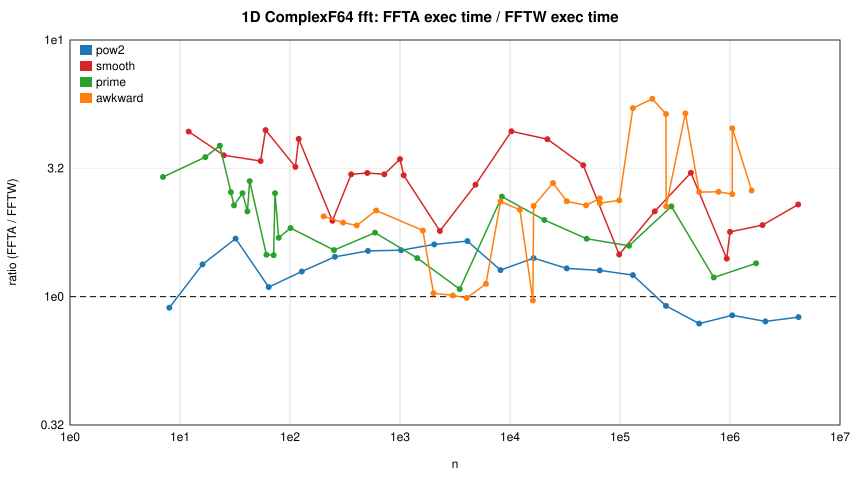
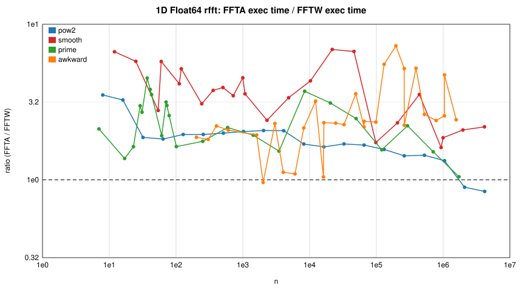
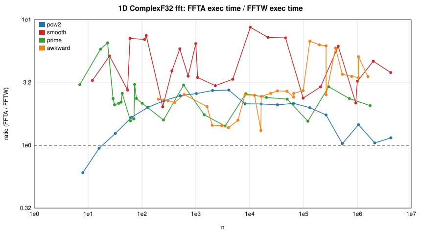
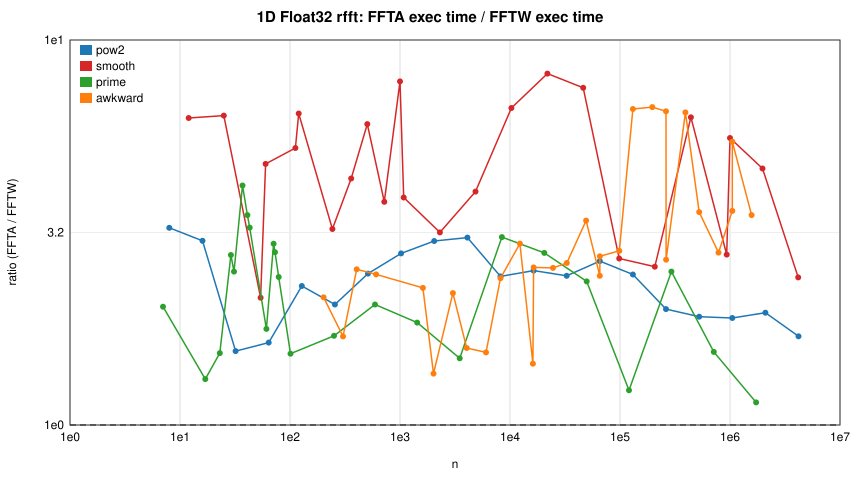
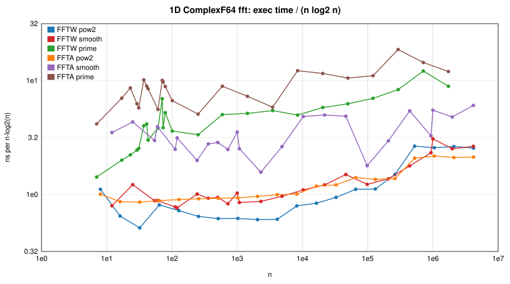
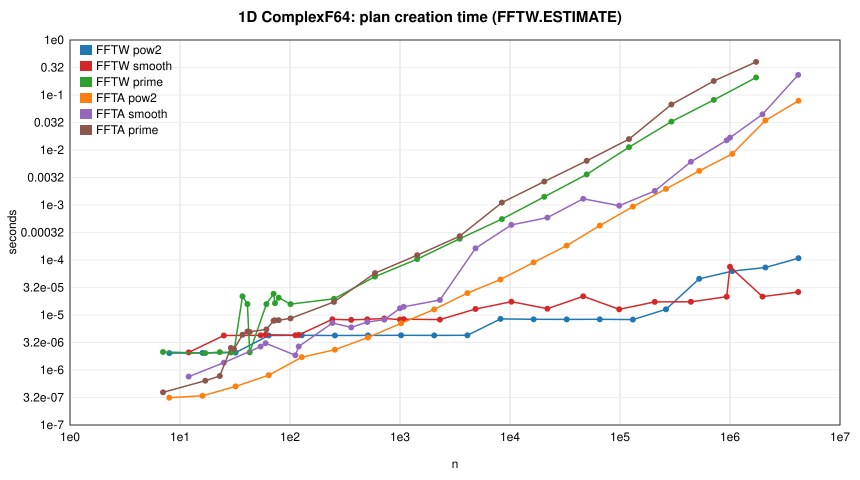

# FFTA.jl vs FFTW.jl benchmark report — after the optimisation PRs (aarch64)

This is the same suite as [`../../REPORT.md`](../../REPORT.md) run on the
same machine against the `integration/all` branch of the fork (all
optimisation PRs merged: twiddle tables, codelets, real-plan `mul!`,
inverse/in-place plans, per-thread workers, Bluestein padding/cutoff, N-d
real plans). Compared with the baseline over the 510 matched cases the
geometric-mean speedup of FFTA is **2.57×** with **no case slower by more
than 5%**; see [`COMPARE.md`](COMPARE.md) for the per-class table. The prime
class here has 24 sizes (five in the 23–46 band were added to the suite);
the baseline report's prime column is over the original 19 until its
supplement rows are merged.

Read the ratios against FFTW `ESTIMATE` with the `FFTW.MEASURE` table in
mind: FFTA now matches or beats FFTW's default plans for mid-size powers of
two, but is 1.5–1.8× behind tuned plans there and 2.7–3.2× behind at
n ≥ 2^20.

Generated 2026-08-29 22:38 UTC by `benchmark/report.jl` from `results_suite.json`.

## Environment

| | |
|:--|:--|
| CPU | Neoverse-N1 (neoverse-n1) |
| Architecture | aarch64 |
| Cores | 80 |
| OS | Linux |
| Julia | 1.12.6 |
| Julia threads | 8 |
| FFTA version | 0.3.1 |
| FFTA commit | 5f17d1c |
| FFTW version | 3.3.11 |
| FFTW provider | fftw |
| Time budget per measurement (s) | 0.5 |
| Run date (UTC) | 2026-08-29T21:59:03.735 |

## Methodology

* Both packages are loaded in one Julia process; FFTA plans are created via
  `invoke` on FFTA's `AbstractFFTs.plan_*` methods (FFTW's more specific
  `StridedArray` methods would otherwise be selected). Every FFTA result is
  compared with FFTW's (`rel. err` = ‖y_FFTA − y_FFTW‖ / ‖y_FFTW‖).
* **exec** = execution of a pre-built plan (`mul!(y, p, x)` where supported;
  if a plan only implements `p * x`, that is timed instead and includes the
  output allocation — see the *FFTA API* column of the allocation table). Times are the **minimum** over samples collected during the
  time budget (batched evals for sub-20 µs calls).
* **plan** = time to construct a plan (FFTW with `FFTW.ESTIMATE`, the
  FFTW.jl default, unless stated otherwise). **cold ratio** = (FFTA plan+exec)
  / (FFTW plan+exec), i.e. the one-shot `fft(x)` cost ratio.
* **exec ratio** = FFTA exec / FFTW exec — values > 1 mean FFTA is slower.
* **alloc/exec** = bytes allocated by one planned execution (`@allocated`).
* FFTW and FFTA are single-threaded (FFTA: one worker) except in the
  *Threading* section, where both are planned with the same thread count
  (FFTA versions with a `num_threads` keyword thread across the pencils of
  multidimensional and batched transforms).
* Size classes: `pow2` = 2^k; `smooth` = 2^a·3^b·5^c·7^d (not a power of 2);
  `prime`; `awkward` = (prime > 73) × small factor. Primes < 73 use FFTA's
  O(n²) DFT leaf, primes ≥ 73 use Bluestein.

## Summary: geometric-mean exec ratio (FFTA / FFTW), single-threaded

| type | pow2 | smooth | prime | awkward | 2D | 3D | batched dim=1 | batched dim=2 |
|:--|--:|--:|--:|--:|--:|--:|--:|--:|
| ComplexF64 fft | 1.19× (0.8–1.7) | 2.79× (1.4–4.5) | 1.97× (1.1–3.9) | 2.29× (1.0–5.9) | 1.90× (1.0–4.1) | 2.96× (2.0–4.9) | 1.61× (1.1–2.3) | 1.42× (1.0–2.7) |
| ComplexF32 fft | 1.68× (0.6–2.8) | 4.28× (2.0–8.7) | 2.37× (1.4–6.5) | 2.75× (1.3–6.7) | 2.48× (1.2–4.9) | 4.31× (3.1–5.9) | 2.43× (1.8–3.6) | 1.66× (1.2–4.4) |
| Float64 rfft | 1.74× (0.8–3.5) | 3.49× (1.6–6.9) | 2.26× (1.0–4.5) | 2.43× (1.0–7.3) | 2.33× (1.1–7.7) | 3.55× (1.8–8.0) | 1.69× (1.3–3.0) | 1.51× (1.0–3.3) |
| Float32 rfft | 2.30× (1.6–3.3) | 4.52× (2.1–8.2) | 2.13× (1.1–4.2) | 2.85× (1.4–6.7) | 2.92× (1.6–6.8) | 4.33× (2.8–7.6) | 2.40× (2.1–2.8) | 1.64× (1.0–3.1) |

Cells are `geomean (min–max)`. ✗ = FFTA threw (unsupported).

## Ratio plots (single-threaded, planned execution)

## 1D transforms

<b>1D ComplexF64 fft</b> (97 sizes)

| n | class | FFTW exec | FFTA exec | **exec ratio** | FFTW plan | FFTA plan | cold ratio | FFTA alloc/exec | rel. err |
|--:|:--|--:|--:|--:|--:|--:|--:|--:|--:|
| 7 | prime | 28 ns | 82 ns | **2.93×** | 2.12 µs | 393 ns | 0.23× | 0 | 1.5e-16 |
| 8 | pow2 | 27 ns | 24 ns | **0.91×** | 2.02 µs | 313 ns | 0.17× | 0 | 2.1e-16 |
| 12 | smooth | 34 ns | 151 ns | **4.40×** | 2.09 µs | 760 ns | 0.45× | 0 | 1.6e-16 |
| 16 | pow2 | 41 ns | 55 ns | **1.34×** | 2.05 µs | 340 ns | 0.21× | 0 | 1.3e-16 |
| 17 | prime | 139 ns | 487 ns | **3.50×** | 2.03 µs | 640 ns | 0.52× | 0 | 2.7e-16 |
| 23 | prime | 232 ns | 897 ns | **3.87×** | 2.12 µs | 779 ns | 0.71× | 0 | 2.8e-16 |
| 25 | smooth | 142 ns | 503 ns | **3.55×** | 4.24 µs | 1.36 µs | 0.43× | 0 | 3.3e-16 |
| 29 | prime | 346 ns | 882 ns | **2.55×** | 2.08 µs | 2.52 µs | 1.38× | 0 | 3.6e-16 |
| 31 | prime | 390 ns | 886 ns | **2.27×** | 2.19 µs | 2.39 µs | 1.34× | 0 | 3.0e-16 |
| 32 | pow2 | 81 ns | 137 ns | **1.68×** | 2.07 µs | 504 ns | 0.32× | 0 | 1.5e-16 |
| 37 | prime | 773 ns | 1.96 µs | **2.53×** | 21.84 µs | 4.38 µs | 0.30× | 0 | 4.5e-16 |
| 41 | prime | 914 ns | 1.96 µs | **2.15×** | 15.76 µs | 5.01 µs | 0.41× | 0 | 4.2e-16 |
| 43 | prime | 701 ns | 1.98 µs | **2.82×** | 2.10 µs | 4.93 µs | 2.31× | 0 | 3.0e-16 |
| 54 | smooth | 274 ns | 926 ns | **3.38×** | 4.27 µs | 2.66 µs | 0.82× | 0 | 3.2e-16 |
| 60 | smooth | 314 ns | 1.40 µs | **4.46×** | 4.38 µs | 3.07 µs | 0.90× | 0 | 3.0e-16 |
| 61 | prime | 1.39 µs | 2.02 µs | **1.46×** | 15.76 µs | 5.48 µs | 0.44× | 0 | 4.2e-16 |
| 64 | pow2 | 311 ns | 339 ns | **1.09×** | 4.24 µs | 806 ns | 0.29× | 0 | 1.8e-16 |
| 71 | prime | 3.03 µs | 4.39 µs | **1.45×** | 24.28 µs | 7.87 µs | 0.47× | 0 | 4.6e-16 |
| 73 | prime | 1.74 µs | 4.41 µs | **2.53×** | 16.36 µs | 8.01 µs | 0.69× | 0 | 4.3e-16 |
| 79 | prime | 2.60 µs | 4.42 µs | **1.70×** | 20.60 µs | 8.04 µs | 0.56× | 0 | 4.5e-16 |
| 101 | prime | 2.43 µs | 4.49 µs | **1.85×** | 15.80 µs | 8.67 µs | 0.74× | 0 | 4.8e-16 |
| 112 | smooth | 593 ns | 1.90 µs | **3.20×** | 4.28 µs | 1.85 µs | 0.76× | 0 | 2.8e-16 |
| 120 | smooth | 633 ns | 2.60 µs | **4.12×** | 4.35 µs | 2.68 µs | 1.06× | 0 | 3.3e-16 |
| 128 | pow2 | 646 ns | 809 ns | **1.25×** | 4.27 µs | 1.71 µs | 0.53× | 0 | 2.2e-16 |
| 202 | awkward | 4.97 µs | 10.22 µs | **2.06×** | 20.36 µs | 14.70 µs | 0.99× | 0 | 4.9e-16 |
| 243 | smooth | 1.94 µs | 3.84 µs | **1.98×** | 8.34 µs | 7.16 µs | 1.06× | 0 | 3.9e-16 |
| 251 | prime | 6.69 µs | 10.16 µs | **1.52×** | 19.68 µs | 17.34 µs | 1.05× | 0 | 5.5e-16 |
| 256 | pow2 | 1.31 µs | 1.88 µs | **1.43×** | 4.24 µs | 2.34 µs | 0.76× | 0 | 2.4e-16 |
| 303 | awkward | 7.93 µs | 15.42 µs | **1.94×** | 20.68 µs | 17.48 µs | 1.19× | 0 | 4.8e-16 |
| 360 | smooth | 2.83 µs | 8.49 µs | **3.00×** | 8.16 µs | 5.95 µs | 1.35× | 0 | 3.7e-16 |
| 404 | awkward | 10.52 µs | 19.92 µs | **1.89×** | 20.92 µs | 20.04 µs | 1.33× | 0 | 4.9e-16 |
| 504 | smooth | 4.27 µs | 12.96 µs | **3.03×** | 8.34 µs | 7.45 µs | 1.68× | 0 | 4.1e-16 |
| 512 | pow2 | 2.83 µs | 4.26 µs | **1.51×** | 4.26 µs | 3.90 µs | 1.04× | 0 | 2.6e-16 |
| 593 | prime | 27.48 µs | 48.80 µs | **1.78×** | 50.00 µs | 57.84 µs | 1.37× | 0 | 5.3e-16 |
| 606 | awkward | 16.14 µs | 34.96 µs | **2.17×** | 20.76 µs | 33.56 µs | 1.92× | 0 | 5.1e-16 |
| 720 | smooth | 5.67 µs | 17.00 µs | **3.00×** | 8.62 µs | 8.20 µs | 1.82× | 0 | 3.9e-16 |
| 1000 | smooth | 10.26 µs | 35.24 µs | **3.43×** | 8.26 µs | 13.22 µs | 2.70× | 0 | 4.5e-16 |
| 1024 | pow2 | 6.31 µs | 9.57 µs | **1.52×** | 4.28 µs | 7.05 µs | 1.43× | 0 | 2.7e-16 |
| 1080 | smooth | 9.25 µs | 27.48 µs | **2.97×** | 8.40 µs | 14.10 µs | 2.49× | 0 | 4.2e-16 |
| 1433 | prime | 77.44 µs | 109.48 µs | **1.41×** | 103.88 µs | 122.24 µs | 1.31× | 0 | 5.9e-16 |
| 1616 | awkward | 44.20 µs | 80.04 µs | **1.81×** | 20.96 µs | 19.92 µs | 1.58× | 0 | 5.1e-16 |
| 2018 | awkward | 109.44 µs | 112.92 µs | **1.03×** | 79.16 µs | 119.08 µs | 1.23× | 0 | 6.4e-16 |
| 2048 | pow2 | 13.56 µs | 21.68 µs | **1.60×** | 4.26 µs | 12.62 µs | 1.75× | 0 | 2.9e-16 |
| 2304 | smooth | 22.40 µs | 40.36 µs | **1.80×** | 8.26 µs | 18.76 µs | 1.96× | 0 | 3.7e-16 |
| 3027 | awkward | 168.16 µs | 170.04 µs | **1.01×** | 79.48 µs | 144.72 µs | 1.27× | 0 | 6.6e-16 |
| 3491 | prime | 224.20 µs | 240.04 µs | **1.07×** | 243.52 µs | 270.32 µs | 1.11× | 0 | 6.6e-16 |
| 4036 | awkward | 223.64 µs | 221.24 µs | **0.99×** | 80.24 µs | 170.44 µs | 1.27× | 0 | 6.5e-16 |
| 4096 | pow2 | 29.76 µs | 49.00 µs | **1.65×** | 4.27 µs | 25.00 µs | 1.96× | 0 | 3.1e-16 |
| 4860 | smooth | 57.40 µs | 156.68 µs | **2.73×** | 12.84 µs | 163.04 µs | 4.41× | 0 | 4.9e-16 |
| 6054 | awkward | 340.24 µs | 381.84 µs | **1.12×** | 79.48 µs | 296.12 µs | 1.62× | 0 | 6.7e-16 |
| 8192 | pow2 | 84.56 µs | 107.32 µs | **1.27×** | 8.50 µs | 44.28 µs | 1.59× | 0 | 3.3e-16 |
| 8198 | awkward | 508.85 µs | 1.195 ms | **2.35×** | 281.16 µs | 717.57 µs | 2.33× | 0 | 6.2e-16 |
| 8443 | prime | 548.37 µs | 1.346 ms | **2.45×** | 553.85 µs | 1.105 ms | 2.20× | 0 | 6.3e-16 |
| 10290 | smooth | 150.52 µs | 663.61 µs | **4.41×** | 17.44 µs | 434.97 µs | 6.24× | 0 | 5.7e-16 |
| 12297 | awkward | 784.21 µs | 1.710 ms | **2.18×** | 283.12 µs | 823.13 µs | 2.38× | 0 | 6.4e-16 |
| 16144 | awkward | 926.33 µs | 895.01 µs | **0.97×** | 80.48 µs | 175.20 µs | 1.08× | 0 | 6.6e-16 |
| 16384 | pow2 | 192.40 µs | 271.96 µs | **1.41×** | 8.34 µs | 90.44 µs | 1.67× | 0 | 3.5e-16 |
| 16396 | awkward | 1.059 ms | 2.392 ms | **2.26×** | 281.00 µs | 930.69 µs | 2.39× | 0 | 6.2e-16 |
| 20507 | prime | 1.706 ms | 3.393 ms | **1.99×** | 1.410 ms | 2.672 ms | 1.92× | 0 | 6.6e-16 |
| 21875 | smooth | 382.84 µs | 1.572 ms | **4.11×** | 13.00 µs | 589.05 µs | 4.78× | 0 | 5.8e-16 |
| 24594 | awkward | 1.618 ms | 4.485 ms | **2.77×** | 282.72 µs | 1.442 ms | 2.68× | 0 | 6.5e-16 |
| 32768 | pow2 | 463.61 µs | 597.17 µs | **1.29×** | 8.32 µs | 182.60 µs | 1.57× | 0 | 3.6e-16 |
| 32822 | awkward | 2.996 ms | 7.050 ms | **2.35×** | 1.210 ms | 3.376 ms | 2.45× | 0 | 6.8e-16 |
| 46305 | smooth | 1.075 ms | 3.495 ms | **3.25×** | 21.84 µs | 1.296 ms | 5.05× | 0 | 6.5e-16 |
| 49233 | awkward | 4.620 ms | 10.478 ms | **2.27×** | 1.220 ms | 3.757 ms | 2.44× | 0 | 7.0e-16 |
| 49757 | prime | 4.863 ms | 8.174 ms | **1.68×** | 3.604 ms | 6.353 ms | 1.69× | 0 | 7.3e-16 |
| 65536 | pow2 | 1.165 ms | 1.475 ms | **1.27×** | 8.34 µs | 421.64 µs | 1.53× | 0 | 3.7e-16 |
| 65584 | awkward | 4.533 ms | 10.942 ms | **2.41×** | 279.88 µs | 1.002 ms | 2.19× | 0 | 6.4e-16 |
| 65644 | awkward | 6.137 ms | 14.196 ms | **2.31×** | 1.217 ms | 4.340 ms | 2.44× | 0 | 6.9e-16 |
| 98304 | smooth | 2.001 ms | 2.922 ms | **1.46×** | 12.70 µs | 970.37 µs | 1.86× | 0 | 4.1e-16 |
| 98466 | awkward | 9.504 ms | 22.553 ms | **2.37×** | 1.220 ms | 6.308 ms | 2.64× | 0 | 7.1e-16 |
| 120779 | prime | 14.251 ms | 22.496 ms | **1.58×** | 11.263 ms | 15.772 ms | 1.61× | 0 | 8.0e-16 |
| 131072 | pow2 | 2.492 ms | 3.025 ms | **1.21×** | 8.26 µs | 934.97 µs | 1.44× | 0 | 3.9e-16 |
| 131074 | awkward | 7.592 ms | 41.224 ms | **5.43×** | 829.73 µs | 17.386 ms | 6.95× | 0 | 6.6e-16 |
| 196611 | awkward | 12.743 ms | 75.176 ms | **5.90×** | 829.81 µs | 21.691 ms | 6.74× | 0 | 6.7e-16 |
| 207360 | smooth | 5.034 ms | 10.823 ms | **2.15×** | 17.28 µs | 1.805 ms | 2.28× | 0 | 5.1e-16 |
| 262144 | pow2 | 7.080 ms | 6.515 ms | **0.92×** | 12.68 µs | 1.961 ms | 1.28× | 0 | 4.1e-16 |
| 262148 | awkward | 16.910 ms | 87.056 ms | **5.15×** | 829.13 µs | 21.197 ms | 6.11× | 0 | 6.7e-16 |
| 262576 | awkward | 26.193 ms | 58.853 ms | **2.25×** | 1.220 ms | 5.875 ms | 2.20× | 0 | 7.0e-16 |
| 293201 | prime | 44.443 ms | 99.891 ms | **2.25×** | 32.813 ms | 67.242 ms | 2.32× | 0 | 7.1e-16 |
| 393222 | awkward | 26.210 ms | 135.692 ms | **5.18×** | 829.65 µs | 27.940 ms | 5.96× | 0 | 6.8e-16 |
| 441000 | smooth | 14.760 ms | 44.827 ms | **3.04×** | 17.40 µs | 6.089 ms | 3.46× | 0 | 6.0e-16 |
| 524288 | pow2 | 26.477 ms | 20.785 ms | **0.79×** | 45.56 µs | 4.177 ms | 0.93× | 0 | 4.1e-16 |
| 524294 | awkward | 76.482 ms | 195.343 ms | **2.55×** | 29.086 ms | 99.370 ms | 2.89× | 0 | 7.9e-16 |
| 711749 | prime | 168.070 ms | 199.662 ms | **1.19×** | 81.593 ms | 179.490 ms | 2.13× | 0 | 7.8e-16 |
| 786441 | awkward | 116.879 ms | 299.352 ms | **2.56×** | 28.600 ms | 103.422 ms | 2.81× | 0 | 8.1e-16 |
| 933120 | smooth | 43.025 ms | 60.531 ms | **1.41×** | 21.52 µs | 14.983 ms | 1.69× | 0 | 5.7e-16 |
| 1000000 | smooth | 61.358 ms | 109.710 ms | **1.79×** | 75.12 µs | 16.822 ms | 2.10× | 0 | 7.0e-16 |
| 1048576 | pow2 | 53.995 ms | 45.671 ms | **0.85×** | 62.72 µs | 8.502 ms | 1.00× | 0 | 4.3e-16 |
| 1048588 | awkward | 157.499 ms | 395.291 ms | **2.51×** | 27.204 ms | 107.263 ms | 2.74× | 0 | 7.9e-16 |
| 1048592 | awkward | 76.339 ms | 345.815 ms | **4.53×** | 827.17 µs | 29.902 ms | 4.63× | 0 | 6.9e-16 |
| 1572882 | awkward | 246.452 ms | 638.833 ms | **2.59×** | 28.506 ms | 158.582 ms | 2.83× | 0 | 8.1e-16 |
| 1727797 | prime | 319.115 ms | 430.415 ms | **1.35×** | 208.036 ms | 399.445 ms | 1.82× | 0 | 8.3e-16 |
| 1975680 | smooth | 104.217 ms | 198.038 ms | **1.90×** | 21.64 µs | 44.515 ms | 2.47× | 0 | 6.3e-16 |
| 2097152 | pow2 | 116.232 ms | 93.071 ms | **0.80×** | 73.08 µs | 34.477 ms | 1.13× | 0 | 4.4e-16 |
| 4167450 | smooth | 242.848 ms | 555.187 ms | **2.29×** | 26.16 µs | 231.529 ms | 3.04× | 0 | 7.3e-16 |
| 4194304 | pow2 | 236.142 ms | 196.655 ms | **0.83×** | 107.96 µs | 78.477 ms | 1.18× | 0 | 4.5e-16 |

<b>1D ComplexF32 fft</b> (97 sizes)

| n | class | FFTW exec | FFTA exec | **exec ratio** | FFTW plan | FFTA plan | cold ratio | FFTA alloc/exec | rel. err |
|--:|:--|--:|--:|--:|--:|--:|--:|--:|--:|
| 7 | prime | 40 ns | 120 ns | **3.04×** | 2.19 µs | 359 ns | 0.23× | 0 | 9.7e-08 |
| 8 | pow2 | 39 ns | 24 ns | **0.61×** | 2.08 µs | 297 ns | 0.17× | 0 | 6.7e-08 |
| 12 | smooth | 46 ns | 150 ns | **3.28×** | 2.17 µs | 696 ns | 0.41× | 0 | 7.2e-08 |
| 16 | pow2 | 57 ns | 54 ns | **0.95×** | 2.15 µs | 332 ns | 0.19× | 0 | 6.0e-08 |
| 17 | prime | 138 ns | 803 ns | **5.82×** | 2.10 µs | 537 ns | 0.60× | 0 | 1.8e-07 |
| 23 | prime | 231 ns | 1.51 µs | **6.52×** | 2.31 µs | 647 ns | 0.88× | 0 | 1.4e-07 |
| 25 | smooth | 129 ns | 662 ns | **5.14×** | 4.38 µs | 1.19 µs | 0.42× | 0 | 1.9e-07 |
| 29 | prime | 346 ns | 814 ns | **2.36×** | 2.08 µs | 1.87 µs | 1.11× | 0 | 1.8e-07 |
| 31 | prime | 389 ns | 816 ns | **2.10×** | 2.09 µs | 1.78 µs | 1.11× | 0 | 2.1e-07 |
| 32 | pow2 | 107 ns | 133 ns | **1.24×** | 2.09 µs | 409 ns | 0.26× | 0 | 8.3e-08 |
| 37 | prime | 838 ns | 1.80 µs | **2.15×** | 38.36 µs | 3.14 µs | 0.12× | 0 | 2.2e-07 |
| 41 | prime | 824 ns | 1.81 µs | **2.20×** | 25.04 µs | 3.25 µs | 0.19× | 0 | 2.4e-07 |
| 43 | prime | 704 ns | 1.82 µs | **2.59×** | 2.11 µs | 3.02 µs | 1.78× | 0 | 2.0e-07 |
| 54 | smooth | 328 ns | 901 ns | **2.75×** | 8.41 µs | 2.12 µs | 0.36× | 0 | 1.3e-07 |
| 60 | smooth | 217 ns | 1.54 µs | **7.09×** | 4.29 µs | 2.40 µs | 0.87× | 0 | 1.8e-07 |
| 61 | prime | 1.19 µs | 1.87 µs | **1.56×** | 24.88 µs | 3.50 µs | 0.20× | 0 | 2.4e-07 |
| 64 | pow2 | 196 ns | 326 ns | **1.67×** | 4.28 µs | 586 ns | 0.22× | 0 | 8.8e-08 |
| 71 | prime | 2.53 µs | 4.10 µs | **1.62×** | 23.68 µs | 6.56 µs | 0.40× | 0 | 2.5e-07 |
| 73 | prime | 1.35 µs | 4.11 µs | **3.05×** | 16.32 µs | 6.42 µs | 0.61× | 0 | 2.2e-07 |
| 79 | prime | 1.75 µs | 4.12 µs | **2.36×** | 19.32 µs | 6.44 µs | 0.51× | 0 | 2.4e-07 |
| 101 | prime | 1.94 µs | 4.18 µs | **2.16×** | 16.28 µs | 7.01 µs | 0.61× | 0 | 2.7e-07 |
| 112 | smooth | 363 ns | 2.52 µs | **6.95×** | 4.38 µs | 1.50 µs | 0.87× | 0 | 1.5e-07 |
| 120 | smooth | 395 ns | 2.95 µs | **7.47×** | 4.23 µs | 2.03 µs | 1.07× | 0 | 1.9e-07 |
| 128 | pow2 | 392 ns | 784 ns | **2.00×** | 4.32 µs | 1.06 µs | 0.39× | 0 | 1.2e-07 |
| 202 | awkward | 4.12 µs | 9.57 µs | **2.32×** | 20.24 µs | 11.34 µs | 0.86× | 0 | 2.8e-07 |
| 243 | smooth | 1.90 µs | 3.84 µs | **2.02×** | 8.48 µs | 5.13 µs | 0.87× | 0 | 2.0e-07 |
| 251 | prime | 6.01 µs | 9.55 µs | **1.59×** | 36.08 µs | 13.12 µs | 0.55× | 0 | 3.1e-07 |
| 256 | pow2 | 807 ns | 1.83 µs | **2.26×** | 4.26 µs | 2.05 µs | 0.74× | 0 | 1.2e-07 |
| 303 | awkward | 6.37 µs | 14.42 µs | **2.26×** | 20.24 µs | 13.98 µs | 1.05× | 0 | 2.8e-07 |
| 360 | smooth | 2.39 µs | 9.32 µs | **3.91×** | 8.56 µs | 4.67 µs | 1.30× | 0 | 2.0e-07 |
| 404 | awkward | 8.44 µs | 18.48 µs | **2.19×** | 20.48 µs | 15.56 µs | 1.19× | 0 | 2.9e-07 |
| 504 | smooth | 2.68 µs | 15.70 µs | **5.86×** | 8.30 µs | 5.68 µs | 1.90× | 0 | 2.1e-07 |
| 512 | pow2 | 1.69 µs | 4.20 µs | **2.48×** | 4.24 µs | 3.06 µs | 1.09× | 0 | 1.4e-07 |
| 593 | prime | 15.24 µs | 45.88 µs | **3.01×** | 35.12 µs | 45.64 µs | 1.82× | 0 | 2.8e-07 |
| 606 | awkward | 12.80 µs | 32.40 µs | **2.53×** | 20.28 µs | 26.08 µs | 1.76× | 0 | 2.9e-07 |
| 720 | smooth | 5.25 µs | 18.62 µs | **3.55×** | 13.00 µs | 6.49 µs | 1.37× | 0 | 2.0e-07 |
| 1000 | smooth | 6.69 µs | 43.08 µs | **6.44×** | 8.50 µs | 9.94 µs | 3.13× | 0 | 2.4e-07 |
| 1024 | pow2 | 3.66 µs | 9.43 µs | **2.58×** | 4.36 µs | 5.13 µs | 1.53× | 0 | 1.5e-07 |
| 1080 | smooth | 8.76 µs | 30.32 µs | **3.46×** | 13.02 µs | 10.02 µs | 1.83× | 0 | 2.1e-07 |
| 1433 | prime | 57.64 µs | 100.76 µs | **1.75×** | 67.40 µs | 99.88 µs | 1.60× | 0 | 3.0e-07 |
| 1616 | awkward | 36.12 µs | 73.44 µs | **2.03×** | 24.88 µs | 15.52 µs | 1.44× | 0 | 3.0e-07 |
| 2018 | awkward | 73.48 µs | 106.00 µs | **1.44×** | 53.72 µs | 92.36 µs | 1.56× | 0 | 3.4e-07 |
| 2048 | pow2 | 7.71 µs | 21.00 µs | **2.72×** | 4.32 µs | 9.28 µs | 2.13× | 0 | 1.5e-07 |
| 2304 | smooth | 12.42 µs | 37.00 µs | **2.98×** | 8.52 µs | 13.54 µs | 2.31× | 0 | 1.8e-07 |
| 3027 | awkward | 111.72 µs | 159.88 µs | **1.43×** | 54.12 µs | 113.44 µs | 1.64× | 0 | 3.4e-07 |
| 3491 | prime | 159.04 µs | 225.96 µs | **1.42×** | 138.32 µs | 220.36 µs | 1.50× | 0 | 3.3e-07 |
| 4036 | awkward | 149.28 µs | 206.20 µs | **1.38×** | 53.80 µs | 132.40 µs | 1.67× | 0 | 3.4e-07 |
| 4096 | pow2 | 16.94 µs | 46.60 µs | **2.75×** | 4.23 µs | 17.16 µs | 2.76× | 0 | 1.6e-07 |
| 4860 | smooth | 49.76 µs | 166.84 µs | **3.35×** | 17.76 µs | 124.96 µs | 4.26× | 0 | 2.5e-07 |
| 6054 | awkward | 225.48 µs | 356.48 µs | **1.58×** | 54.08 µs | 228.16 µs | 2.07× | 0 | 3.4e-07 |
| 8192 | pow2 | 48.68 µs | 104.04 µs | **2.14×** | 8.32 µs | 33.56 µs | 1.96× | 0 | 1.7e-07 |
| 8198 | awkward | 413.17 µs | 1.040 ms | **2.52×** | 178.92 µs | 571.21 µs | 2.72× | 0 | 3.1e-07 |
| 8443 | prime | 415.08 µs | 1.066 ms | **2.57×** | 313.80 µs | 877.53 µs | 2.63× | 0 | 3.2e-07 |
| 10290 | smooth | 97.44 µs | 846.13 µs | **8.68×** | 17.40 µs | 335.44 µs | 9.86× | 0 | 3.6e-07 |
| 12297 | awkward | 624.57 µs | 1.560 ms | **2.50×** | 179.16 µs | 654.29 µs | 2.70× | 0 | 3.2e-07 |
| 16144 | awkward | 629.09 µs | 823.65 µs | **1.31×** | 58.32 µs | 129.56 µs | 1.41× | 0 | 3.5e-07 |
| 16384 | pow2 | 108.56 µs | 231.44 µs | **2.13×** | 8.38 µs | 66.12 µs | 2.21× | 0 | 1.8e-07 |
| 16396 | awkward | 833.89 µs | 2.040 ms | **2.45×** | 179.08 µs | 735.21 µs | 2.71× | 0 | 3.2e-07 |
| 20507 | prime | 1.121 ms | 2.688 ms | **2.40×** | 775.77 µs | 1.980 ms | 2.36× | 0 | 3.5e-07 |
| 21875 | smooth | 262.12 µs | 1.893 ms | **7.22×** | 17.56 µs | 443.61 µs | 8.17× | 0 | 3.9e-07 |
| 24594 | awkward | 1.264 ms | 3.269 ms | **2.59×** | 177.88 µs | 1.131 ms | 2.82× | 0 | 3.3e-07 |
| 32768 | pow2 | 239.80 µs | 502.61 µs | **2.10×** | 8.42 µs | 132.52 µs | 2.17× | 0 | 1.9e-07 |
| 32822 | awkward | 2.048 ms | 5.548 ms | **2.71×** | 705.09 µs | 2.539 ms | 2.68× | 0 | 3.7e-07 |
| 46305 | smooth | 556.77 µs | 3.981 ms | **7.15×** | 17.28 µs | 962.01 µs | 8.21× | 0 | 3.8e-07 |
| 49233 | awkward | 3.141 ms | 8.446 ms | **2.69×** | 717.97 µs | 2.837 ms | 2.83× | 0 | 3.8e-07 |
| 49757 | prime | 2.695 ms | 6.273 ms | **2.33×** | 1.706 ms | 4.541 ms | 2.44× | 0 | 4.2e-07 |
| 65536 | pow2 | 556.81 µs | 1.199 ms | **2.15×** | 8.58 µs | 278.96 µs | 2.35× | 0 | 2.0e-07 |
| 65584 | awkward | 3.565 ms | 8.617 ms | **2.42×** | 183.60 µs | 731.61 µs | 2.38× | 0 | 3.3e-07 |
| 65644 | awkward | 4.153 ms | 10.732 ms | **2.58×** | 705.37 µs | 3.212 ms | 2.80× | 0 | 3.8e-07 |
| 98304 | smooth | 1.135 ms | 2.692 ms | **2.37×** | 12.86 µs | 722.61 µs | 2.71× | 0 | 2.2e-07 |
| 98466 | awkward | 6.414 ms | 17.469 ms | **2.72×** | 709.33 µs | 4.748 ms | 3.05× | 0 | 3.8e-07 |
| 120779 | prime | 9.905 ms | 15.387 ms | **1.55×** | 5.787 ms | 10.850 ms | 1.52× | 0 | 4.1e-07 |
| 131072 | pow2 | 1.415 ms | 2.819 ms | **1.99×** | 8.38 µs | 610.81 µs | 2.22× | 0 | 2.0e-07 |
| 131074 | awkward | 4.464 ms | 30.063 ms | **6.74×** | 828.93 µs | 12.384 ms | 7.63× | 0 | 3.5e-07 |
| 196611 | awkward | 7.029 ms | 44.339 ms | **6.31×** | 830.81 µs | 13.697 ms | 7.14× | 0 | 3.6e-07 |
| 207360 | smooth | 3.404 ms | 9.915 ms | **2.91×** | 22.04 µs | 1.409 ms | 3.06× | 0 | 2.6e-07 |
| 262144 | pow2 | 3.619 ms | 6.306 ms | **1.74×** | 13.02 µs | 1.383 ms | 1.92× | 0 | 2.1e-07 |
| 262148 | awkward | 9.423 ms | 58.209 ms | **6.18×** | 827.81 µs | 14.757 ms | 6.92× | 0 | 3.5e-07 |
| 262576 | awkward | 18.596 ms | 47.016 ms | **2.53×** | 702.33 µs | 3.772 ms | 2.61× | 0 | 3.9e-07 |
| 293201 | prime | 32.002 ms | 93.505 ms | **2.92×** | 17.992 ms | 59.386 ms | 2.88× | 0 | 3.6e-07 |
| 393222 | awkward | 15.320 ms | 90.967 ms | **5.94×** | 827.57 µs | 20.921 ms | 7.26× | 0 | 3.6e-07 |
| 441000 | smooth | 8.352 ms | 51.155 ms | **6.12×** | 17.52 µs | 3.769 ms | 6.32× | 0 | 3.9e-07 |
| 524288 | pow2 | 12.738 ms | 13.107 ms | **1.03×** | 45.24 µs | 2.983 ms | 1.10× | 0 | 2.1e-07 |
| 524294 | awkward | 51.849 ms | 190.362 ms | **3.67×** | 14.159 ms | 65.953 ms | 3.93× | 0 | 3.9e-07 |
| 711749 | prime | 76.614 ms | 180.061 ms | **2.35×** | 54.752 ms | 114.007 ms | 2.39× | 0 | 4.0e-07 |
| 786441 | awkward | 80.201 ms | 283.313 ms | **3.53×** | 14.432 ms | 72.601 ms | 3.55× | 0 | 3.9e-07 |
| 933120 | smooth | 24.952 ms | 54.206 ms | **2.17×** | 22.20 µs | 11.562 ms | 2.68× | 0 | 2.9e-07 |
| 1000000 | smooth | 33.025 ms | 106.633 ms | **3.23×** | 75.76 µs | 12.591 ms | 3.75× | 0 | 3.9e-07 |
| 1048576 | pow2 | 27.940 ms | 40.741 ms | **1.46×** | 62.60 µs | 5.931 ms | 1.74× | 0 | 2.2e-07 |
| 1048588 | awkward | 106.659 ms | 368.401 ms | **3.45×** | 14.488 ms | 78.227 ms | 3.53× | 0 | 3.9e-07 |
| 1048592 | awkward | 50.023 ms | 253.403 ms | **5.07×** | 832.97 µs | 18.736 ms | 5.47× | 0 | 3.6e-07 |
| 1572882 | awkward | 165.513 ms | 582.531 ms | **3.52×** | 14.465 ms | 120.610 ms | 3.88× | 0 | 4.0e-07 |
| 1727797 | prime | 194.459 ms | 401.996 ms | **2.07×** | 119.127 ms | 297.743 ms | 2.29× | 0 | 4.2e-07 |
| 1975680 | smooth | 47.714 ms | 222.653 ms | **4.67×** | 22.24 µs | 27.891 ms | 4.80× | 0 | 3.9e-07 |
| 2097152 | pow2 | 81.199 ms | 84.722 ms | **1.04×** | 73.24 µs | 12.091 ms | 1.20× | 0 | 2.3e-07 |
| 4167450 | smooth | 156.389 ms | 592.566 ms | **3.79×** | 26.52 µs | 161.534 ms | 4.93× | 0 | 4.3e-07 |
| 4194304 | pow2 | 163.801 ms | 187.752 ms | **1.15×** | 108.16 µs | 42.213 ms | 1.36× | 0 | 2.4e-07 |

<b>1D Float64 rfft</b> (97 sizes)

| n | class | FFTW exec | FFTA exec | **exec ratio** | FFTW plan | FFTA plan | cold ratio | FFTA alloc/exec | rel. err |
|--:|:--|--:|--:|--:|--:|--:|--:|--:|--:|
| 7 | prime | 25 ns | 53 ns | **2.12×** | 2.10 µs | 441 ns | 0.24× | 0 | 1.5e-16 |
| 8 | pow2 | 23 ns | 82 ns | **3.51×** | 2.06 µs | 255 ns | 0.17× | 0 | 3.1e-17 |
| 12 | smooth | 28 ns | 188 ns | **6.66×** | 2.12 µs | 660 ns | 0.40× | 0 | 1.3e-16 |
| 16 | pow2 | 32 ns | 106 ns | **3.26×** | 2.05 µs | 358 ns | 0.22× | 0 | 1.2e-16 |
| 17 | prime | 140 ns | 191 ns | **1.37×** | 6.19 µs | 682 ns | 0.14× | 0 | 2.5e-16 |
| 23 | prime | 209 ns | 341 ns | **1.63×** | 6.11 µs | 825 ns | 0.19× | 0 | 2.7e-16 |
| 25 | smooth | 76 ns | 440 ns | **5.78×** | 2.08 µs | 1.51 µs | 0.89× | 0 | 1.8e-16 |
| 29 | prime | 295 ns | 884 ns | **2.99×** | 6.01 µs | 2.57 µs | 0.54× | 0 | 2.6e-16 |
| 31 | prime | 326 ns | 887 ns | **2.72×** | 6.03 µs | 2.64 µs | 0.55× | 0 | 4.3e-16 |
| 32 | pow2 | 89 ns | 167 ns | **1.87×** | 8.00 µs | 416 ns | 0.08× | 0 | 2.1e-16 |
| 37 | prime | 434 ns | 1.96 µs | **4.51×** | 5.95 µs | 4.96 µs | 1.11× | 0 | 3.2e-16 |
| 41 | prime | 515 ns | 1.96 µs | **3.81×** | 6.07 µs | 4.61 µs | 1.10× | 0 | 3.3e-16 |
| 43 | prime | 560 ns | 1.98 µs | **3.53×** | 6.35 µs | 5.23 µs | 1.00× | 0 | 3.5e-16 |
| 54 | smooth | 170 ns | 473 ns | **2.79×** | 8.22 µs | 1.07 µs | 0.19× | 0 | 3.9e-16 |
| 60 | smooth | 172 ns | 994 ns | **5.77×** | 8.44 µs | 2.18 µs | 0.37× | 0 | 3.3e-16 |
| 61 | prime | 1.05 µs | 2.01 µs | **1.92×** | 6.19 µs | 5.72 µs | 1.05× | 0 | 3.8e-16 |
| 64 | pow2 | 170 ns | 311 ns | **1.83×** | 8.10 µs | 570 ns | 0.11× | 0 | 2.3e-16 |
| 71 | prime | 1.39 µs | 4.38 µs | **3.16×** | 6.09 µs | 7.90 µs | 1.71× | 0 | 3.3e-16 |
| 73 | prime | 1.46 µs | 4.39 µs | **3.01×** | 6.07 µs | 8.53 µs | 1.73× | 0 | 3.5e-16 |
| 79 | prime | 1.70 µs | 4.39 µs | **2.59×** | 6.03 µs | 8.21 µs | 1.69× | 0 | 3.9e-16 |
| 101 | prime | 2.72 µs | 4.44 µs | **1.64×** | 6.13 µs | 8.99 µs | 1.55× | 0 | 4.8e-16 |
| 112 | smooth | 299 ns | 1.24 µs | **4.14×** | 8.19 µs | 1.54 µs | 0.34× | 0 | 2.9e-16 |
| 120 | smooth | 333 ns | 1.72 µs | **5.17×** | 8.26 µs | 3.21 µs | 0.60× | 0 | 3.4e-16 |
| 128 | pow2 | 326 ns | 639 ns | **1.96×** | 8.04 µs | 1.03 µs | 0.21× | 0 | 2.1e-16 |
| 202 | awkward | 2.60 µs | 4.88 µs | **1.88×** | 23.44 µs | 8.96 µs | 0.55× | 0 | 5.1e-16 |
| 243 | smooth | 1.25 µs | 3.85 µs | **3.08×** | 22.20 µs | 7.45 µs | 0.49× | 0 | 4.0e-16 |
| 251 | prime | 5.70 µs | 10.08 µs | **1.77×** | 93.60 µs | 17.78 µs | 0.28× | 0 | 5.4e-16 |
| 256 | pow2 | 693 ns | 1.36 µs | **1.96×** | 8.05 µs | 1.98 µs | 0.39× | 0 | 2.5e-16 |
| 303 | awkward | 8.41 µs | 15.32 µs | **1.82×** | 15.16 µs | 17.96 µs | 1.46× | 0 | 4.7e-16 |
| 360 | smooth | 1.40 µs | 5.26 µs | **3.76×** | 18.80 µs | 8.09 µs | 0.71× | 0 | 4.1e-16 |
| 404 | awkward | 5.38 µs | 11.94 µs | **2.22×** | 25.48 µs | 15.46 µs | 0.92× | 0 | 4.7e-16 |
| 504 | smooth | 2.04 µs | 7.99 µs | **3.92×** | 12.42 µs | 10.38 µs | 1.35× | 0 | 4.6e-16 |
| 512 | pow2 | 1.47 µs | 2.93 µs | **2.00×** | 8.09 µs | 2.78 µs | 0.63× | 0 | 3.9e-16 |
| 593 | prime | 22.44 µs | 48.64 µs | **2.17×** | 65.60 µs | 58.20 µs | 1.27× | 0 | 5.1e-16 |
| 606 | awkward | 8.31 µs | 17.34 µs | **2.09×** | 25.24 µs | 17.48 µs | 1.10× | 0 | 5.6e-16 |
| 720 | smooth | 2.89 µs | 10.04 µs | **3.47×** | 18.72 µs | 6.45 µs | 0.81× | 0 | 4.5e-16 |
| 1000 | smooth | 4.50 µs | 20.36 µs | **4.53×** | 19.12 µs | 19.16 µs | 1.75× | 0 | 5.7e-16 |
| 1024 | pow2 | 3.13 µs | 6.39 µs | **2.04×** | 8.07 µs | 4.28 µs | 0.93× | 0 | 4.0e-16 |
| 1080 | smooth | 4.71 µs | 16.82 µs | **3.57×** | 18.84 µs | 20.44 µs | 1.68× | 0 | 4.4e-16 |
| 1433 | prime | 56.20 µs | 108.84 µs | **1.94×** | 123.56 µs | 126.72 µs | 1.34× | 0 | 5.9e-16 |
| 1616 | awkward | 22.32 µs | 43.32 µs | **1.94×** | 25.36 µs | 15.62 µs | 1.31× | 0 | 5.9e-16 |
| 2018 | awkward | 55.84 µs | 53.76 µs | **0.96×** | 83.08 µs | 67.56 µs | 0.88× | 0 | 7.3e-16 |
| 2048 | pow2 | 6.68 µs | 13.86 µs | **2.07×** | 8.18 µs | 6.79 µs | 1.35× | 0 | 4.4e-16 |
| 2304 | smooth | 9.77 µs | 23.60 µs | **2.41×** | 12.64 µs | 10.76 µs | 1.48× | 0 | 7.8e-16 |
| 3027 | awkward | 73.56 µs | 169.32 µs | **2.30×** | 108.36 µs | 149.24 µs | 1.78× | 0 | 6.2e-16 |
| 3491 | prime | 156.68 µs | 239.56 µs | **1.53×** | 148.16 µs | 273.72 µs | 1.69× | 0 | 6.5e-16 |
| 4036 | awkward | 113.56 µs | 127.12 µs | **1.12×** | 85.56 µs | 120.56 µs | 1.26× | 0 | 8.9e-16 |
| 4096 | pow2 | 14.56 µs | 30.12 µs | **2.07×** | 14.90 µs | 10.74 µs | 1.48× | 0 | 6.5e-16 |
| 4860 | smooth | 29.04 µs | 97.92 µs | **3.37×** | 23.64 µs | 102.16 µs | 3.84× | 0 | 7.7e-16 |
| 6054 | awkward | 171.80 µs | 187.60 µs | **1.09×** | 85.56 µs | 145.88 µs | 1.29× | 0 | 7.7e-16 |
| 8192 | pow2 | 39.08 µs | 66.36 µs | **1.70×** | 12.30 µs | 24.84 µs | 1.71× | 0 | 7.6e-16 |
| 8198 | awkward | 258.56 µs | 557.85 µs | **2.16×** | 289.04 µs | 512.25 µs | 1.70× | 0 | 1.0e-15 |
| 8443 | prime | 370.88 µs | 1.376 ms | **3.71×** | 143.12 µs | 1.128 ms | 4.82× | 0 | 6.3e-16 |
| 10290 | smooth | 74.84 µs | 323.64 µs | **4.32×** | 21.52 µs | 180.04 µs | 5.06× | 0 | 1.2e-15 |
| 12297 | awkward | 549.49 µs | 1.762 ms | **3.21×** | 136.08 µs | 826.13 µs | 3.76× | 0 | 6.3e-16 |
| 16144 | awkward | 461.89 µs | 482.01 µs | **1.04×** | 86.56 µs | 118.64 µs | 1.14× | 0 | 1.5e-15 |
| 16384 | pow2 | 86.80 µs | 141.32 µs | **1.63×** | 18.76 µs | 43.24 µs | 1.74× | 0 | 7.2e-16 |
| 16396 | awkward | 525.49 µs | 1.224 ms | **2.33×** | 291.16 µs | 720.41 µs | 2.08× | 0 | 1.6e-15 |
| 20507 | prime | 1.070 ms | 3.339 ms | **3.12×** | 128.32 µs | 2.619 ms | 4.85× | 0 | 6.6e-16 |
| 21875 | smooth | 203.52 µs | 1.401 ms | **6.89×** | 44.36 µs | 583.41 µs | 8.24× | 0 | 5.8e-16 |
| 24594 | awkward | 795.65 µs | 1.842 ms | **2.31×** | 293.84 µs | 822.33 µs | 2.40× | 0 | 2.0e-15 |
| 32768 | pow2 | 193.84 µs | 329.88 µs | **1.70×** | 12.32 µs | 93.00 µs | 1.88× | 0 | 1.1e-15 |
| 32822 | awkward | 1.497 ms | 3.392 ms | **2.27×** | 1.223 ms | 2.488 ms | 2.19× | 0 | 9.9e-16 |
| 46305 | smooth | 483.77 µs | 3.234 ms | **6.68×** | 48.12 µs | 1.293 ms | 9.11× | 0 | 6.0e-16 |
| 49233 | awkward | 2.953 ms | 10.550 ms | **3.57×** | 205.04 µs | 3.791 ms | 4.11× | 0 | 6.7e-16 |
| 49757 | prime | 3.166 ms | 7.842 ms | **2.48×** | 184.48 µs | 6.071 ms | 4.25× | 0 | 7.3e-16 |
| 65536 | pow2 | 467.53 µs | 781.85 µs | **1.67×** | 12.48 µs | 198.92 µs | 1.89× | 0 | 3.0e-15 |
| 65584 | awkward | 2.231 ms | 4.883 ms | **2.19×** | 289.60 µs | 721.17 µs | 2.04× | 0 | 1.8e-15 |
| 65644 | awkward | 3.058 ms | 7.272 ms | **2.38×** | 1.225 ms | 3.322 ms | 2.50× | 0 | 1.3e-15 |
| 98304 | smooth | 950.77 µs | 1.652 ms | **1.74×** | 23.24 µs | 476.45 µs | 2.13× | 0 | 3.3e-15 |
| 98466 | awkward | 4.686 ms | 11.012 ms | **2.35×** | 1.219 ms | 3.763 ms | 2.51× | 0 | 3.7e-15 |
| 120779 | prime | 13.131 ms | 20.479 ms | **1.56×** | 271.76 µs | 15.234 ms | 2.84× | 0 | 8.0e-16 |
| 131072 | pow2 | 1.148 ms | 1.801 ms | **1.57×** | 19.28 µs | 408.48 µs | 1.79× | 0 | 4.0e-15 |
| 131074 | awkward | 3.904 ms | 21.590 ms | **5.53×** | 832.05 µs | 14.456 ms | 7.54× | 0 | 3.1e-15 |
| 196611 | awkward | 9.270 ms | 67.346 ms | **7.27×** | 905.45 µs | 21.226 ms | 8.53× | 0 | 6.5e-16 |
| 207360 | smooth | 2.338 ms | 5.437 ms | **2.33×** | 28.40 µs | 815.25 µs | 2.60× | 0 | 9.2e-15 |
| 262144 | pow2 | 2.645 ms | 3.773 ms | **1.43×** | 16.96 µs | 887.37 µs | 1.80× | 0 | 5.7e-15 |
| 262148 | awkward | 7.752 ms | 40.241 ms | **5.19×** | 833.61 µs | 16.767 ms | 6.91× | 0 | 3.5e-15 |
| 262576 | awkward | 13.117 ms | 29.426 ms | **2.24×** | 1.222 ms | 3.615 ms | 2.32× | 0 | 7.5e-15 |
| 293201 | prime | 43.767 ms | 97.428 ms | **2.23×** | 352.40 µs | 69.355 ms | 3.91× | 0 | 7.2e-16 |
| 393222 | awkward | 12.905 ms | 67.344 ms | **5.22×** | 834.13 µs | 19.002 ms | 6.25× | 0 | 3.7e-15 |
| 441000 | smooth | 6.510 ms | 23.014 ms | **3.53×** | 26.12 µs | 7.468 ms | 4.68× | 0 | 4.9e-15 |
| 524288 | pow2 | 6.614 ms | 9.517 ms | **1.44×** | 23.36 µs | 1.906 ms | 1.69× | 0 | 9.9e-15 |
| 524294 | awkward | 38.166 ms | 100.614 ms | **2.64×** | 24.612 ms | 66.197 ms | 2.36× | 0 | 5.3e-15 |
| 711749 | prime | 133.430 ms | 202.120 ms | **1.51×** | 757.69 µs | 202.247 ms | 2.87× | 0 | 8.0e-16 |
| 786441 | awkward | 124.648 ms | 299.917 ms | **2.41×** | 214.84 µs | 91.011 ms | 3.16× | 0 | 8.8e-16 |
| 933120 | smooth | 18.974 ms | 30.639 ms | **1.61×** | 26.36 µs | 6.980 ms | 2.01× | 0 | 4.1e-15 |
| 1000000 | smooth | 29.878 ms | 55.729 ms | **1.87×** | 58.00 µs | 7.976 ms | 2.14× | 0 | 3.1e-15 |
| 1048576 | pow2 | 17.065 ms | 22.647 ms | **1.33×** | 16.44 µs | 4.082 ms | 1.69× | 0 | 3.5e-15 |
| 1048588 | awkward | 78.189 ms | 201.683 ms | **2.58×** | 25.186 ms | 90.494 ms | 2.61× | 0 | 4.3e-15 |
| 1048592 | awkward | 38.887 ms | 183.622 ms | **4.72×** | 834.77 µs | 19.866 ms | 5.16× | 0 | 5.2e-15 |
| 1572882 | awkward | 124.689 ms | 303.445 ms | **2.43×** | 30.325 ms | 86.193 ms | 2.80× | 0 | 1.5e-14 |
| 1727797 | prime | 405.739 ms | 425.097 ms | **1.05×** | 483.01 µs | 493.020 ms | 2.31× | 0 | 8.3e-16 |
| 1975680 | smooth | 48.833 ms | 102.105 ms | **2.09×** | 30.64 µs | 16.210 ms | 2.55× | 0 | 1.0e-14 |
| 2097152 | pow2 | 57.031 ms | 51.166 ms | **0.90×** | 70.56 µs | 8.384 ms | 1.05× | 0 | 1.3e-14 |
| 4167450 | smooth | 126.632 ms | 277.587 ms | **2.19×** | 63.24 µs | 86.650 ms | 2.82× | 0 | 1.5e-14 |
| 4194304 | pow2 | 120.482 ms | 101.439 ms | **0.84×** | 72.96 µs | 18.749 ms | 1.15× | 0 | 1.8e-14 |

<b>1D Float32 rfft</b> (97 sizes)

| n | class | FFTW exec | FFTA exec | **exec ratio** | FFTW plan | FFTA plan | cold ratio | FFTA alloc/exec | rel. err |
|--:|:--|--:|--:|--:|--:|--:|--:|--:|--:|
| 7 | prime | 25 ns | 51 ns | **2.03×** | 2.12 µs | 403 ns | 0.23× | 0 | 1.2e-07 |
| 8 | pow2 | 23 ns | 75 ns | **3.25×** | 2.06 µs | 256 ns | 0.16× | 0 | 1.0e-08 |
| 12 | smooth | 28 ns | 177 ns | **6.27×** | 2.22 µs | 631 ns | 0.36× | 0 | 9.5e-08 |
| 16 | pow2 | 33 ns | 100 ns | **3.01×** | 2.08 µs | 344 ns | 0.21× | 0 | 4.4e-08 |
| 17 | prime | 136 ns | 179 ns | **1.32×** | 6.21 µs | 585 ns | 0.13× | 0 | 1.3e-07 |
| 23 | prime | 205 ns | 315 ns | **1.54×** | 6.11 µs | 695 ns | 0.17× | 0 | 1.3e-07 |
| 25 | smooth | 78 ns | 499 ns | **6.36×** | 2.09 µs | 1.23 µs | 0.78× | 0 | 1.3e-07 |
| 29 | prime | 292 ns | 808 ns | **2.76×** | 6.31 µs | 1.94 µs | 0.44× | 0 | 1.7e-07 |
| 31 | prime | 324 ns | 811 ns | **2.50×** | 6.28 µs | 1.98 µs | 0.43× | 0 | 2.0e-07 |
| 32 | pow2 | 103 ns | 161 ns | **1.56×** | 8.18 µs | 380 ns | 0.07× | 0 | 6.2e-08 |
| 37 | prime | 430 ns | 1.80 µs | **4.19×** | 6.15 µs | 3.17 µs | 0.75× | 0 | 2.3e-07 |
| 41 | prime | 513 ns | 1.80 µs | **3.51×** | 6.07 µs | 3.26 µs | 0.75× | 0 | 1.9e-07 |
| 43 | prime | 555 ns | 1.81 µs | **3.26×** | 6.20 µs | 3.33 µs | 0.74× | 0 | 1.6e-07 |
| 54 | smooth | 216 ns | 463 ns | **2.14×** | 10.54 µs | 873 ns | 0.12× | 0 | 1.8e-07 |
| 60 | smooth | 221 ns | 1.05 µs | **4.77×** | 15.22 µs | 1.82 µs | 0.19× | 0 | 2.0e-07 |
| 61 | prime | 1.04 µs | 1.84 µs | **1.78×** | 6.24 µs | 3.58 µs | 0.74× | 0 | 1.9e-07 |
| 64 | pow2 | 182 ns | 297 ns | **1.64×** | 8.12 µs | 451 ns | 0.09× | 0 | 9.6e-08 |
| 71 | prime | 1.38 µs | 4.07 µs | **2.96×** | 6.23 µs | 6.60 µs | 1.39× | 0 | 2.3e-07 |
| 73 | prime | 1.45 µs | 4.08 µs | **2.81×** | 6.27 µs | 6.56 µs | 1.40× | 0 | 2.2e-07 |
| 79 | prime | 1.68 µs | 4.08 µs | **2.42×** | 6.17 µs | 6.72 µs | 1.39× | 0 | 1.9e-07 |
| 101 | prime | 2.69 µs | 4.13 µs | **1.53×** | 6.24 µs | 6.71 µs | 1.25× | 0 | 2.3e-07 |
| 112 | smooth | 290 ns | 1.52 µs | **5.24×** | 8.34 µs | 1.10 µs | 0.30× | 0 | 1.4e-07 |
| 120 | smooth | 290 ns | 1.87 µs | **6.44×** | 8.46 µs | 2.45 µs | 0.50× | 0 | 2.1e-07 |
| 128 | pow2 | 264 ns | 607 ns | **2.30×** | 8.20 µs | 607 ns | 0.15× | 0 | 1.2e-07 |
| 202 | awkward | 2.13 µs | 4.57 µs | **2.15×** | 22.20 µs | 7.24 µs | 0.49× | 0 | 2.5e-07 |
| 243 | smooth | 1.19 µs | 3.83 µs | **3.23×** | 21.08 µs | 5.33 µs | 0.41× | 0 | 1.9e-07 |
| 251 | prime | 5.49 µs | 9.36 µs | **1.70×** | 92.80 µs | 13.80 µs | 0.23× | 0 | 3.1e-07 |
| 256 | pow2 | 636 ns | 1.31 µs | **2.06×** | 14.84 µs | 1.16 µs | 0.16× | 0 | 1.3e-07 |
| 303 | awkward | 8.35 µs | 14.18 µs | **1.70×** | 15.32 µs | 13.94 µs | 1.21× | 0 | 2.4e-07 |
| 360 | smooth | 1.31 µs | 5.74 µs | **4.37×** | 19.04 µs | 5.84 µs | 0.58× | 0 | 2.2e-07 |
| 404 | awkward | 4.31 µs | 10.94 µs | **2.54×** | 24.48 µs | 11.62 µs | 0.79× | 0 | 3.2e-07 |
| 504 | smooth | 1.53 µs | 9.23 µs | **6.05×** | 12.56 µs | 8.27 µs | 1.22× | 0 | 2.3e-07 |
| 512 | pow2 | 1.14 µs | 2.82 µs | **2.47×** | 14.90 µs | 2.23 µs | 0.33× | 0 | 2.2e-07 |
| 593 | prime | 22.04 µs | 45.32 µs | **2.06×** | 66.04 µs | 46.04 µs | 1.06× | 0 | 2.9e-07 |
| 606 | awkward | 6.51 µs | 16.02 µs | **2.46×** | 24.36 µs | 14.08 µs | 0.97× | 0 | 3.0e-07 |
| 720 | smooth | 2.88 µs | 10.94 µs | **3.80×** | 24.04 µs | 5.06 µs | 0.61× | 0 | 2.6e-07 |
| 1000 | smooth | 3.12 µs | 24.36 µs | **7.81×** | 19.60 µs | 15.42 µs | 1.75× | 0 | 2.7e-07 |
| 1024 | pow2 | 2.20 µs | 6.14 µs | **2.79×** | 15.04 µs | 3.38 µs | 0.55× | 0 | 2.7e-07 |
| 1080 | smooth | 4.65 µs | 18.12 µs | **3.90×** | 23.64 µs | 15.76 µs | 1.23× | 0 | 2.7e-07 |
| 1433 | prime | 54.08 µs | 99.76 µs | **1.84×** | 123.76 µs | 100.04 µs | 1.14× | 0 | 3.1e-07 |
| 1616 | awkward | 17.56 µs | 39.88 µs | **2.27×** | 24.32 µs | 12.34 µs | 1.25× | 0 | 3.0e-07 |
| 2018 | awkward | 37.20 µs | 50.60 µs | **1.36×** | 56.40 µs | 52.92 µs | 1.12× | 0 | 3.7e-07 |
| 2048 | pow2 | 4.43 µs | 13.32 µs | **3.01×** | 15.14 µs | 5.29 µs | 0.92× | 0 | 1.7e-07 |
| 2304 | smooth | 6.84 µs | 21.64 µs | **3.16×** | 19.28 µs | 7.68 µs | 1.14× | 0 | 3.8e-07 |
| 3027 | awkward | 71.64 µs | 157.64 µs | **2.20×** | 110.52 µs | 112.56 µs | 1.52× | 0 | 3.2e-07 |
| 3491 | prime | 149.64 µs | 223.00 µs | **1.49×** | 147.88 µs | 221.68 µs | 1.50× | 0 | 3.3e-07 |
| 4036 | awkward | 75.40 µs | 119.48 µs | **1.58×** | 59.72 µs | 93.16 µs | 1.58× | 0 | 3.6e-07 |
| 4096 | pow2 | 9.40 µs | 28.84 µs | **3.07×** | 15.20 µs | 9.44 µs | 1.49× | 0 | 3.4e-07 |
| 4860 | smooth | 25.48 µs | 102.88 µs | **4.04×** | 23.84 µs | 77.32 µs | 3.64× | 0 | 2.6e-07 |
| 6054 | awkward | 113.72 µs | 175.52 µs | **1.54×** | 59.00 µs | 112.56 µs | 1.68× | 0 | 5.5e-07 |
| 8192 | pow2 | 25.52 µs | 62.08 µs | **2.43×** | 12.50 µs | 16.68 µs | 1.91× | 0 | 2.4e-07 |
| 8198 | awkward | 207.64 µs | 499.57 µs | **2.41×** | 183.16 µs | 414.08 µs | 2.38× | 0 | 4.7e-07 |
| 8443 | prime | 345.76 µs | 1.064 ms | **3.08×** | 143.20 µs | 865.33 µs | 3.98× | 0 | 3.1e-07 |
| 10290 | smooth | 62.84 µs | 418.44 µs | **6.66×** | 21.92 µs | 139.24 µs | 6.55× | 0 | 6.3e-07 |
| 12297 | awkward | 521.73 µs | 1.544 ms | **2.96×** | 136.20 µs | 652.73 µs | 3.36× | 0 | 3.1e-07 |
| 16144 | awkward | 307.44 µs | 443.61 µs | **1.44×** | 59.04 µs | 91.16 µs | 1.46× | 0 | 5.4e-07 |
| 16384 | pow2 | 53.92 µs | 135.76 µs | **2.52×** | 19.60 µs | 35.12 µs | 2.12× | 0 | 5.4e-07 |
| 16396 | awkward | 418.65 µs | 1.074 ms | **2.57×** | 185.28 µs | 574.01 µs | 2.76× | 0 | 3.7e-07 |
| 20507 | prime | 960.73 µs | 2.690 ms | **2.80×** | 129.28 µs | 1.995 ms | 4.18× | 0 | 3.4e-07 |
| 21875 | smooth | 197.32 µs | 1.614 ms | **8.18×** | 44.36 µs | 443.05 µs | 8.65× | 0 | 3.5e-07 |
| 24594 | awkward | 630.89 µs | 1.614 ms | **2.56×** | 185.56 µs | 658.21 µs | 2.77× | 0 | 9.3e-07 |
| 32768 | pow2 | 119.72 µs | 292.16 µs | **2.44×** | 12.60 µs | 69.72 µs | 2.56× | 0 | 5.0e-07 |
| 32822 | awkward | 1.036 ms | 2.730 ms | **2.64×** | 702.85 µs | 1.900 ms | 2.64× | 0 | 9.9e-07 |
| 46305 | smooth | 455.85 µs | 3.425 ms | **7.51×** | 48.76 µs | 963.29 µs | 9.11× | 0 | 3.4e-07 |
| 49233 | awkward | 2.642 ms | 8.970 ms | **3.39×** | 212.08 µs | 2.871 ms | 3.79× | 0 | 3.8e-07 |
| 49757 | prime | 2.639 ms | 6.229 ms | **2.36×** | 183.80 µs | 4.632 ms | 3.82× | 0 | 4.1e-07 |
| 65536 | pow2 | 245.40 µs | 654.21 µs | **2.67×** | 12.60 µs | 134.80 µs | 2.75× | 0 | 5.9e-07 |
| 65584 | awkward | 1.739 ms | 4.245 ms | **2.44×** | 185.00 µs | 548.45 µs | 2.35× | 0 | 6.3e-07 |
| 65644 | awkward | 2.138 ms | 5.865 ms | **2.74×** | 713.17 µs | 2.606 ms | 2.71× | 0 | 4.8e-07 |
| 98304 | smooth | 525.81 µs | 1.424 ms | **2.71×** | 23.56 µs | 360.32 µs | 2.90× | 0 | 2.6e-07 |
| 98466 | awkward | 3.145 ms | 8.913 ms | **2.83×** | 706.65 µs | 2.865 ms | 2.92× | 0 | 4.3e-07 |
| 120779 | prime | 11.523 ms | 14.185 ms | **1.23×** | 272.60 µs | 11.129 ms | 2.14× | 0 | 4.0e-07 |
| 131072 | pow2 | 623.77 µs | 1.534 ms | **2.46×** | 18.92 µs | 256.72 µs | 2.56× | 0 | 4.2e-07 |
| 131074 | awkward | 2.214 ms | 14.657 ms | **6.62×** | 829.93 µs | 10.088 ms | 7.54× | 0 | 6.4e-07 |
| 196611 | awkward | 6.536 ms | 43.766 ms | **6.70×** | 883.45 µs | 13.635 ms | 7.78× | 0 | 3.5e-07 |
| 207360 | smooth | 1.780 ms | 4.587 ms | **2.58×** | 26.52 µs | 543.45 µs | 3.10× | 0 | 4.4e-07 |
| 262144 | pow2 | 1.722 ms | 3.444 ms | **2.00×** | 17.16 µs | 614.61 µs | 2.12× | 0 | 6.5e-07 |
| 262148 | awkward | 4.670 ms | 30.484 ms | **6.53×** | 833.25 µs | 12.436 ms | 7.26× | 0 | 6.6e-07 |
| 262576 | awkward | 8.841 ms | 23.760 ms | **2.69×** | 707.89 µs | 2.572 ms | 2.67× | 0 | 6.5e-07 |
| 293201 | prime | 35.397 ms | 88.600 ms | **2.50×** | 355.32 µs | 58.589 ms | 4.32× | 0 | 3.9e-07 |
| 393222 | awkward | 7.064 ms | 45.830 ms | **6.49×** | 834.89 µs | 13.857 ms | 7.19× | 0 | 1.3e-06 |
| 441000 | smooth | 3.964 ms | 24.964 ms | **6.30×** | 26.52 µs | 5.569 ms | 7.43× | 0 | 1.4e-06 |
| 524288 | pow2 | 3.866 ms | 7.386 ms | **1.91×** | 23.72 µs | 1.346 ms | 2.04× | 0 | 1.7e-06 |
| 524294 | awkward | 25.887 ms | 92.482 ms | **3.57×** | 14.127 ms | 56.501 ms | 3.57× | 0 | 1.8e-06 |
| 711749 | prime | 115.301 ms | 178.537 ms | **1.55×** | 759.17 µs | 125.280 ms | 2.89× | 0 | 4.2e-07 |
| 786441 | awkward | 101.656 ms | 284.998 ms | **2.80×** | 217.52 µs | 72.116 ms | 3.33× | 0 | 3.7e-07 |
| 933120 | smooth | 10.103 ms | 27.989 ms | **2.77×** | 30.96 µs | 5.083 ms | 2.99× | 0 | 6.9e-06 |
| 1000000 | smooth | 10.643 ms | 59.228 ms | **5.56×** | 29.04 µs | 5.580 ms | 5.13× | 0 | 5.7e-06 |
| 1048576 | pow2 | 8.555 ms | 16.223 ms | **1.90×** | 16.96 µs | 2.930 ms | 2.07× | 0 | 8.1e-06 |
| 1048588 | awkward | 52.742 ms | 189.805 ms | **3.60×** | 14.365 ms | 66.772 ms | 3.87× | 0 | 7.8e-06 |
| 1048592 | awkward | 24.508 ms | 133.388 ms | **5.44×** | 832.45 µs | 13.533 ms | 5.16× | 0 | 7.8e-06 |
| 1572882 | awkward | 81.197 ms | 284.959 ms | **3.51×** | 14.690 ms | 72.156 ms | 3.78× | 0 | 2.3e-05 |
| 1727797 | prime | 351.092 ms | 402.009 ms | **1.15×** | 479.45 µs | 281.385 ms | 1.99× | 0 | 4.3e-07 |
| 1975680 | smooth | 22.972 ms | 106.493 ms | **4.64×** | 27.00 µs | 12.302 ms | 5.82× | 0 | 2.9e-05 |
| 2097152 | pow2 | 23.878 ms | 46.743 ms | **1.96×** | 16.88 µs | 5.997 ms | 2.23× | 0 | 6.7e-05 |
| 4167450 | smooth | 118.213 ms | 285.802 ms | **2.42×** | 63.60 µs | 60.322 ms | 3.02× | 0 | 1.2e-04 |
| 4194304 | pow2 | 55.302 ms | 93.983 ms | **1.70×** | 23.76 µs | 11.908 ms | 2.17× | 0 | 1.3e-04 |

<b>1D ComplexF64 fft vs FFTW planned with FFTW.MEASURE</b> (pow2 only)

| n | FFTW exec (MEASURE) | FFTA exec | ratio |
|--:|--:|--:|--:|
| 8 | 27 ns | 25 ns | 0.94× |
| 16 | 42 ns | 54 ns | 1.29× |
| 32 | 82 ns | 137 ns | 1.68× |
| 64 | 170 ns | 339 ns | 2.00× |
| 128 | 377 ns | 811 ns | 2.15× |
| 256 | 1.02 µs | 1.86 µs | 1.83× |
| 512 | 2.35 µs | 4.28 µs | 1.82× |
| 1024 | 5.28 µs | 9.57 µs | 1.81× |
| 2048 | 12.20 µs | 21.76 µs | 1.78× |
| 4096 | 27.44 µs | 49.08 µs | 1.79× |
| 8192 | 65.96 µs | 107.76 µs | 1.63× |
| 16384 | 178.32 µs | 248.80 µs | 1.40× |
| 32768 | 383.21 µs | 601.01 µs | 1.57× |
| 65536 | 866.41 µs | 1.432 ms | 1.65× |
| 131072 | 1.916 ms | 3.078 ms | 1.61× |
| 262144 | 4.300 ms | 7.030 ms | 1.63× |
| 524288 | 10.538 ms | 21.599 ms | 2.05× |
| 1048576 | 21.611 ms | 46.067 ms | 2.13× |
| 2097152 | 49.402 ms | 94.346 ms | 1.91× |
| 4194304 | 106.057 ms | 197.525 ms | 1.86× |

## 2D and 3D transforms (all dims)

<b>2D ComplexF64 fft</b>

| size | dims | FFTW exec | FFTA exec | **exec ratio** | FFTW plan | FFTA plan | cold ratio | FFTW alloc | FFTA alloc | rel. err |
|:--|:--|--:|--:|--:|--:|--:|--:|--:|--:|--:|
| 8×8 | 1,2 | 174 ns | 714 ns | **4.11×** | 7.23 µs | 583 ns | 0.19× | 16 B | 0 | 1.6e-16 |
| 16×16 | 1,2 | 822 ns | 2.54 µs | **3.08×** | 7.19 µs | 678 ns | 0.43× | 0 | 0 | 2.0e-16 |
| 32×32 | 1,2 | 4.11 µs | 11.34 µs | **2.76×** | 7.13 µs | 951 ns | 0.95× | 0 | 0 | 2.4e-16 |
| 64×64 | 1,2 | 20.56 µs | 53.12 µs | **2.58×** | 7.19 µs | 1.62 µs | 1.63× | 0 | 0 | 2.8e-16 |
| 128×128 | 1,2 | 118.16 µs | 266.24 µs | **2.25×** | 7.29 µs | 3.22 µs | 2.02× | 0 | 0 | 3.1e-16 |
| 127×257 | 1,2 | 1.814 ms | 4.092 ms | **2.26×** | 39.92 µs | 36.96 µs | 2.13× | 0 | 0 | 7.5e-16 |
| 1009×64 | 1,2 | 3.708 ms | 3.854 ms | **1.04×** | 82.56 µs | 67.80 µs | 1.01× | 0 | 0 | 6.6e-16 |
| 64×1009 | 1,2 | 3.888 ms | 3.990 ms | **1.03×** | 83.40 µs | 67.80 µs | 0.99× | 0 | 0 | 6.5e-16 |
| 256×256 | 1,2 | 1.360 ms | 1.517 ms | **1.12×** | 17.02 µs | 4.85 µs | 1.21× | 0 | 0 | 3.6e-16 |
| 512×512 | 1,2 | 6.551 ms | 8.350 ms | **1.27×** | 16.94 µs | 7.66 µs | 1.16× | 0 | 0 | 3.8e-16 |
| 720×480 | 1,2 | 7.409 ms | 21.440 ms | **2.89×** | 34.20 µs | 13.86 µs | 2.76× | 0 | 0 | 5.3e-16 |
| 1000×1000 | 1,2 | 29.723 ms | 88.821 ms | **2.99×** | 34.36 µs | 25.52 µs | 2.96× | 0 | 0 | 6.8e-16 |
| 1024×1024 | 1,2 | 35.069 ms | 43.424 ms | **1.24×** | 16.98 µs | 14.20 µs | 1.22× | 0 | 0 | 4.1e-16 |
| 2048×2048 | 1,2 | 184.669 ms | 195.610 ms | **1.06×** | 16.92 µs | 26.72 µs | 1.13× | 0 | 0 | 4.3e-16 |

<b>2D ComplexF32 fft</b>

| size | dims | FFTW exec | FFTA exec | **exec ratio** | FFTW plan | FFTA plan | cold ratio | FFTW alloc | FFTA alloc | rel. err |
|:--|:--|--:|--:|--:|--:|--:|--:|--:|--:|--:|
| 8×8 | 1,2 | 146 ns | 716 ns | **4.90×** | 7.25 µs | 565 ns | 0.18× | 16 B | 0 | 7.7e-08 |
| 16×16 | 1,2 | 569 ns | 2.47 µs | **4.34×** | 7.20 µs | 611 ns | 0.42× | 0 | 0 | 9.0e-08 |
| 32×32 | 1,2 | 2.68 µs | 10.82 µs | **4.04×** | 7.48 µs | 762 ns | 1.00× | 0 | 0 | 1.3e-07 |
| 64×64 | 1,2 | 12.32 µs | 48.72 µs | **3.95×** | 7.28 µs | 1.09 µs | 2.08× | 0 | 0 | 1.4e-07 |
| 128×128 | 1,2 | 60.36 µs | 249.48 µs | **4.13×** | 7.28 µs | 1.98 µs | 3.06× | 0 | 0 | 1.6e-07 |
| 256×256 | 1,2 | 864.05 µs | 1.201 ms | **1.39×** | 23.52 µs | 3.85 µs | 1.31× | 0 | 0 | 1.8e-07 |
| 512×512 | 1,2 | 5.867 ms | 7.341 ms | **1.25×** | 23.44 µs | 6.21 µs | 1.18× | 0 | 0 | 1.9e-07 |
| 1024×1024 | 1,2 | 30.756 ms | 37.127 ms | **1.21×** | 24.12 µs | 10.74 µs | 1.20× | 0 | 0 | 2.1e-07 |
| 2048×2048 | 1,2 | 140.799 ms | 168.131 ms | **1.19×** | 23.16 µs | 18.76 µs | 1.24× | 0 | 0 | 2.2e-07 |

<b>2D Float64 rfft</b>

| size | dims | FFTW exec | FFTA exec | **exec ratio** | FFTW plan | FFTA plan | cold ratio | FFTW alloc | FFTA alloc | rel. err |
|:--|:--|--:|--:|--:|--:|--:|--:|--:|--:|--:|
| 8×8 | 1,2 | 118 ns | 907 ns | **7.70×** | 7.25 µs | 538 ns | 0.20× | 16 B | 0 | 1.5e-16 |
| 16×16 | 1,2 | 492 ns | 2.45 µs | **4.98×** | 7.19 µs | 688 ns | 0.43× | 0 | 0 | 1.8e-16 |
| 32×32 | 1,2 | 2.40 µs | 8.37 µs | **3.49×** | 7.39 µs | 880 ns | 0.84× | 0 | 0 | 2.5e-16 |
| 64×64 | 1,2 | 11.78 µs | 33.52 µs | **2.85×** | 7.28 µs | 1.46 µs | 1.51× | 0 | 0 | 2.8e-16 |
| 128×128 | 1,2 | 58.28 µs | 147.08 µs | **2.52×** | 7.24 µs | 2.77 µs | 1.89× | 0 | 0 | 3.1e-16 |
| 127×257 | 1,2 | 1.519 ms | 2.604 ms | **1.71×** | 33.00 µs | 38.56 µs | 1.69× | 0 | 0 | 6.7e-16 |
| 1009×64 | 1,2 | 1.613 ms | 3.428 ms | **2.12×** | 103.40 µs | 67.76 µs | 2.04× | 0 | 0 | 6.2e-16 |
| 64×1009 | 1,2 | 1.944 ms | 2.056 ms | **1.06×** | 83.56 µs | 67.60 µs | 1.02× | 0 | 0 | 6.6e-16 |
| 256×256 | 1,2 | 412.60 µs | 659.81 µs | **1.60×** | 20.64 µs | 4.16 µs | 1.40× | 0 | 0 | 3.6e-16 |
| 512×512 | 1,2 | 1.947 ms | 3.112 ms | **1.60×** | 20.64 µs | 6.66 µs | 1.31× | 0 | 0 | 4.9e-16 |
| 720×480 | 1,2 | 3.223 ms | 10.007 ms | **3.11×** | 45.92 µs | 11.66 µs | 2.93× | 0 | 0 | 5.6e-16 |
| 1000×1000 | 1,2 | 14.071 ms | 46.295 ms | **3.29×** | 65.72 µs | 32.28 µs | 3.10× | 0 | 0 | 7.0e-16 |
| 1024×1024 | 1,2 | 12.953 ms | 16.363 ms | **1.26×** | 20.60 µs | 12.04 µs | 1.22× | 0 | 0 | 5.0e-16 |
| 2048×2048 | 1,2 | 59.915 ms | 69.990 ms | **1.17×** | 20.40 µs | 20.84 µs | 1.19× | 0 | 0 | 5.5e-16 |

<b>2D Float32 rfft</b>

| size | dims | FFTW exec | FFTA exec | **exec ratio** | FFTW plan | FFTA plan | cold ratio | FFTW alloc | FFTA alloc | rel. err |
|:--|:--|--:|--:|--:|--:|--:|--:|--:|--:|--:|
| 8×8 | 1,2 | 125 ns | 849 ns | **6.79×** | 7.29 µs | 527 ns | 0.20× | 16 B | 0 | 7.1e-08 |
| 16×16 | 1,2 | 436 ns | 2.35 µs | **5.39×** | 7.36 µs | 673 ns | 0.39× | 0 | 0 | 8.7e-08 |
| 32×32 | 1,2 | 2.06 µs | 7.99 µs | **3.88×** | 7.36 µs | 825 ns | 0.93× | 0 | 0 | 1.2e-07 |
| 64×64 | 1,2 | 9.86 µs | 31.84 µs | **3.23×** | 7.40 µs | 1.07 µs | 1.56× | 0 | 0 | 1.4e-07 |
| 128×128 | 1,2 | 46.80 µs | 140.60 µs | **3.00×** | 7.50 µs | 1.75 µs | 2.27× | 0 | 0 | 1.7e-07 |
| 256×256 | 1,2 | 356.28 µs | 619.09 µs | **1.74×** | 34.76 µs | 3.28 µs | 1.53× | 0 | 0 | 1.8e-07 |
| 512×512 | 1,2 | 1.456 ms | 2.849 ms | **1.96×** | 34.96 µs | 5.32 µs | 1.59× | 0 | 0 | 2.6e-07 |
| 1024×1024 | 1,2 | 6.980 ms | 14.019 ms | **2.01×** | 34.32 µs | 8.70 µs | 1.72× | 0 | 0 | 3.1e-07 |
| 2048×2048 | 1,2 | 38.674 ms | 63.632 ms | **1.65×** | 34.36 µs | 15.48 µs | 1.64× | 0 | 0 | 2.3e-07 |

<b>3D ComplexF64 fft</b>

| size | dims | FFTW exec | FFTA exec | **exec ratio** | FFTW plan | FFTA plan | cold ratio | FFTW alloc | FFTA alloc | rel. err |
|:--|:--|--:|--:|--:|--:|--:|--:|--:|--:|--:|
| 8×8×8 | 1,2,3 | 1.90 µs | 9.40 µs | **4.94×** | 15.82 µs | 849 ns | 0.60× | 16 B | 0 | 2.1e-16 |
| 16×16×16 | 1,2,3 | 20.08 µs | 66.56 µs | **3.31×** | 15.96 µs | 956 ns | 1.53× | 0 | 0 | 2.6e-16 |
| 32×32×32 | 1,2,3 | 243.32 µs | 641.73 µs | **2.64×** | 15.86 µs | 1.31 µs | 2.08× | 0 | 0 | 3.2e-16 |
| 64×64×64 | 1,2,3 | 2.638 ms | 7.057 ms | **2.67×** | 15.98 µs | 2.36 µs | 2.14× | 0 | 0 | 3.6e-16 |
| 128×128×128 | 1,2,3 | 43.977 ms | 86.254 ms | **1.96×** | 16.04 µs | 4.67 µs | 2.01× | 0 | 0 | 3.9e-16 |

<b>3D ComplexF32 fft</b>

| size | dims | FFTW exec | FFTA exec | **exec ratio** | FFTW plan | FFTA plan | cold ratio | FFTW alloc | FFTA alloc | rel. err |
|:--|:--|--:|--:|--:|--:|--:|--:|--:|--:|--:|
| 8×8×8 | 1,2,3 | 1.55 µs | 9.23 µs | **5.94×** | 16.14 µs | 808 ns | 0.58× | 16 B | 0 | 9.3e-08 |
| 16×16×16 | 1,2,3 | 13.44 µs | 64.68 µs | **4.81×** | 16.16 µs | 903 ns | 1.83× | 0 | 0 | 1.3e-07 |
| 32×32×32 | 1,2,3 | 141.52 µs | 617.37 µs | **4.36×** | 16.04 µs | 1.13 µs | 2.78× | 0 | 0 | 1.6e-07 |
| 64×64×64 | 1,2,3 | 1.519 ms | 5.820 ms | **3.83×** | 16.18 µs | 1.59 µs | 3.10× | 0 | 0 | 1.8e-07 |
| 128×128×128 | 1,2,3 | 21.834 ms | 67.616 ms | **3.10×** | 16.20 µs | 2.85 µs | 3.01× | 0 | 0 | 2.0e-07 |

<b>3D Float64 rfft</b>

| size | dims | FFTW exec | FFTA exec | **exec ratio** | FFTW plan | FFTA plan | cold ratio | FFTW alloc | FFTA alloc | rel. err |
|:--|:--|--:|--:|--:|--:|--:|--:|--:|--:|--:|
| 8×8×8 | 1,2,3 | 1.20 µs | 9.55 µs | **7.97×** | 17.96 µs | 828 ns | 0.54× | 16 B | 0 | 2.1e-16 |
| 16×16×16 | 1,2,3 | 11.36 µs | 52.84 µs | **4.65×** | 17.68 µs | 1.02 µs | 1.75× | 0 | 0 | 2.6e-16 |
| 32×32×32 | 1,2,3 | 117.44 µs | 389.80 µs | **3.32×** | 18.00 µs | 1.34 µs | 2.13× | 0 | 0 | 3.1e-16 |
| 64×64×64 | 1,2,3 | 1.390 ms | 3.528 ms | **2.54×** | 17.88 µs | 2.25 µs | 2.07× | 0 | 0 | 3.5e-16 |
| 128×128×128 | 1,2,3 | 22.193 ms | 39.867 ms | **1.80×** | 17.96 µs | 4.28 µs | 1.77× | 0 | 0 | 3.9e-16 |

<b>3D Float32 rfft</b>

| size | dims | FFTW exec | FFTA exec | **exec ratio** | FFTW plan | FFTA plan | cold ratio | FFTW alloc | FFTA alloc | rel. err |
|:--|:--|--:|--:|--:|--:|--:|--:|--:|--:|--:|
| 8×8×8 | 1,2,3 | 1.19 µs | 9.03 µs | **7.61×** | 18.16 µs | 836 ns | 0.52× | 16 B | 0 | 8.4e-08 |
| 16×16×16 | 1,2,3 | 9.21 µs | 51.20 µs | **5.56×** | 18.16 µs | 944 ns | 1.85× | 0 | 0 | 1.2e-07 |
| 32×32×32 | 1,2,3 | 91.24 µs | 366.52 µs | **4.02×** | 18.16 µs | 1.24 µs | 3.21× | 0 | 0 | 1.6e-07 |
| 64×64×64 | 1,2,3 | 973.29 µs | 3.109 ms | **3.19×** | 18.20 µs | 1.58 µs | 2.52× | 0 | 0 | 1.8e-07 |
| 128×128×128 | 1,2,3 | 11.536 ms | 32.385 ms | **2.81×** | 18.32 µs | 2.58 µs | 2.38× | 0 | 0 | 2.1e-07 |

## Batched transforms along one dimension of a matrix (`dims` keyword)

`dims=1` transforms contiguous columns; `dims=2` transforms strided rows.

<b>Batched ComplexF64 fft</b>

| size | dims | FFTW exec | FFTA exec | **exec ratio** | FFTW plan | FFTA plan | cold ratio | FFTW alloc | FFTA alloc | rel. err |
|:--|:--|--:|--:|--:|--:|--:|--:|--:|--:|--:|
| 64×64 | 1 | 10.30 µs | 23.84 µs | **2.31×** | 2.19 µs | 896 ns | 1.82× | 16 B | 0 | 1.8e-16 |
| 256×64 | 1 | 86.68 µs | 129.32 µs | **1.49×** | 6.28 µs | 2.65 µs | 1.12× | 0 | 0 | 2.4e-16 |
| 1024×64 | 1 | 435.85 µs | 698.33 µs | **1.60×** | 6.08 µs | 7.24 µs | 1.28× | 0 | 0 | 2.8e-16 |
| 4096×64 | 1 | 2.256 ms | 4.928 ms | **2.18×** | 6.25 µs | 25.16 µs | 1.74× | 0 | 0 | 3.1e-16 |
| 16384×64 | 1 | 17.292 ms | 22.652 ms | **1.31×** | 10.52 µs | 99.04 µs | 1.33× | 0 | 0 | 3.5e-16 |
| 65536×64 | 1 | 105.263 ms | 115.713 ms | **1.10×** | 10.48 µs | 426.96 µs | 1.18× | 0 | 0 | 3.8e-16 |
| 64×64 | 2 | 10.82 µs | 28.68 µs | **2.65×** | 2.11 µs | 902 ns | 2.10× | 0 | 0 | 1.8e-16 |
| 64×256 | 2 | 106.96 µs | 161.28 µs | **1.51×** | 6.35 µs | 2.60 µs | 1.49× | 0 | 0 | 2.4e-16 |
| 64×1024 | 2 | 1.005 ms | 1.292 ms | **1.29×** | 6.35 µs | 7.23 µs | 1.40× | 0 | 0 | 2.8e-16 |
| 64×4096 | 2 | 6.184 ms | 7.667 ms | **1.24×** | 6.40 µs | 22.76 µs | 1.27× | 0 | 0 | 3.1e-16 |
| 64×16384 | 2 | 39.570 ms | 50.606 ms | **1.28×** | 10.74 µs | 97.84 µs | 1.18× | 0 | 0 | 3.5e-16 |
| 64×65536 | 2 | 285.844 ms | 288.250 ms | **1.01×** | 10.58 µs | 411.97 µs | 1.05× | 0 | 0 | 3.7e-16 |

<b>Batched ComplexF32 fft</b>

| size | dims | FFTW exec | FFTA exec | **exec ratio** | FFTW plan | FFTA plan | cold ratio | FFTW alloc | FFTA alloc | rel. err |
|:--|:--|--:|--:|--:|--:|--:|--:|--:|--:|--:|
| 64×64 | 1 | 6.23 µs | 22.48 µs | **3.61×** | 2.23 µs | 621 ns | 1.84× | 16 B | 0 | 9.4e-08 |
| 256×64 | 1 | 52.20 µs | 123.60 µs | **2.37×** | 6.48 µs | 2.09 µs | 1.32× | 0 | 0 | 1.2e-07 |
| 1024×64 | 1 | 245.04 µs | 636.89 µs | **2.60×** | 6.48 µs | 5.32 µs | 1.80× | 0 | 0 | 1.4e-07 |
| 4096×64 | 1 | 1.282 ms | 3.465 ms | **2.70×** | 6.28 µs | 17.28 µs | 2.46× | 0 | 0 | 1.6e-07 |
| 16384×64 | 1 | 10.123 ms | 18.568 ms | **1.83×** | 10.62 µs | 73.44 µs | 1.83× | 0 | 0 | 1.8e-07 |
| 65536×64 | 1 | 49.929 ms | 93.235 ms | **1.87×** | 10.64 µs | 290.92 µs | 1.59× | 0 | 0 | 1.9e-07 |
| 64×64 | 2 | 6.16 µs | 27.16 µs | **4.41×** | 2.14 µs | 618 ns | 2.70× | 0 | 0 | 9.3e-08 |
| 64×256 | 2 | 79.92 µs | 152.88 µs | **1.91×** | 6.43 µs | 2.10 µs | 1.75× | 0 | 0 | 1.2e-07 |
| 64×1024 | 2 | 649.33 µs | 870.45 µs | **1.34×** | 6.27 µs | 5.43 µs | 1.84× | 0 | 0 | 1.4e-07 |
| 64×4096 | 2 | 4.660 ms | 6.134 ms | **1.32×** | 10.74 µs | 17.64 µs | 1.33× | 0 | 0 | 1.5e-07 |
| 64×16384 | 2 | 31.075 ms | 37.507 ms | **1.21×** | 15.24 µs | 72.52 µs | 1.37× | 0 | 0 | 1.7e-07 |
| 64×65536 | 2 | 209.928 ms | 242.849 ms | **1.16×** | 15.38 µs | 294.88 µs | 1.11× | 0 | 0 | 1.8e-07 |

<b>Batched Float64 rfft</b>

| size | dims | FFTW exec | FFTA exec | **exec ratio** | FFTW plan | FFTA plan | cold ratio | FFTW alloc | FFTA alloc | rel. err |
|:--|:--|--:|--:|--:|--:|--:|--:|--:|--:|--:|
| 64×64 | 1 | 6.68 µs | 19.82 µs | **2.97×** | 2.15 µs | 558 ns | 2.19× | 16 B | 0 | 1.9e-16 |
| 256×64 | 1 | 44.44 µs | 87.52 µs | **1.97×** | 10.22 µs | 2.06 µs | 1.39× | 0 | 0 | 2.5e-16 |
| 1024×64 | 1 | 215.36 µs | 416.08 µs | **1.93×** | 10.30 µs | 4.45 µs | 1.56× | 0 | 0 | 3.9e-16 |
| 4096×64 | 1 | 1.053 ms | 1.978 ms | **1.88×** | 16.92 µs | 13.22 µs | 1.69× | 0 | 0 | 6.5e-16 |
| 16384×64 | 1 | 8.207 ms | 10.290 ms | **1.25×** | 21.08 µs | 43.52 µs | 1.25× | 0 | 0 | 7.2e-16 |
| 256×4096 | 1 | 4.441 ms | 6.492 ms | **1.46×** | 10.10 µs | 1.88 µs | 1.35× | 0 | 0 | 2.5e-16 |
| 1024×1024 | 1 | 4.821 ms | 7.526 ms | **1.56×** | 10.10 µs | 4.40 µs | 1.47× | 0 | 0 | 3.9e-16 |
| 4096×256 | 1 | 6.131 ms | 8.768 ms | **1.43×** | 16.76 µs | 13.42 µs | 1.40× | 0 | 0 | 6.5e-16 |
| 65536×64 | 1 | 40.349 ms | 51.756 ms | **1.28×** | 14.58 µs | 202.92 µs | 1.03× | 0 | 0 | 3.0e-15 |
| 64×64 | 2 | 6.60 µs | 21.48 µs | **3.25×** | 2.22 µs | 578 ns | 2.08× | 0 | 0 | 1.9e-16 |
| 64×256 | 2 | 71.68 µs | 116.24 µs | **1.62×** | 10.48 µs | 1.97 µs | 1.38× | 0 | 0 | 2.5e-16 |
| 64×1024 | 2 | 383.48 µs | 582.65 µs | **1.52×** | 10.22 µs | 4.45 µs | 1.41× | 0 | 0 | 3.9e-16 |
| 64×4096 | 2 | 2.819 ms | 3.771 ms | **1.34×** | 17.48 µs | 13.58 µs | 1.27× | 0 | 0 | 6.5e-16 |
| 64×16384 | 2 | 19.663 ms | 21.512 ms | **1.09×** | 21.64 µs | 45.08 µs | 1.16× | 0 | 0 | 7.1e-16 |
| 64×65536 | 2 | 126.233 ms | 125.351 ms | **0.99×** | 14.52 µs | 183.16 µs | 1.04× | 0 | 0 | 3.0e-15 |

<b>Batched Float32 rfft</b>

| size | dims | FFTW exec | FFTA exec | **exec ratio** | FFTW plan | FFTA plan | cold ratio | FFTW alloc | FFTA alloc | rel. err |
|:--|:--|--:|--:|--:|--:|--:|--:|--:|--:|--:|
| 64×64 | 1 | 6.59 µs | 18.64 µs | **2.83×** | 2.18 µs | 438 ns | 2.04× | 16 B | 0 | 9.4e-08 |
| 256×64 | 1 | 40.96 µs | 84.24 µs | **2.06×** | 16.96 µs | 1.15 µs | 1.43× | 0 | 0 | 1.3e-07 |
| 1024×64 | 1 | 143.20 µs | 398.56 µs | **2.78×** | 16.92 µs | 3.58 µs | 1.88× | 0 | 0 | 2.7e-07 |
| 4096×64 | 1 | 688.29 µs | 1.884 ms | **2.74×** | 17.00 µs | 9.84 µs | 2.44× | 0 | 0 | 3.4e-07 |
| 16384×64 | 1 | 4.573 ms | 9.400 ms | **2.06×** | 21.44 µs | 32.56 µs | 1.92× | 0 | 0 | 5.4e-07 |
| 65536×64 | 1 | 20.733 ms | 43.379 ms | **2.09×** | 14.62 µs | 133.12 µs | 2.11× | 0 | 0 | 5.9e-07 |
| 64×64 | 2 | 6.61 µs | 20.28 µs | **3.07×** | 2.29 µs | 460 ns | 2.10× | 0 | 0 | 9.6e-08 |
| 64×256 | 2 | 58.00 µs | 98.24 µs | **1.69×** | 17.12 µs | 1.20 µs | 1.28× | 0 | 0 | 1.3e-07 |
| 64×1024 | 2 | 280.88 µs | 516.77 µs | **1.84×** | 17.36 µs | 3.38 µs | 1.66× | 0 | 0 | 2.7e-07 |
| 64×4096 | 2 | 1.904 ms | 2.922 ms | **1.53×** | 17.08 µs | 9.76 µs | 1.52× | 0 | 0 | 3.4e-07 |
| 64×16384 | 2 | 13.290 ms | 16.679 ms | **1.25×** | 14.92 µs | 34.80 µs | 1.27× | 0 | 0 | 5.4e-07 |
| 64×65536 | 2 | 85.908 ms | 89.777 ms | **1.05×** | 19.32 µs | 144.04 µs | 1.02× | 0 | 0 | 5.8e-07 |

## Threading: FFTW vs FFTA with 8 threads

| size | dims | FFTW 1 thread | FFTW 8 threads | FFTW speedup | FFTA 1 thread | FFTA 8 threads | FFTA speedup | FFTA / FFTW (8 thr) |
|:--|:--|--:|--:|--:|--:|--:|--:|--:|
| 65536 | 1 | 1.165 ms | 217.92 µs | 5.35× | 1.475 ms | 1.445 ms | 1.02× | 6.63× |
| 131072 | 1 | 2.492 ms | 443.73 µs | 5.62× | 3.025 ms | 3.050 ms | 0.99× | 6.87× |
| 262144 | 1 | 7.080 ms | 932.45 µs | 7.59× | 6.515 ms | 6.917 ms | 0.94× | 7.42× |
| 524288 | 1 | 26.477 ms | 2.568 ms | 10.31× | 20.785 ms | 21.736 ms | 0.96× | 8.46× |
| 1048576 | 1 | 53.995 ms | 6.902 ms | 7.82× | 45.671 ms | 46.626 ms | 0.98× | 6.76× |
| 2097152 | 1 | 116.232 ms | 16.537 ms | 7.03× | 93.071 ms | 93.659 ms | 0.99× | 5.66× |
| 4194304 | 1 | 236.142 ms | 33.641 ms | 7.02× | 196.655 ms | 198.555 ms | 0.99× | 5.90× |
| 256×256 | 1,2 | 1.360 ms | 205.56 µs | 6.62× | 1.517 ms | 348.80 µs | 4.35× | 1.70× |
| 512×512 | 1,2 | 6.551 ms | 933.01 µs | 7.02× | 8.350 ms | 1.619 ms | 5.16× | 1.74× |
| 1024×1024 | 1,2 | 35.069 ms | 4.489 ms | 7.81× | 43.424 ms | 9.279 ms | 4.68× | 2.07× |
| 2048×2048 | 1,2 | 184.669 ms | 26.054 ms | 7.09× | 195.610 ms | 36.358 ms | 5.38× | 1.40× |
| 1024×64 | 1 | 435.85 µs | 76.08 µs | 5.73× | 698.33 µs | 145.40 µs | 4.80× | 1.91× |
| 4096×64 | 1 | 2.256 ms | 385.16 µs | 5.86× | 4.928 ms | 634.05 µs | 7.77× | 1.65× |
| 16384×64 | 1 | 17.292 ms | 2.159 ms | 8.01× | 22.652 ms | 3.224 ms | 7.03× | 1.49× |
| 65536×64 | 1 | 105.263 ms | 13.828 ms | 7.61× | 115.713 ms | 15.797 ms | 7.32× | 1.14× |

## Allocations per planned execution

| case | FFTA API | zero-alloc? | typical bytes |
|:--|:--|:--|--:|
| 1D complex fft, mul! | `mul!` | yes | 0 (max 0) |
| 1D complex fft, prime/awkward (Bluestein) | `mul!` | yes | 0 (max 0) |
| 1D rfft | `mul!` | yes | 0 (max 0) |
| 2D/3D complex fft, mul! | `mul!` | yes | 0 (max 0) |
| 2D rfft | `mul!` | yes | 0 (max 0) |
| batched complex fft, mul! | `mul!` | yes | 0 (max 0) |
| batched rfft | `mul!` | yes | 0 (max 0) |

FFTW planned execution allocates 0 bytes in all cases except: 8 fft, 8 rfft, 8 fft, 8 rfft, 8×8 fft, 8×8 rfft, 8×8 fft, 8×8 rfft, 8×8×8 fft, 8×8×8 rfft, 8×8×8 fft, 8×8×8 rfft, 64×64 fft, 64×64 rfft, 64×64 fft, 64×64 rfft, 65536 fft, 131072 fft, 262144 fft, 524288 fft, 1048576 fft, 2097152 fft, 4194304 fft, 256×256 fft, 512×512 fft, 1024×1024 fft, 2048×2048 fft, 1024×64 fft, 4096×64 fft, 16384×64 fft, 65536×64 fft

