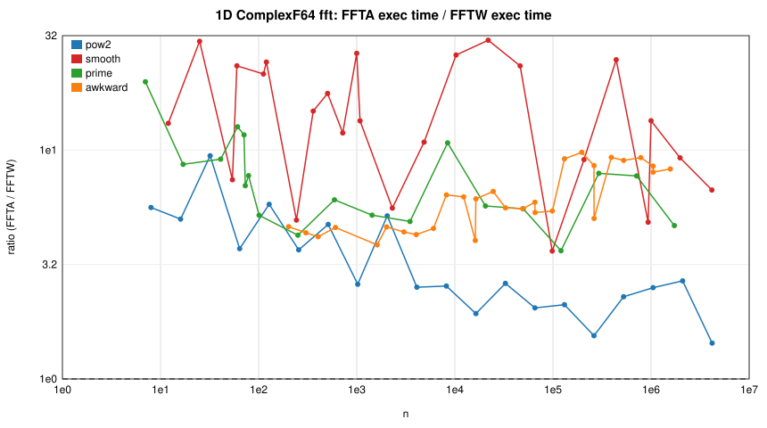
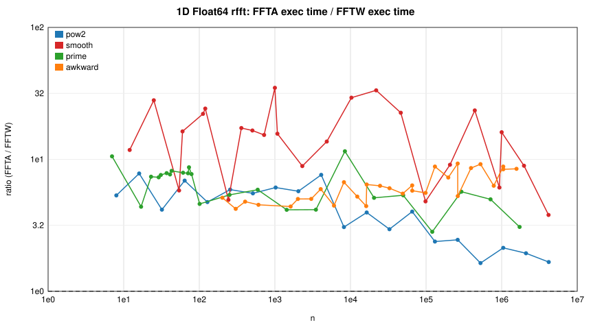
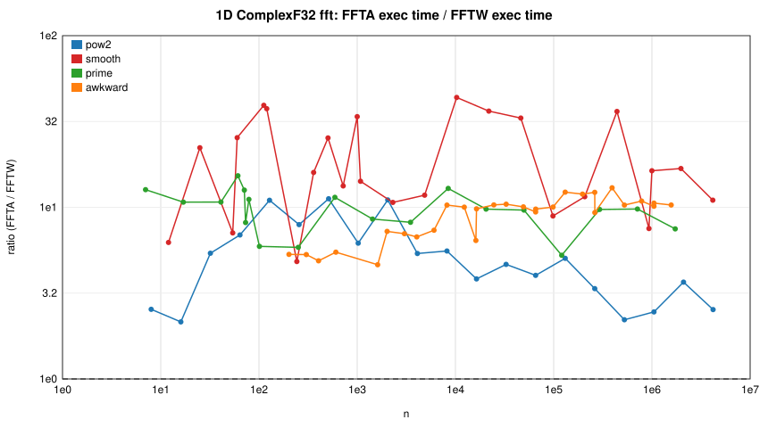
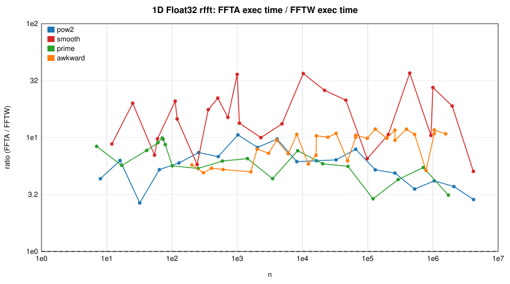
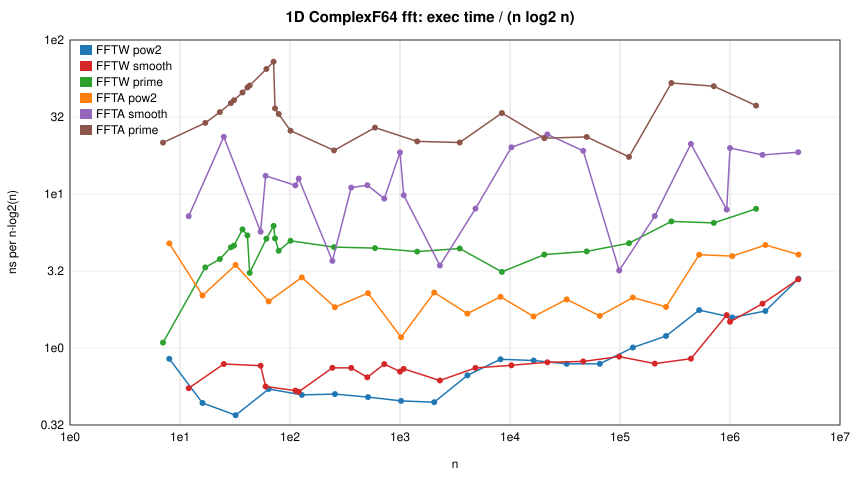
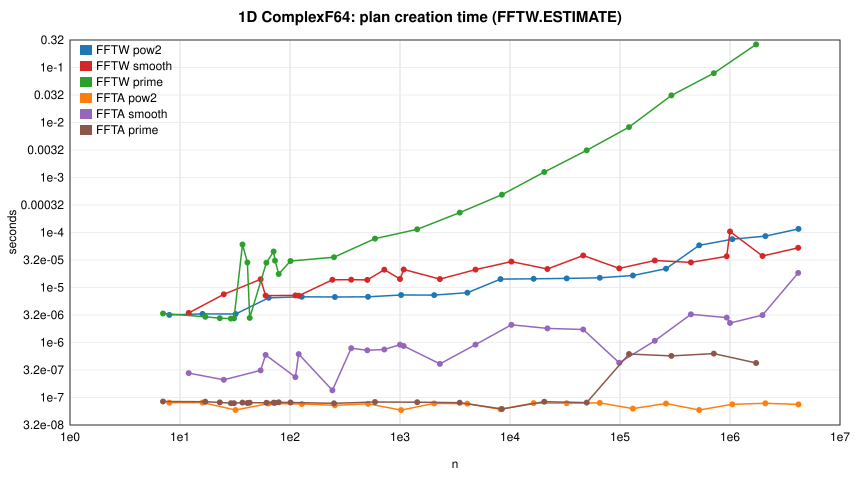

# FFTA.jl vs FFTW.jl benchmark report

Generated 2026-08-29 21:00 UTC by `benchmark/report.jl` from `baseline.json`.

## Environment

| | |
|:--|:--|
| CPU | Intel(R) Core(TM) Ultra 7 165H (alderlake) |
| Architecture | x86_64 |
| Cores | 22 |
| OS | Linux |
| Julia | 1.12.6 |
| Julia threads | 8 |
| FFTA version | 0.3.1 |
| FFTA commit | 73b190c |
| FFTW version | 3.3.11 |
| FFTW provider | fftw |
| Time budget per measurement (s) | 0.5 |
| Run date (UTC) | 2026-08-29T20:12:29.531 |

## Methodology

* Both packages are loaded in one Julia process; FFTA plans are created via
  `invoke` on FFTA's `AbstractFFTs.plan_*` methods (FFTW's more specific
  `StridedArray` methods would otherwise be selected). Every FFTA result is
  compared with FFTW's (`rel. err` = ‖y_FFTA − y_FFTW‖ / ‖y_FFTW‖).
* **exec** = execution of a pre-built plan (`mul!(y, p, x)` where supported;
  if a plan only implements `p * x`, that is timed instead and includes the
  output allocation — see the *FFTA API* column of the allocation table). Times are the **minimum** over samples collected during the
  time budget (batched evals for sub-20 µs calls).
* **plan** = time to construct a plan (FFTW with `FFTW.ESTIMATE`, the
  FFTW.jl default, unless stated otherwise). **cold ratio** = (FFTA plan+exec)
  / (FFTW plan+exec), i.e. the one-shot `fft(x)` cost ratio.
* **exec ratio** = FFTA exec / FFTW exec — values > 1 mean FFTA is slower.
* **alloc/exec** = bytes allocated by one planned execution (`@allocated`).
* FFTW and FFTA are single-threaded (FFTA: one worker) except in the
  *Threading* section, where both are planned with the same thread count
  (FFTA versions with a `num_threads` keyword thread across the pencils of
  multidimensional and batched transforms).
* Size classes: `pow2` = 2^k; `smooth` = 2^a·3^b·5^c·7^d (not a power of 2);
  `prime`; `awkward` = (prime > 73) × small factor. Primes < 73 use FFTA's
  O(n²) DFT leaf, primes ≥ 73 use Bluestein.

## Summary: geometric-mean exec ratio (FFTA / FFTW), single-threaded

| type | pow2 | smooth | prime | awkward | 2D | 3D | batched dim=1 | batched dim=2 |
|:--|--:|--:|--:|--:|--:|--:|--:|--:|
| ComplexF64 fft | 3.09× (1.4–9.4) | 13.14× (3.6–30.2) | 7.10× (3.6–19.9) | 5.98× (3.9–9.8) | 5.77× (1.1–18.1) | 6.98× (4.4–20.8) | 3.18× (1.8–7.3) | 1.89× (1.3–3.3) |
| ComplexF32 fft | 4.68× (2.1–11.2) | 16.80× (4.8–43.7) | 9.42× (5.3–15.3) | 8.66× (4.6–13.0) | 5.22× (1.0–16.3) | 11.61× (9.1–17.5) | 6.47× (3.7–10.3) | 2.22× (1.2–10.9) |
| Float64 rfft | 3.83× (1.6–7.8) | 13.67× (3.8–34.9) | 5.77× (2.8–11.5) | 6.09× (4.2–9.3) | 14.86× (6.3–45.6) | ✗ unsupported | 6.86× (4.0–9.1) | 2.41× (1.1–9.0) |
| Float32 rfft | 5.54× (2.7–10.6) | 14.75× (5.1–36.8) | 6.08× (2.9–9.9) | 8.37× (4.9–11.9) | 14.13× (8.5–20.1) | ✗ unsupported | 7.86× (5.2–9.9) | 2.62× (1.0–8.9) |

Cells are `geomean (min–max)`. ✗ = FFTA threw (unsupported).

## Ratio plots (single-threaded, planned execution)

## 1D transforms

<b>1D ComplexF64 fft</b> (92 sizes)

| n | class | FFTW exec | FFTA exec | **exec ratio** | FFTW plan | FFTA plan | cold ratio | FFTA alloc/exec | rel. err |
|--:|:--|--:|--:|--:|--:|--:|--:|--:|--:|
| 7 | prime | 21 ns | 424 ns | **19.89×** | 3.36 µs | 85 ns | 0.15× | 0 | 4.2e-16 |
| 8 | pow2 | 20 ns | 115 ns | **5.61×** | 3.17 µs | 81 ns | 0.06× | 0 | 8.7e-17 |
| 12 | smooth | 24 ns | 309 ns | **13.09×** | 3.45 µs | 278 ns | 0.17× | 0 | 1.9e-16 |
| 16 | pow2 | 28 ns | 140 ns | **4.99×** | 3.31 µs | 81 ns | 0.07× | 0 | 1.9e-16 |
| 17 | prime | 232 ns | 2.01 µs | **8.67×** | 2.93 µs | 84 ns | 0.56× | 0 | 2.2e-15 |
| 25 | smooth | 91 ns | 2.73 µs | **29.89×** | 7.53 µs | 210 ns | 0.28× | 0 | 8.1e-16 |
| 32 | pow2 | 59 ns | 554 ns | **9.45×** | 3.29 µs | 59 ns | 0.20× | 0 | 2.2e-16 |
| 41 | prime | 1.18 µs | 10.79 µs | **9.13×** | 28.43 µs | 80 ns | 0.33× | 0 | 3.8e-15 |
| 54 | smooth | 238 ns | 1.77 µs | **7.42×** | 14.13 µs | 311 ns | 0.15× | 0 | 5.2e-16 |
| 60 | smooth | 199 ns | 4.65 µs | **23.34×** | 7.12 µs | 595 ns | 0.74× | 0 | 7.0e-16 |
| 61 | prime | 1.85 µs | 23.44 µs | **12.65×** | 28.29 µs | 80 ns | 0.86× | 0 | 6.2e-15 |
| 64 | pow2 | 208 ns | 771 ns | **3.71×** | 6.50 µs | 78 ns | 0.13× | 0 | 3.1e-16 |
| 71 | prime | 2.71 µs | 31.57 µs | **11.66×** | 45.08 µs | 80 ns | 0.66× | 0 | 6.2e-15 |
| 73 | prime | 2.33 µs | 16.26 µs | **6.99×** | 30.84 µs | 80 ns | 0.45× | 12.2 KiB | 5.9e-16 |
| 79 | prime | 2.13 µs | 16.47 µs | **7.73×** | 17.61 µs | 82 ns | 0.84× | 12.2 KiB | 6.2e-16 |
| 101 | prime | 3.34 µs | 17.34 µs | **5.19×** | 30.39 µs | 81 ns | 0.73× | 12.2 KiB | 6.0e-16 |
| 112 | smooth | 403 ns | 8.67 µs | **21.50×** | 7.18 µs | 235 ns | 1.16× | 0 | 5.9e-16 |
| 120 | smooth | 431 ns | 10.44 µs | **24.24×** | 7.11 µs | 614 ns | 1.43× | 0 | 7.2e-16 |
| 128 | pow2 | 444 ns | 2.58 µs | **5.80×** | 6.76 µs | 76 ns | 0.36× | 0 | 2.9e-16 |
| 202 | awkward | 6.92 µs | 32.04 µs | **4.63×** | 39.70 µs | 297 ns | 0.63× | 12.2 KiB | 6.1e-16 |
| 243 | smooth | 1.43 µs | 7.08 µs | **4.95×** | 13.80 µs | 135 ns | 0.43× | 0 | 4.6e-16 |
| 251 | prime | 9.04 µs | 38.42 µs | **4.25×** | 35.49 µs | 79 ns | 1.00× | 24.2 KiB | 8.5e-16 |
| 256 | pow2 | 1.03 µs | 3.77 µs | **3.66×** | 6.72 µs | 72 ns | 0.35× | 0 | 3.2e-16 |
| 303 | awkward | 10.45 µs | 45.47 µs | **4.35×** | 39.44 µs | 427 ns | 0.88× | 12.2 KiB | 7.2e-16 |
| 360 | smooth | 2.27 µs | 33.62 µs | **14.80×** | 13.88 µs | 789 ns | 1.96× | 0 | 7.4e-16 |
| 404 | awkward | 13.90 µs | 58.11 µs | **4.18×** | 40.05 µs | 316 ns | 1.07× | 12.2 KiB | 6.5e-16 |
| 504 | smooth | 2.92 µs | 51.62 µs | **17.68×** | 13.76 µs | 721 ns | 3.84× | 0 | 7.8e-16 |
| 512 | pow2 | 2.21 µs | 10.47 µs | **4.73×** | 6.78 µs | 77 ns | 1.20× | 0 | 4.0e-16 |
| 593 | prime | 24.32 µs | 147.41 µs | **6.06×** | 77.47 µs | 83 ns | 1.87× | 96.2 KiB | 1.2e-15 |
| 606 | awkward | 21.42 µs | 98.32 µs | **4.59×** | 48.48 µs | 941 ns | 1.38× | 24.4 KiB | 7.6e-16 |
| 720 | smooth | 5.37 µs | 63.78 µs | **11.88×** | 21.03 µs | 746 ns | 2.19× | 0 | 7.9e-16 |
| 1000 | smooth | 7.00 µs | 185.52 µs | **26.49×** | 14.25 µs | 913 ns | 7.81× | 0 | 1.1e-15 |
| 1024 | pow2 | 4.64 µs | 12.04 µs | **2.59×** | 7.30 µs | 59 ns | 0.94× | 0 | 4.9e-16 |
| 1080 | smooth | 7.96 µs | 106.86 µs | **13.43×** | 21.26 µs | 863 ns | 3.27× | 0 | 8.4e-16 |
| 1433 | prime | 63.52 µs | 330.12 µs | **5.20×** | 114.29 µs | 82 ns | 1.83× | 192.2 KiB | 1.5e-15 |
| 1616 | awkward | 58.66 µs | 226.16 µs | **3.86×** | 40.60 µs | 306 ns | 2.25× | 12.2 KiB | 7.1e-16 |
| 2018 | awkward | 86.47 µs | 399.04 µs | **4.61×** | 92.99 µs | 322 ns | 2.18× | 96.2 KiB | 1.3e-15 |
| 2048 | pow2 | 10.01 µs | 51.64 µs | **5.16×** | 7.28 µs | 78 ns | 2.72× | 0 | 6.5e-16 |
| 2304 | smooth | 15.83 µs | 88.32 µs | **5.58×** | 14.23 µs | 408 ns | 2.76× | 0 | 5.1e-16 |
| 3027 | awkward | 131.60 µs | 577.89 µs | **4.39×** | 93.41 µs | 461 ns | 2.53× | 96.2 KiB | 1.2e-15 |
| 3491 | prime | 181.90 µs | 886.75 µs | **4.87×** | 230.33 µs | 80 ns | 2.16× | 384.2 KiB | 1.7e-15 |
| 4036 | awkward | 174.98 µs | 747.59 µs | **4.27×** | 78.07 µs | 334 ns | 2.67× | 96.2 KiB | 1.4e-15 |
| 4096 | pow2 | 32.69 µs | 82.27 µs | **2.52×** | 8.06 µs | 77 ns | 1.88× | 0 | 9.4e-16 |
| 4860 | smooth | 44.20 µs | 478.81 µs | **10.83×** | 21.12 µs | 915 ns | 6.97× | 0 | 1.1e-15 |
| 6054 | awkward | 270.12 µs | 1.228 ms | **4.55×** | 102.46 µs | 827 ns | 3.25× | 192.4 KiB | 1.3e-15 |
| 8192 | pow2 | 89.98 µs | 229.14 µs | **2.55×** | 14.23 µs | 61 ns | 2.08× | 0 | 9.9e-16 |
| 8198 | awkward | 418.55 µs | 2.666 ms | **6.37×** | 280.58 µs | 316 ns | 3.79× | 768.2 KiB | 2.6e-15 |
| 8443 | prime | 343.70 µs | 3.696 ms | **10.75×** | 487.62 µs | 62 ns | 4.04× | 1.50 MiB | 2.7e-15 |
| 10290 | smooth | 105.93 µs | 2.758 ms | **26.03×** | 29.53 µs | 2.10 µs | 20.48× | 0 | 1.6e-15 |
| 12297 | awkward | 633.88 µs | 3.958 ms | **6.24×** | 280.32 µs | 459 ns | 4.28× | 768.2 KiB | 2.9e-15 |
| 16144 | awkward | 739.35 µs | 2.977 ms | **4.03×** | 93.73 µs | 311 ns | 3.48× | 96.2 KiB | 1.4e-15 |
| 16384 | pow2 | 190.29 µs | 367.40 µs | **1.93×** | 14.41 µs | 79 ns | 1.74× | 0 | 1.6e-15 |
| 16396 | awkward | 845.14 µs | 5.175 ms | **6.12×** | 280.94 µs | 310 ns | 4.42× | 768.2 KiB | 2.6e-15 |
| 20507 | prime | 1.187 ms | 6.762 ms | **5.70×** | 1.261 ms | 84 ns | 2.70× | 3.00 MiB | 6.1e-15 |
| 21875 | smooth | 254.51 µs | 7.692 ms | **30.22×** | 21.67 µs | 1.80 µs | 27.36× | 0 | 1.7e-15 |
| 24594 | awkward | 1.305 ms | 8.609 ms | **6.60×** | 280.95 µs | 822 ns | 5.25× | 1.50 MiB | 4.4e-15 |
| 32768 | pow2 | 388.31 µs | 1.016 ms | **2.62×** | 14.64 µs | 79 ns | 2.41× | 0 | 1.7e-15 |
| 32822 | awkward | 2.280 ms | 12.749 ms | **5.59×** | 1.147 ms | 346 ns | 3.70× | 3.00 MiB | 6.0e-15 |
| 46305 | smooth | 587.12 µs | 13.700 ms | **23.33×** | 38.23 µs | 1.72 µs | 20.66× | 0 | 1.9e-15 |
| 49233 | awkward | 3.439 ms | 19.074 ms | **5.55×** | 1.160 ms | 484 ns | 3.97× | 3.00 MiB | 6.8e-15 |
| 49757 | prime | 3.290 ms | 18.221 ms | **5.54×** | 3.125 ms | 81 ns | 3.04× | 6.00 MiB | 7.6e-15 |
| 65536 | pow2 | 828.47 µs | 1.693 ms | **2.04×** | 14.98 µs | 80 ns | 1.96× | 0 | 3.8e-15 |
| 65584 | awkward | 3.668 ms | 21.710 ms | **5.92×** | 279.48 µs | 620 ns | 4.78× | 768.2 KiB | 2.8e-15 |
| 65644 | awkward | 4.689 ms | 25.017 ms | **5.34×** | 1.162 ms | 587 ns | 3.60× | 3.00 MiB | 6.1e-15 |
| 98304 | smooth | 1.434 ms | 5.196 ms | **3.62×** | 22.21 µs | 428 ns | 3.55× | 0 | 1.7e-15 |
| 98466 | awkward | 7.248 ms | 39.293 ms | **5.42×** | 1.162 ms | 1.17 µs | 4.69× | 6.00 MiB | 7.5e-15 |
| 120779 | prime | 9.772 ms | 35.513 ms | **3.63×** | 8.261 ms | 618 ns | 2.01× | 12.00 MiB | 1.4e-14 |
| 131072 | pow2 | 2.245 ms | 4.739 ms | **2.11×** | 16.52 µs | 63 ns | 2.10× | 0 | 4.4e-15 |
| 131074 | awkward | 7.384 ms | 67.633 ms | **9.16×** | 1.282 ms | 1.12 µs | 7.25× | 12.00 MiB | 1.4e-14 |
| 196611 | awkward | 10.937 ms | 107.002 ms | **9.78×** | 1.282 ms | 1.09 µs | 9.59× | 12.00 MiB | 1.5e-14 |
| 207360 | smooth | 2.899 ms | 26.350 ms | **9.09×** | 30.95 µs | 1.07 µs | 9.11× | 0 | 1.0e-15 |
| 262144 | pow2 | 5.643 ms | 8.718 ms | **1.55×** | 21.97 µs | 78 ns | 1.46× | 0 | 8.6e-15 |
| 262148 | awkward | 14.799 ms | 126.674 ms | **8.56×** | 1.280 ms | 1.01 µs | 8.90× | 12.00 MiB | 1.5e-14 |
| 262576 | awkward | 20.320 ms | 102.169 ms | **5.03×** | 1.147 ms | 314 ns | 4.53× | 3.00 MiB | 7.0e-15 |
| 293201 | prime | 35.362 ms | 279.948 ms | **7.92×** | 31.087 ms | 570 ns | 4.20× | 48.00 MiB | 2.0e-14 |
| 393222 | awkward | 22.932 ms | 213.164 ms | **9.30×** | 1.287 ms | 2.83 µs | 8.22× | 24.00 MiB | 1.5e-14 |
| 441000 | smooth | 7.043 ms | 174.795 ms | **24.82×** | 28.64 µs | 3.25 µs | 22.10× | 0 | 7.7e-15 |
| 524288 | pow2 | 17.569 ms | 40.172 ms | **2.29×** | 58.49 µs | 59 ns | 2.26× | 0 | 1.1e-14 |
| 524294 | awkward | 60.294 ms | 543.580 ms | **9.02×** | 26.332 ms | 1.20 µs | 6.35× | 48.00 MiB | 2.2e-14 |
| 711749 | prime | 89.887 ms | 693.025 ms | **7.71×** | 78.672 ms | 627 ns | 3.47× | 96.00 MiB | 3.0e-14 |
| 786441 | awkward | 87.340 ms | 809.736 ms | **9.27×** | 25.457 ms | 1.50 µs | 6.98× | 48.00 MiB | 2.2e-14 |
| 933120 | smooth | 30.283 ms | 146.542 ms | **4.84×** | 36.89 µs | 2.84 µs | 5.68× | 0 | 1.9e-15 |
| 1000000 | smooth | 29.492 ms | 396.439 ms | **13.44×** | 104.22 µs | 2.26 µs | 12.50× | 0 | 3.9e-15 |
| 1048576 | pow2 | 33.068 ms | 82.848 ms | **2.51×** | 75.59 µs | 75 ns | 2.32× | 0 | 1.2e-14 |
| 1048588 | awkward | 124.009 ms | 1.055 s | **8.51×** | 25.049 ms | 1.22 µs | 7.24× | 48.00 MiB | 2.1e-14 |
| 1048592 | awkward | 72.207 ms | 577.980 ms | **8.00×** | 1.279 ms | 1.22 µs | 7.79× | 12.00 MiB | 1.5e-14 |
| 1572882 | awkward | 197.212 ms | 1.631 s | **8.27×** | 19.781 ms | 6.19 µs | 7.85× | 96.00 MiB | 2.6e-14 |
| 1727797 | prime | 287.123 ms | 1.343 s | **4.68×** | 263.290 ms | 424 ns | 2.71× | 192.00 MiB | 5.0e-14 |
| 1975680 | smooth | 80.169 ms | 741.758 ms | **9.25×** | 37.34 µs | 3.14 µs | 8.50× | 0 | 3.8e-15 |
| 2097152 | pow2 | 76.624 ms | 205.501 ms | **2.68×** | 85.88 µs | 78 ns | 1.76× | 0 | 1.8e-14 |
| 4167450 | smooth | 255.811 ms | 1.712 s | **6.69×** | 52.65 µs | 18.45 µs | 7.04× | 0 | 1.5e-14 |
| 4194304 | pow2 | 259.974 ms | 372.703 ms | **1.43×** | 116.07 µs | 75 ns | 1.65× | 0 | 2.7e-14 |

<b>1D ComplexF32 fft</b> (92 sizes)

| n | class | FFTW exec | FFTA exec | **exec ratio** | FFTW plan | FFTA plan | cold ratio | FFTA alloc/exec | rel. err |
|--:|:--|--:|--:|--:|--:|--:|--:|--:|--:|
| 7 | prime | 32 ns | 412 ns | **12.67×** | 3.30 µs | 83 ns | 0.15× | 0 | 2.9e-07 |
| 8 | pow2 | 34 ns | 86 ns | **2.55×** | 3.12 µs | 80 ns | 0.06× | 0 | 1.1e-07 |
| 12 | smooth | 40 ns | 250 ns | **6.24×** | 3.43 µs | 280 ns | 0.15× | 0 | 8.6e-08 |
| 16 | pow2 | 62 ns | 134 ns | **2.15×** | 3.29 µs | 81 ns | 0.07× | 0 | 9.9e-08 |
| 17 | prime | 207 ns | 2.22 µs | **10.72×** | 2.97 µs | 78 ns | 0.72× | 0 | 1.5e-06 |
| 25 | smooth | 92 ns | 2.04 µs | **22.23×** | 7.00 µs | 255 ns | 0.32× | 0 | 4.9e-07 |
| 32 | pow2 | 95 ns | 511 ns | **5.40×** | 3.36 µs | 78 ns | 0.14× | 0 | 1.1e-07 |
| 41 | prime | 1.15 µs | 12.34 µs | **10.73×** | 44.11 µs | 81 ns | 0.24× | 0 | 2.4e-06 |
| 54 | smooth | 231 ns | 1.64 µs | **7.10×** | 13.97 µs | 313 ns | 0.13× | 0 | 2.0e-07 |
| 60 | smooth | 148 ns | 3.78 µs | **25.47×** | 7.39 µs | 575 ns | 0.55× | 0 | 3.9e-07 |
| 61 | prime | 1.75 µs | 26.77 µs | **15.27×** | 43.38 µs | 82 ns | 0.52× | 0 | 3.6e-06 |
| 64 | pow2 | 113 ns | 782 ns | **6.90×** | 6.31 µs | 79 ns | 0.13× | 0 | 1.5e-07 |
| 71 | prime | 2.00 µs | 25.21 µs | **12.60×** | 43.86 µs | 81 ns | 0.79× | 0 | 4.5e-06 |
| 73 | prime | 2.01 µs | 16.38 µs | **8.15×** | 28.84 µs | 80 ns | 0.46× | 6.2 KiB | 3.4e-07 |
| 79 | prime | 1.50 µs | 16.73 µs | **11.12×** | 33.42 µs | 83 ns | 0.49× | 6.2 KiB | 3.2e-07 |
| 101 | prime | 3.00 µs | 17.75 µs | **5.92×** | 28.70 µs | 81 ns | 0.36× | 6.2 KiB | 3.6e-07 |
| 112 | smooth | 209 ns | 8.19 µs | **39.28×** | 7.08 µs | 222 ns | 1.09× | 0 | 3.0e-07 |
| 120 | smooth | 222 ns | 8.34 µs | **37.54×** | 6.94 µs | 589 ns | 1.24× | 0 | 3.8e-07 |
| 128 | pow2 | 225 ns | 2.47 µs | **10.99×** | 6.49 µs | 75 ns | 0.34× | 0 | 1.4e-07 |
| 202 | awkward | 6.18 µs | 32.85 µs | **5.32×** | 36.40 µs | 234 ns | 0.78× | 6.2 KiB | 3.4e-07 |
| 243 | smooth | 1.31 µs | 6.33 µs | **4.83×** | 12.94 µs | 136 ns | 0.40× | 0 | 2.2e-07 |
| 251 | prime | 8.30 µs | 48.52 µs | **5.84×** | 63.26 µs | 86 ns | 0.64× | 12.2 KiB | 4.1e-07 |
| 256 | pow2 | 358 ns | 2.84 µs | **7.92×** | 6.90 µs | 79 ns | 0.51× | 0 | 1.7e-07 |
| 303 | awkward | 8.82 µs | 46.80 µs | **5.30×** | 35.36 µs | 417 ns | 0.98× | 6.2 KiB | 4.0e-07 |
| 360 | smooth | 1.65 µs | 26.40 µs | **15.96×** | 14.31 µs | 705 ns | 1.56× | 0 | 3.8e-07 |
| 404 | awkward | 12.35 µs | 60.20 µs | **4.88×** | 35.73 µs | 310 ns | 1.16× | 6.2 KiB | 3.8e-07 |
| 504 | smooth | 1.88 µs | 47.61 µs | **25.37×** | 14.08 µs | 696 ns | 2.76× | 0 | 4.2e-07 |
| 512 | pow2 | 1.02 µs | 11.45 µs | **11.21×** | 6.97 µs | 79 ns | 1.59× | 0 | 2.1e-07 |
| 593 | prime | 16.80 µs | 192.13 µs | **11.43×** | 68.96 µs | 80 ns | 2.24× | 48.2 KiB | 7.1e-07 |
| 606 | awkward | 18.51 µs | 101.48 µs | **5.48×** | 38.01 µs | 849 ns | 1.79× | 12.4 KiB | 4.6e-07 |
| 720 | smooth | 3.86 µs | 51.40 µs | **13.32×** | 21.16 µs | 714 ns | 1.63× | 0 | 3.7e-07 |
| 1000 | smooth | 4.25 µs | 143.48 µs | **33.76×** | 14.36 µs | 832 ns | 6.98× | 0 | 5.8e-07 |
| 1024 | pow2 | 2.22 µs | 13.72 µs | **6.18×** | 6.87 µs | 79 ns | 1.86× | 0 | 4.2e-07 |
| 1080 | smooth | 5.95 µs | 84.44 µs | **14.19×** | 21.00 µs | 757 ns | 2.87× | 0 | 3.6e-07 |
| 1433 | prime | 40.84 µs | 348.88 µs | **8.54×** | 85.76 µs | 83 ns | 2.70× | 96.2 KiB | 9.2e-07 |
| 1616 | awkward | 50.88 µs | 235.53 µs | **4.63×** | 44.04 µs | 309 ns | 2.34× | 6.2 KiB | 3.9e-07 |
| 2018 | awkward | 55.22 µs | 399.54 µs | **7.24×** | 74.43 µs | 324 ns | 3.10× | 48.2 KiB | 7.6e-07 |
| 2048 | pow2 | 4.74 µs | 52.38 µs | **11.04×** | 7.54 µs | 78 ns | 3.72× | 0 | 4.3e-07 |
| 2304 | smooth | 8.03 µs | 85.73 µs | **10.68×** | 14.55 µs | 398 ns | 2.87× | 0 | 2.6e-07 |
| 3027 | awkward | 82.84 µs | 581.16 µs | **7.02×** | 74.65 µs | 458 ns | 3.63× | 48.2 KiB | 7.9e-07 |
| 3491 | prime | 112.34 µs | 918.97 µs | **8.18×** | 118.06 µs | 82 ns | 3.38× | 192.2 KiB | 1.2e-06 |
| 4036 | awkward | 111.32 µs | 748.24 µs | **6.72×** | 75.08 µs | 316 ns | 4.00× | 48.2 KiB | 8.1e-07 |
| 4096 | pow2 | 12.21 µs | 65.75 µs | **5.38×** | 8.07 µs | 78 ns | 2.97× | 0 | 5.5e-07 |
| 4860 | smooth | 32.87 µs | 386.62 µs | **11.76×** | 28.61 µs | 963 ns | 5.80× | 0 | 4.2e-07 |
| 6054 | awkward | 167.37 µs | 1.230 ms | **7.35×** | 75.25 µs | 840 ns | 4.99× | 96.4 KiB | 9.9e-07 |
| 8192 | pow2 | 43.89 µs | 244.16 µs | **5.56×** | 14.48 µs | 80 ns | 3.88× | 0 | 7.0e-07 |
| 8198 | awkward | 283.77 µs | 2.925 ms | **10.31×** | 208.80 µs | 329 ns | 5.85× | 384.2 KiB | 1.3e-06 |
| 8443 | prime | 297.45 µs | 3.835 ms | **12.89×** | 312.18 µs | 83 ns | 6.28× | 768.2 KiB | 2.0e-06 |
| 10290 | smooth | 61.41 µs | 2.682 ms | **43.68×** | 20.22 µs | 2.12 µs | 27.65× | 0 | 1.2e-06 |
| 12297 | awkward | 429.57 µs | 4.306 ms | **10.02×** | 209.47 µs | 433 ns | 6.61× | 384.2 KiB | 1.6e-06 |
| 16144 | awkward | 464.81 µs | 2.977 ms | **6.41×** | 83.71 µs | 294 ns | 5.46× | 48.2 KiB | 9.3e-07 |
| 16384 | pow2 | 108.88 µs | 416.70 µs | **3.83×** | 14.46 µs | 80 ns | 3.31× | 0 | 8.0e-07 |
| 16396 | awkward | 576.52 µs | 5.648 ms | **9.80×** | 207.19 µs | 332 ns | 6.97× | 384.2 KiB | 1.3e-06 |
| 20507 | prime | 754.07 µs | 7.360 ms | **9.76×** | 636.88 µs | 82 ns | 5.05× | 1.50 MiB | 2.1e-06 |
| 21875 | smooth | 172.47 µs | 6.269 ms | **36.35×** | 28.83 µs | 1.60 µs | 29.99× | 0 | 8.3e-07 |
| 24594 | awkward | 864.56 µs | 8.933 ms | **10.33×** | 207.36 µs | 825 ns | 8.07× | 768.4 KiB | 1.8e-06 |
| 32768 | pow2 | 232.13 µs | 1.080 ms | **4.65×** | 14.66 µs | 77 ns | 4.30× | 0 | 1.2e-06 |
| 32822 | awkward | 1.329 ms | 13.864 ms | **10.43×** | 596.86 µs | 328 ns | 7.07× | 1.50 MiB | 2.5e-06 |
| 46305 | smooth | 368.44 µs | 12.199 ms | **33.11×** | 29.07 µs | 1.33 µs | 30.80× | 0 | 8.6e-07 |
| 49233 | awkward | 2.051 ms | 20.628 ms | **10.06×** | 590.74 µs | 431 ns | 6.83× | 1.50 MiB | 2.6e-06 |
| 49757 | prime | 1.978 ms | 19.049 ms | **9.63×** | 1.528 ms | 81 ns | 5.40× | 3.00 MiB | 3.0e-06 |
| 65536 | pow2 | 474.25 µs | 1.905 ms | **4.02×** | 14.88 µs | 79 ns | 3.76× | 0 | 1.2e-06 |
| 65584 | awkward | 2.415 ms | 22.711 ms | **9.40×** | 216.71 µs | 338 ns | 8.53× | 384.2 KiB | 1.4e-06 |
| 65644 | awkward | 2.771 ms | 27.043 ms | **9.76×** | 594.26 µs | 321 ns | 7.88× | 1.50 MiB | 2.2e-06 |
| 98304 | smooth | 531.62 µs | 4.733 ms | **8.90×** | 22.45 µs | 497 ns | 6.19× | 0 | 1.2e-06 |
| 98466 | awkward | 4.218 ms | 42.337 ms | **10.04×** | 594.61 µs | 856 ns | 8.77× | 3.00 MiB | 2.7e-06 |
| 120779 | prime | 7.126 ms | 37.447 ms | **5.25×** | 4.979 ms | 615 ns | 3.06× | 6.00 MiB | 2.3e-06 |
| 131072 | pow2 | 985.65 µs | 4.970 ms | **5.04×** | 16.44 µs | 78 ns | 4.72× | 0 | 1.6e-06 |
| 131074 | awkward | 5.367 ms | 65.791 ms | **12.26×** | 1.289 ms | 794 ns | 10.37× | 6.00 MiB | 2.4e-06 |
| 196611 | awkward | 8.239 ms | 98.365 ms | **11.94×** | 1.296 ms | 1.41 µs | 10.34× | 6.00 MiB | 2.3e-06 |
| 207360 | smooth | 1.894 ms | 21.841 ms | **11.53×** | 35.99 µs | 1.31 µs | 10.98× | 0 | 5.3e-07 |
| 262144 | pow2 | 2.794 ms | 9.382 ms | **3.36×** | 22.49 µs | 62 ns | 3.31× | 0 | 1.4e-06 |
| 262148 | awkward | 10.907 ms | 133.321 ms | **12.22×** | 1.298 ms | 787 ns | 9.52× | 6.00 MiB | 2.4e-06 |
| 262576 | awkward | 12.178 ms | 113.471 ms | **9.32×** | 604.78 µs | 416 ns | 8.55× | 1.50 MiB | 2.4e-06 |
| 293201 | prime | 23.120 ms | 224.641 ms | **9.72×** | 15.000 ms | 566 ns | 4.15× | 24.00 MiB | 1.2e-05 |
| 393222 | awkward | 16.814 ms | 218.476 ms | **12.99×** | 1.297 ms | 2.78 µs | 11.22× | 12.00 MiB | 2.8e-06 |
| 441000 | smooth | 3.873 ms | 140.123 ms | **36.18×** | 29.07 µs | 3.37 µs | 36.54× | 0 | 1.8e-06 |
| 524288 | pow2 | 10.765 ms | 23.818 ms | **2.21×** | 60.02 µs | 78 ns | 2.17× | 0 | 2.2e-06 |
| 524294 | awkward | 32.834 ms | 338.365 ms | **10.31×** | 10.084 ms | 1.58 µs | 8.18× | 24.00 MiB | 1.2e-05 |
| 711749 | prime | 69.191 ms | 676.729 ms | **9.78×** | 48.908 ms | 628 ns | 5.12× | 48.00 MiB | 7.6e-05 |
| 786441 | awkward | 49.989 ms | 543.521 ms | **10.87×** | 10.016 ms | 1.48 µs | 8.72× | 24.00 MiB | 1.3e-05 |
| 933120 | smooth | 14.478 ms | 108.923 ms | **7.52×** | 37.73 µs | 1.41 µs | 6.92× | 0 | 9.7e-07 |
| 1000000 | smooth | 20.246 ms | 330.448 ms | **16.32×** | 102.51 µs | 2.41 µs | 15.95× | 0 | 2.0e-06 |
| 1048576 | pow2 | 23.904 ms | 58.732 ms | **2.46×** | 76.09 µs | 80 ns | 2.07× | 0 | 6.9e-06 |
| 1048588 | awkward | 68.810 ms | 698.208 ms | **10.15×** | 10.261 ms | 1.61 µs | 7.61× | 24.00 MiB | 1.4e-05 |
| 1048592 | awkward | 51.726 ms | 547.497 ms | **10.58×** | 1.298 ms | 1.19 µs | 11.24× | 6.00 MiB | 3.0e-06 |
| 1572882 | awkward | 112.451 ms | 1.160 s | **10.32×** | 10.161 ms | 4.16 µs | 8.20× | 48.00 MiB | 4.2e-05 |
| 1727797 | prime | 176.422 ms | 1.321 s | **7.49×** | 114.072 ms | 679 ns | 4.45× | 96.00 MiB | 2.2e-04 |
| 1975680 | smooth | 40.112 ms | 674.741 ms | **16.82×** | 36.82 µs | 2.77 µs | 12.14× | 0 | 2.5e-06 |
| 2097152 | pow2 | 54.934 ms | 201.429 ms | **3.67×** | 84.29 µs | 78 ns | 3.40× | 0 | 4.8e-05 |
| 4167450 | smooth | 139.594 ms | 1.535 s | **11.00×** | 44.77 µs | 4.16 µs | 9.96× | 0 | 1.6e-04 |
| 4194304 | pow2 | 156.278 ms | 396.368 ms | **2.54×** | 116.15 µs | 79 ns | 2.27× | 0 | 1.3e-04 |

<b>1D Float64 rfft</b> (92 sizes)

| n | class | FFTW exec | FFTA exec | **exec ratio** | FFTW plan | FFTA plan | cold ratio | FFTA alloc/exec | rel. err |
|--:|:--|--:|--:|--:|--:|--:|--:|--:|--:|
| 7 | prime | 25 ns | 263 ns | **10.54×** | 3.29 µs | 6.07 µs | 1.88× | 304 B | 3.8e-16 |
| 8 | pow2 | 24 ns | 130 ns | **5.33×** | 3.06 µs | 6.02 µs | 1.94× | 144 B | 1.7e-16 |
| 12 | smooth | 29 ns | 336 ns | **11.78×** | 3.49 µs | 4.88 µs | 1.87× | 176 B | 1.5e-16 |
| 16 | pow2 | 34 ns | 262 ns | **7.82×** | 3.08 µs | 6.10 µs | 2.02× | 208 B | 1.3e-16 |
| 17 | prime | 227 ns | 993 ns | **4.38×** | 9.17 µs | 6.13 µs | 0.76× | 544 B | 1.3e-15 |
| 25 | smooth | 82 ns | 2.30 µs | **28.03×** | 3.44 µs | 6.33 µs | 2.39× | 752 B | 8.0e-16 |
| 32 | pow2 | 75 ns | 313 ns | **4.16×** | 12.50 µs | 6.10 µs | 0.42× | 336 B | 2.2e-16 |
| 41 | prime | 636 ns | 4.89 µs | **7.69×** | 9.22 µs | 6.03 µs | 1.12× | 1.1 KiB | 3.1e-15 |
| 54 | smooth | 143 ns | 833 ns | **5.81×** | 17.45 µs | 6.13 µs | 0.38× | 528 B | 4.0e-16 |
| 60 | smooth | 164 ns | 2.67 µs | **16.30×** | 25.80 µs | 6.73 µs | 0.33× | 576 B | 6.8e-16 |
| 61 | prime | 1.32 µs | 10.48 µs | **7.92×** | 9.11 µs | 6.08 µs | 1.60× | 1.6 KiB | 5.2e-15 |
| 64 | pow2 | 127 ns | 875 ns | **6.90×** | 10.45 µs | 6.09 µs | 0.46× | 608 B | 2.7e-16 |
| 71 | prime | 1.80 µs | 14.09 µs | **7.84×** | 9.52 µs | 6.10 µs | 1.77× | 1.8 KiB | 4.4e-15 |
| 73 | prime | 1.86 µs | 16.21 µs | **8.71×** | 9.15 µs | 5.98 µs | 1.98× | 14.1 KiB | 5.6e-16 |
| 79 | prime | 2.14 µs | 16.53 µs | **7.73×** | 9.36 µs | 6.08 µs | 2.02× | 14.3 KiB | 5.2e-16 |
| 101 | prime | 3.55 µs | 16.31 µs | **4.60×** | 9.31 µs | 6.09 µs | 2.40× | 14.9 KiB | 6.2e-16 |
| 112 | smooth | 231 ns | 5.10 µs | **22.12×** | 20.78 µs | 6.16 µs | 0.50× | 1.0 KiB | 6.3e-16 |
| 120 | smooth | 209 ns | 5.08 µs | **24.25×** | 13.95 µs | 6.65 µs | 0.80× | 1.0 KiB | 7.4e-16 |
| 128 | pow2 | 239 ns | 1.14 µs | **4.75×** | 13.99 µs | 6.06 µs | 0.53× | 1.1 KiB | 3.2e-16 |
| 202 | awkward | 3.52 µs | 17.98 µs | **5.12×** | 41.92 µs | 6.06 µs | 0.49× | 14.0 KiB | 6.6e-16 |
| 243 | smooth | 1.46 µs | 7.20 µs | **4.93×** | 41.08 µs | 6.08 µs | 0.29× | 5.9 KiB | 4.8e-16 |
| 251 | prime | 9.08 µs | 48.89 µs | **5.38×** | 202.28 µs | 4.98 µs | 0.26× | 30.3 KiB | 8.6e-16 |
| 256 | pow2 | 511 ns | 3.02 µs | **5.90×** | 36.63 µs | 6.03 µs | 0.24× | 2.1 KiB | 3.1e-16 |
| 303 | awkward | 10.91 µs | 45.98 µs | **4.21×** | 28.23 µs | 6.50 µs | 1.29× | 19.5 KiB | 6.3e-16 |
| 360 | smooth | 938 ns | 16.21 µs | **17.28×** | 33.68 µs | 6.98 µs | 0.59× | 2.9 KiB | 7.3e-16 |
| 404 | awkward | 7.04 µs | 33.63 µs | **4.78×** | 48.57 µs | 6.39 µs | 0.72× | 15.5 KiB | 6.0e-16 |
| 504 | smooth | 1.50 µs | 24.76 µs | **16.55×** | 28.96 µs | 7.03 µs | 0.93× | 4.1 KiB | 8.7e-16 |
| 512 | pow2 | 901 ns | 4.98 µs | **5.53×** | 37.64 µs | 6.08 µs | 0.27× | 4.1 KiB | 4.4e-16 |
| 593 | prime | 33.25 µs | 195.64 µs | **5.88×** | 125.03 µs | 4.74 µs | 1.26× | 110.4 KiB | 1.1e-15 |
| 606 | awkward | 10.57 µs | 47.80 µs | **4.52×** | 47.02 µs | 6.54 µs | 0.90× | 17.0 KiB | 7.3e-16 |
| 720 | smooth | 2.36 µs | 36.19 µs | **15.31×** | 41.90 µs | 6.91 µs | 0.89× | 5.8 KiB | 7.9e-16 |
| 1000 | smooth | 2.58 µs | 90.12 µs | **34.87×** | 34.12 µs | 7.17 µs | 2.41× | 7.9 KiB | 1.2e-15 |
| 1024 | pow2 | 1.81 µs | 11.08 µs | **6.11×** | 28.46 µs | 4.16 µs | 0.49× | 8.1 KiB | 4.9e-16 |
| 1080 | smooth | 3.27 µs | 51.21 µs | **15.64×** | 42.65 µs | 7.18 µs | 1.18× | 8.6 KiB | 8.8e-16 |
| 1433 | prime | 80.49 µs | 333.80 µs | **4.15×** | 256.63 µs | 5.19 µs | 1.48× | 226.0 KiB | 1.5e-15 |
| 1616 | awkward | 28.49 µs | 125.08 µs | **4.39×** | 48.17 µs | 6.50 µs | 1.69× | 25.0 KiB | 7.4e-16 |
| 2018 | awkward | 43.29 µs | 216.83 µs | **5.01×** | 96.76 µs | 6.06 µs | 1.58× | 112.1 KiB | 1.2e-15 |
| 2048 | pow2 | 3.76 µs | 21.58 µs | **5.74×** | 36.80 µs | 6.09 µs | 0.61× | 16.1 KiB | 6.4e-16 |
| 2304 | smooth | 7.16 µs | 63.68 µs | **8.90×** | 30.38 µs | 6.63 µs | 1.75× | 18.1 KiB | 8.6e-16 |
| 3027 | awkward | 115.65 µs | 580.19 µs | **5.02×** | 216.94 µs | 5.74 µs | 1.72× | 167.4 KiB | 1.2e-15 |
| 3491 | prime | 216.32 µs | 899.29 µs | **4.16×** | 335.15 µs | 5.64 µs | 1.63× | 466.2 KiB | 1.7e-15 |
| 4036 | awkward | 69.29 µs | 412.40 µs | **5.95×** | 101.70 µs | 6.50 µs | 2.21× | 127.8 KiB | 1.4e-15 |
| 4096 | pow2 | 8.41 µs | 64.22 µs | **7.63×** | 43.18 µs | 6.06 µs | 1.30× | 32.1 KiB | 9.7e-16 |
| 4860 | smooth | 18.98 µs | 258.87 µs | **13.64×** | 41.00 µs | 7.18 µs | 4.09× | 38.1 KiB | 1.2e-15 |
| 6054 | awkward | 133.87 µs | 597.02 µs | **4.46×** | 101.97 µs | 6.65 µs | 2.57× | 143.6 KiB | 1.3e-15 |
| 8192 | pow2 | 31.73 µs | 97.31 µs | **3.07×** | 45.11 µs | 6.06 µs | 1.19× | 64.1 KiB | 1.2e-15 |
| 8198 | awkward | 210.20 µs | 1.412 ms | **6.72×** | 283.85 µs | 6.09 µs | 2.86× | 832.3 KiB | 2.5e-15 |
| 8443 | prime | 330.53 µs | 3.804 ms | **11.51×** | 204.22 µs | 6.10 µs | 4.56× | 1.69 MiB | 2.7e-15 |
| 10290 | smooth | 48.30 µs | 1.418 ms | **29.35×** | 36.72 µs | 7.98 µs | 15.33× | 80.5 KiB | 1.7e-15 |
| 12297 | awkward | 758.60 µs | 3.963 ms | **5.22×** | 298.03 µs | 6.59 µs | 3.69× | 1.03 MiB | 2.8e-15 |
| 16144 | awkward | 358.69 µs | 1.587 ms | **4.42×** | 99.69 µs | 6.51 µs | 3.42× | 222.5 KiB | 1.7e-15 |
| 16384 | pow2 | 70.02 µs | 277.15 µs | **3.96×** | 45.28 µs | 6.07 µs | 2.24× | 128.1 KiB | 1.2e-15 |
| 16396 | awkward | 426.11 µs | 2.748 ms | **6.45×** | 287.27 µs | 6.50 µs | 3.82× | 896.4 KiB | 3.0e-15 |
| 20507 | prime | 1.304 ms | 6.664 ms | **5.11×** | 273.10 µs | 4.55 µs | 4.33× | 3.47 MiB | 5.9e-15 |
| 21875 | smooth | 214.39 µs | 7.152 ms | **33.36×** | 68.86 µs | 8.02 µs | 21.82× | 512.9 KiB | 1.7e-15 |
| 24594 | awkward | 637.14 µs | 4.014 ms | **6.30×** | 289.68 µs | 6.52 µs | 4.25× | 960.5 KiB | 3.6e-15 |
| 32768 | pow2 | 145.07 µs | 428.92 µs | **2.96×** | 44.67 µs | 6.07 µs | 2.10× | 256.1 KiB | 1.8e-15 |
| 32822 | awkward | 1.111 ms | 6.713 ms | **6.04×** | 1.182 ms | 6.02 µs | 2.85× | 3.25 MiB | 6.0e-15 |
| 46305 | smooth | 511.78 µs | 11.543 ms | **22.56×** | 112.82 µs | 8.27 µs | 18.76× | 1.06 MiB | 1.8e-15 |
| 49233 | awkward | 3.438 ms | 18.901 ms | **5.50×** | 499.28 µs | 6.75 µs | 4.82× | 4.13 MiB | 6.6e-15 |
| 49757 | prime | 3.503 ms | 18.718 ms | **5.34×** | 451.35 µs | 6.10 µs | 4.95× | 7.14 MiB | 7.5e-15 |
| 65536 | pow2 | 297.83 µs | 1.197 ms | **4.02×** | 44.36 µs | 6.09 µs | 3.27× | 512.1 KiB | 3.5e-15 |
| 65584 | awkward | 1.740 ms | 11.041 ms | **6.34×** | 286.74 µs | 6.42 µs | 5.20× | 1.25 MiB | 3.1e-15 |
| 65644 | awkward | 2.276 ms | 13.174 ms | **5.79×** | 1.168 ms | 6.54 µs | 3.64× | 3.50 MiB | 6.1e-15 |
| 98304 | smooth | 509.31 µs | 2.447 ms | **4.81×** | 38.81 µs | 6.71 µs | 4.20× | 768.1 KiB | 3.6e-15 |
| 98466 | awkward | 3.466 ms | 19.319 ms | **5.57×** | 1.170 ms | 6.82 µs | 4.06× | 3.75 MiB | 7.3e-15 |
| 120779 | prime | 13.354 ms | 37.731 ms | **2.83×** | 618.01 µs | 6.64 µs | 2.66× | 14.76 MiB | 1.4e-14 |
| 131072 | pow2 | 827.90 µs | 1.972 ms | **2.38×** | 51.60 µs | 6.07 µs | 2.04× | 1.00 MiB | 5.5e-15 |
| 131074 | awkward | 3.555 ms | 31.339 ms | **8.82×** | 1.282 ms | 6.36 µs | 6.29× | 13.00 MiB | 1.4e-14 |
| 196611 | awkward | 13.124 ms | 95.534 ms | **7.28×** | 1.474 ms | 7.90 µs | 6.61× | 16.50 MiB | 1.5e-14 |
| 207360 | smooth | 1.332 ms | 12.121 ms | **9.10×** | 61.49 µs | 7.78 µs | 7.99× | 1.58 MiB | 9.3e-15 |
| 262144 | pow2 | 2.163 ms | 5.314 ms | **2.46×** | 54.74 µs | 6.08 µs | 2.29× | 2.00 MiB | 6.9e-15 |
| 262148 | awkward | 7.297 ms | 67.847 ms | **9.30×** | 1.292 ms | 7.18 µs | 7.28× | 14.00 MiB | 1.5e-14 |
| 262576 | awkward | 9.762 ms | 51.387 ms | **5.26×** | 1.181 ms | 7.21 µs | 4.03× | 5.00 MiB | 9.8e-15 |
| 293201 | prime | 51.949 ms | 295.235 ms | **5.68×** | 729.38 µs | 6.57 µs | 5.57× | 54.71 MiB | 2.0e-14 |
| 393222 | awkward | 11.100 ms | 95.305 ms | **8.59×** | 1.290 ms | 7.95 µs | 7.53× | 15.00 MiB | 1.5e-14 |
| 441000 | smooth | 3.465 ms | 81.429 ms | **23.50×** | 44.61 µs | 10.34 µs | 19.96× | 3.36 MiB | 1.0e-14 |
| 524288 | pow2 | 5.624 ms | 9.204 ms | **1.64×** | 53.43 µs | 4.43 µs | 1.42× | 4.00 MiB | 1.3e-14 |
| 524294 | awkward | 27.920 ms | 256.825 ms | **9.20×** | 21.204 ms | 6.48 µs | 3.97× | 52.00 MiB | 2.1e-14 |
| 711749 | prime | 154.903 ms | 771.023 ms | **4.98×** | 1.993 ms | 6.63 µs | 5.38× | 112.30 MiB | 3.0e-14 |
| 786441 | awkward | 120.787 ms | 761.796 ms | **6.31×** | 450.43 µs | 9.18 µs | 6.44× | 66.00 MiB | 2.2e-14 |
| 933120 | smooth | 11.419 ms | 69.872 ms | **6.12×** | 46.53 µs | 9.92 µs | 5.53× | 7.12 MiB | 4.3e-15 |
| 1000000 | smooth | 12.986 ms | 208.634 ms | **16.07×** | 81.38 µs | 9.72 µs | 15.49× | 7.63 MiB | 4.8e-15 |
| 1048576 | pow2 | 16.821 ms | 35.917 ms | **2.14×** | 53.56 µs | 6.08 µs | 1.99× | 8.00 MiB | 1.2e-14 |
| 1048588 | awkward | 61.869 ms | 545.868 ms | **8.82×** | 20.601 ms | 8.53 µs | 6.20× | 56.00 MiB | 2.2e-14 |
| 1048592 | awkward | 32.893 ms | 276.458 ms | **8.40×** | 1.286 ms | 8.73 µs | 7.92× | 20.00 MiB | 1.6e-14 |
| 1572882 | awkward | 93.836 ms | 795.696 ms | **8.48×** | 20.096 ms | 9.33 µs | 6.50× | 60.00 MiB | 2.5e-14 |
| 1727797 | prime | 443.742 ms | 1.364 s | **3.07×** | 910.56 µs | 6.64 µs | 2.51× | 231.55 MiB | 5.0e-14 |
| 1975680 | smooth | 41.337 ms | 369.906 ms | **8.95×** | 41.14 µs | 11.82 µs | 8.78× | 15.07 MiB | 1.1e-14 |
| 2097152 | pow2 | 40.433 ms | 78.511 ms | **1.94×** | 54.64 µs | 6.07 µs | 1.80× | 16.00 MiB | 1.7e-14 |
| 4167450 | smooth | 217.623 ms | 824.478 ms | **3.79×** | 125.21 µs | 11.67 µs | 3.78× | 31.80 MiB | 1.5e-14 |
| 4194304 | pow2 | 121.046 ms | 201.668 ms | **1.67×** | 60.80 µs | 6.08 µs | 1.72× | 32.00 MiB | 2.5e-14 |

<b>1D Float32 rfft</b> (92 sizes)

| n | class | FFTW exec | FFTA exec | **exec ratio** | FFTW plan | FFTA plan | cold ratio | FFTA alloc/exec | rel. err |
|--:|:--|--:|--:|--:|--:|--:|--:|--:|--:|
| 7 | prime | 25 ns | 207 ns | **8.37×** | 3.10 µs | 6.04 µs | 1.95× | 208 B | 1.6e-07 |
| 8 | pow2 | 24 ns | 105 ns | **4.35×** | 3.14 µs | 4.21 µs | 1.54× | 96 B | 6.8e-09 |
| 12 | smooth | 30 ns | 263 ns | **8.78×** | 3.44 µs | 6.27 µs | 1.85× | 112 B | 6.7e-08 |
| 16 | pow2 | 34 ns | 211 ns | **6.30×** | 3.12 µs | 5.99 µs | 1.96× | 128 B | 9.1e-08 |
| 17 | prime | 149 ns | 851 ns | **5.69×** | 9.19 µs | 6.03 µs | 0.76× | 320 B | 1.2e-06 |
| 25 | smooth | 82 ns | 1.64 µs | **20.04×** | 3.33 µs | 6.31 µs | 2.22× | 416 B | 1.8e-07 |
| 32 | pow2 | 104 ns | 277 ns | **2.67×** | 12.96 µs | 5.98 µs | 0.43× | 192 B | 8.6e-08 |
| 41 | prime | 644 ns | 4.97 µs | **7.71×** | 9.51 µs | 5.98 µs | 1.09× | 624 B | 2.0e-06 |
| 54 | smooth | 108 ns | 760 ns | **7.01×** | 11.61 µs | 6.10 µs | 0.49× | 288 B | 1.6e-07 |
| 60 | smooth | 182 ns | 1.77 µs | **9.76×** | 25.68 µs | 6.71 µs | 0.32× | 304 B | 4.4e-07 |
| 61 | prime | 1.24 µs | 11.17 µs | **9.02×** | 9.36 µs | 5.97 µs | 1.62× | 880 B | 2.5e-06 |
| 64 | pow2 | 150 ns | 786 ns | **5.23×** | 13.03 µs | 6.00 µs | 0.47× | 320 B | 1.5e-07 |
| 71 | prime | 1.54 µs | 15.22 µs | **9.91×** | 6.70 µs | 5.94 µs | 2.04× | 1.0 KiB | 3.2e-06 |
| 73 | prime | 1.71 µs | 16.53 µs | **9.66×** | 9.04 µs | 6.02 µs | 2.07× | 7.2 KiB | 3.1e-07 |
| 79 | prime | 1.92 µs | 16.64 µs | **8.68×** | 9.01 µs | 5.98 µs | 2.12× | 7.3 KiB | 3.1e-07 |
| 101 | prime | 3.11 µs | 17.56 µs | **5.65×** | 6.27 µs | 6.01 µs | 2.04× | 7.6 KiB | 3.1e-07 |
| 112 | smooth | 227 ns | 4.73 µs | **20.87×** | 20.90 µs | 6.20 µs | 0.47× | 528 B | 3.5e-07 |
| 120 | smooth | 232 ns | 3.38 µs | **14.57×** | 13.96 µs | 6.64 µs | 0.68× | 576 B | 3.8e-07 |
| 128 | pow2 | 189 ns | 1.13 µs | **5.98×** | 13.35 µs | 6.02 µs | 0.48× | 576 B | 1.6e-07 |
| 202 | awkward | 3.17 µs | 18.23 µs | **5.76×** | 39.60 µs | 6.01 µs | 0.53× | 7.1 KiB | 3.5e-07 |
| 243 | smooth | 1.11 µs | 6.42 µs | **5.79×** | 40.09 µs | 6.09 µs | 0.32× | 3.0 KiB | 2.2e-07 |
| 251 | prime | 9.07 µs | 48.57 µs | **5.36×** | 201.12 µs | 6.06 µs | 0.26× | 15.3 KiB | 4.1e-07 |
| 256 | pow2 | 455 ns | 3.36 µs | **7.38×** | 25.51 µs | 6.02 µs | 0.34× | 1.1 KiB | 1.6e-07 |
| 303 | awkward | 9.62 µs | 47.24 µs | **4.91×** | 27.02 µs | 6.43 µs | 1.43× | 9.9 KiB | 3.7e-07 |
| 360 | smooth | 738 ns | 12.97 µs | **17.58×** | 32.58 µs | 6.79 µs | 0.52× | 1.5 KiB | 3.8e-07 |
| 404 | awkward | 6.37 µs | 34.26 µs | **5.38×** | 48.20 µs | 6.24 µs | 1.05× | 8.0 KiB | 3.5e-07 |
| 504 | smooth | 1.06 µs | 23.61 µs | **22.23×** | 21.65 µs | 6.89 µs | 1.19× | 2.1 KiB | 4.3e-07 |
| 512 | pow2 | 780 ns | 5.31 µs | **6.81×** | 25.24 µs | 4.29 µs | 0.39× | 2.1 KiB | 2.6e-07 |
| 593 | prime | 30.84 µs | 191.76 µs | **6.22×** | 124.16 µs | 5.93 µs | 1.27× | 55.4 KiB | 7.0e-07 |
| 606 | awkward | 9.37 µs | 49.12 µs | **5.24×** | 42.29 µs | 6.55 µs | 1.00× | 8.7 KiB | 4.1e-07 |
| 720 | smooth | 1.95 µs | 29.31 µs | **15.04×** | 28.81 µs | 6.82 µs | 1.02× | 2.9 KiB | 3.9e-07 |
| 1000 | smooth | 1.98 µs | 71.12 µs | **35.89×** | 33.29 µs | 7.13 µs | 1.97× | 4.0 KiB | 6.3e-07 |
| 1024 | pow2 | 1.42 µs | 15.04 µs | **10.57×** | 25.98 µs | 6.01 µs | 0.72× | 4.1 KiB | 3.3e-07 |
| 1080 | smooth | 3.09 µs | 41.37 µs | **13.40×** | 28.14 µs | 7.00 µs | 1.36× | 4.3 KiB | 4.4e-07 |
| 1433 | prime | 53.48 µs | 349.92 µs | **6.54×** | 260.68 µs | 5.16 µs | 1.00× | 113.2 KiB | 9.1e-07 |
| 1616 | awkward | 25.65 µs | 128.17 µs | **5.00×** | 52.21 µs | 6.45 µs | 1.61× | 12.7 KiB | 4.1e-07 |
| 2018 | awkward | 27.31 µs | 216.24 µs | **7.92×** | 76.48 µs | 6.00 µs | 2.11× | 56.2 KiB | 7.5e-07 |
| 2048 | pow2 | 2.90 µs | 23.78 µs | **8.20×** | 26.39 µs | 6.03 µs | 0.94× | 8.1 KiB | 4.4e-07 |
| 2304 | smooth | 5.81 µs | 57.98 µs | **9.98×** | 29.76 µs | 6.51 µs | 1.66× | 9.1 KiB | 4.2e-07 |
| 3027 | awkward | 79.71 µs | 580.54 µs | **7.28×** | 169.46 µs | 6.67 µs | 2.13× | 83.9 KiB | 7.9e-07 |
| 3491 | prime | 211.86 µs | 922.34 µs | **4.35×** | 335.68 µs | 5.99 µs | 1.69× | 233.4 KiB | 1.2e-06 |
| 4036 | awkward | 43.58 µs | 413.33 µs | **9.49×** | 82.92 µs | 6.42 µs | 3.03× | 64.1 KiB | 7.8e-07 |
| 4096 | pow2 | 6.81 µs | 66.04 µs | **9.69×** | 29.06 µs | 6.06 µs | 1.91× | 16.1 KiB | 5.2e-07 |
| 4860 | smooth | 16.10 µs | 212.46 µs | **13.20×** | 35.55 µs | 7.09 µs | 3.74× | 19.1 KiB | 4.3e-07 |
| 6054 | awkward | 83.02 µs | 598.50 µs | **7.21×** | 83.68 µs | 6.48 µs | 3.58× | 72.0 KiB | 9.0e-07 |
| 8192 | pow2 | 17.59 µs | 108.04 µs | **6.14×** | 21.98 µs | 6.02 µs | 2.75× | 32.1 KiB | 5.7e-07 |
| 8198 | awkward | 142.43 µs | 1.520 ms | **10.67×** | 211.37 µs | 5.98 µs | 4.34× | 416.3 KiB | 1.3e-06 |
| 8443 | prime | 499.55 µs | 3.830 ms | **7.67×** | 298.33 µs | 6.03 µs | 4.66× | 867.4 KiB | 1.9e-06 |
| 10290 | smooth | 35.72 µs | 1.303 ms | **36.49×** | 32.26 µs | 7.92 µs | 18.75× | 40.3 KiB | 1.0e-06 |
| 12297 | awkward | 736.07 µs | 4.316 ms | **5.86×** | 289.82 µs | 6.56 µs | 4.12× | 528.5 KiB | 1.6e-06 |
| 16144 | awkward | 225.84 µs | 1.577 ms | **6.98×** | 82.37 µs | 6.41 µs | 5.02× | 111.4 KiB | 9.9e-07 |
| 16384 | pow2 | 46.61 µs | 291.58 µs | **6.26×** | 34.03 µs | 6.04 µs | 3.43× | 64.1 KiB | 9.0e-07 |
| 16396 | awkward | 287.49 µs | 2.976 ms | **10.35×** | 217.06 µs | 6.43 µs | 5.10× | 448.3 KiB | 1.3e-06 |
| 20507 | prime | 1.237 ms | 7.276 ms | **5.88×** | 270.96 µs | 5.96 µs | 4.73× | 1.74 MiB | 2.1e-06 |
| 21875 | smooth | 211.11 µs | 5.486 ms | **25.99×** | 108.14 µs | 8.00 µs | 16.87× | 256.6 KiB | 6.6e-07 |
| 24594 | awkward | 437.85 µs | 4.409 ms | **10.07×** | 219.10 µs | 6.54 µs | 5.79× | 480.4 KiB | 1.8e-06 |
| 32768 | pow2 | 76.86 µs | 489.37 µs | **6.37×** | 22.52 µs | 6.06 µs | 4.66× | 128.1 KiB | 9.2e-07 |
| 32822 | awkward | 663.70 µs | 7.219 ms | **10.88×** | 600.23 µs | 6.03 µs | 5.57× | 1.63 MiB | 2.4e-06 |
| 46305 | smooth | 500.08 µs | 10.645 ms | **21.29×** | 112.81 µs | 7.83 µs | 16.98× | 542.9 KiB | 8.0e-07 |
| 49233 | awkward | 3.311 ms | 20.650 ms | **6.24×** | 480.78 µs | 6.59 µs | 5.34× | 2.06 MiB | 2.5e-06 |
| 49757 | prime | 3.312 ms | 18.511 ms | **5.59×** | 445.68 µs | 6.01 µs | 4.82× | 3.57 MiB | 3.1e-06 |
| 65536 | pow2 | 160.83 µs | 1.271 ms | **7.90×** | 24.74 µs | 6.02 µs | 6.44× | 256.1 KiB | 1.3e-06 |
| 65584 | awkward | 1.168 ms | 11.729 ms | **10.04×** | 211.76 µs | 6.48 µs | 7.46× | 640.5 KiB | 1.4e-06 |
| 65644 | awkward | 1.349 ms | 14.157 ms | **10.49×** | 599.31 µs | 6.45 µs | 6.09× | 1.75 MiB | 2.5e-06 |
| 98304 | smooth | 353.54 µs | 2.308 ms | **6.53×** | 36.40 µs | 6.45 µs | 5.67× | 384.1 KiB | 8.0e-07 |
| 98466 | awkward | 2.111 ms | 20.830 ms | **9.87×** | 615.59 µs | 6.56 µs | 6.10× | 1.88 MiB | 2.7e-06 |
| 120779 | prime | 12.835 ms | 37.235 ms | **2.90×** | 608.40 µs | 6.51 µs | 2.87× | 7.38 MiB | 2.3e-06 |
| 131072 | pow2 | 424.09 µs | 2.206 ms | **5.20×** | 36.69 µs | 6.04 µs | 4.38× | 512.1 KiB | 1.3e-06 |
| 131074 | awkward | 2.818 ms | 33.435 ms | **11.86×** | 1.288 ms | 6.24 µs | 7.74× | 6.50 MiB | 2.3e-06 |
| 196611 | awkward | 9.951 ms | 98.136 ms | **9.86×** | 1.425 ms | 7.83 µs | 8.50× | 8.25 MiB | 2.3e-06 |
| 207360 | smooth | 947.65 µs | 10.065 ms | **10.62×** | 45.46 µs | 7.45 µs | 9.78× | 810.1 KiB | 6.1e-07 |
| 262144 | pow2 | 1.171 ms | 5.718 ms | **4.88×** | 30.18 µs | 5.13 µs | 4.51× | 1.00 MiB | 1.7e-06 |
| 262148 | awkward | 5.673 ms | 65.949 ms | **11.62×** | 1.300 ms | 7.34 µs | 9.48× | 7.00 MiB | 2.5e-06 |
| 262576 | awkward | 5.825 ms | 55.143 ms | **9.47×** | 602.05 µs | 6.92 µs | 7.95× | 2.50 MiB | 2.4e-06 |
| 293201 | prime | 40.969 ms | 175.257 ms | **4.28×** | 713.92 µs | 6.45 µs | 4.13× | 27.36 MiB | 1.2e-05 |
| 393222 | awkward | 8.468 ms | 100.364 ms | **11.85×** | 1.301 ms | 7.90 µs | 10.73× | 7.50 MiB | 2.6e-06 |
| 441000 | smooth | 1.837 ms | 67.647 ms | **36.82×** | 51.55 µs | 10.43 µs | 35.32× | 1.68 MiB | 1.8e-06 |
| 524288 | pow2 | 2.924 ms | 10.332 ms | **3.53×** | 41.81 µs | 5.99 µs | 3.28× | 2.00 MiB | 2.3e-06 |
| 524294 | awkward | 16.276 ms | 173.141 ms | **10.64×** | 9.932 ms | 6.38 µs | 7.03× | 26.00 MiB | 1.2e-05 |
| 711749 | prime | 118.685 ms | 649.083 ms | **5.47×** | 1.994 ms | 4.54 µs | 5.73× | 56.15 MiB | 7.5e-05 |
| 786441 | awkward | 104.576 ms | 538.367 ms | **5.15×** | 447.60 µs | 8.60 µs | 4.70× | 33.00 MiB | 1.3e-05 |
| 933120 | smooth | 5.266 ms | 54.977 ms | **10.44×** | 53.39 µs | 8.24 µs | 7.35× | 3.56 MiB | 7.0e-06 |
| 1000000 | smooth | 5.787 ms | 159.176 ms | **27.50×** | 50.17 µs | 9.78 µs | 16.72× | 3.81 MiB | 5.9e-06 |
| 1048576 | pow2 | 6.752 ms | 28.139 ms | **4.17×** | 30.09 µs | 6.00 µs | 4.08× | 4.00 MiB | 8.4e-06 |
| 1048588 | awkward | 33.241 ms | 361.000 ms | **10.86×** | 9.896 ms | 8.14 µs | 8.75× | 28.00 MiB | 1.6e-05 |
| 1048592 | awkward | 22.859 ms | 266.646 ms | **11.66×** | 1.295 ms | 7.66 µs | 10.24× | 10.00 MiB | 8.4e-06 |
| 1572882 | awkward | 52.740 ms | 567.813 ms | **10.77×** | 10.077 ms | 8.62 µs | 9.23× | 30.00 MiB | 2.8e-05 |
| 1727797 | prime | 445.802 ms | 1.393 s | **3.12×** | 894.67 µs | 6.65 µs | 3.41× | 115.78 MiB | 2.2e-04 |
| 1975680 | smooth | 16.048 ms | 304.005 ms | **18.94×** | 46.18 µs | 11.70 µs | 21.96× | 7.54 MiB | 2.9e-05 |
| 2097152 | pow2 | 14.872 ms | 55.219 ms | **3.71×** | 33.29 µs | 6.02 µs | 2.44× | 8.00 MiB | 6.7e-05 |
| 4167450 | smooth | 147.194 ms | 743.454 ms | **5.05×** | 116.79 µs | 10.96 µs | 4.68× | 15.90 MiB | 1.2e-04 |
| 4194304 | pow2 | 74.561 ms | 213.139 ms | **2.86×** | 45.42 µs | 6.00 µs | 2.97× | 16.00 MiB | 1.4e-04 |

<b>1D ComplexF64 fft vs FFTW planned with FFTW.MEASURE</b> (pow2 only)

| n | FFTW exec (MEASURE) | FFTA exec | ratio |
|--:|--:|--:|--:|
| 8 | 21 ns | 111 ns | 5.27× |
| 16 | 28 ns | 139 ns | 4.90× |
| 32 | 61 ns | 553 ns | 9.12× |
| 64 | 111 ns | 773 ns | 6.94× |
| 128 | 219 ns | 2.58 µs | 11.79× |
| 256 | 445 ns | 3.77 µs | 8.48× |
| 512 | 929 ns | 11.75 µs | 12.66× |
| 1024 | 2.38 µs | 17.59 µs | 7.39× |
| 2048 | 5.66 µs | 51.78 µs | 9.15× |
| 4096 | 15.15 µs | 82.20 µs | 5.42× |
| 8192 | 34.31 µs | 228.43 µs | 6.66× |
| 16384 | 76.69 µs | 367.51 µs | 4.79× |
| 32768 | 177.70 µs | 1.015 ms | 5.71× |
| 65536 | 432.47 µs | 1.684 ms | 3.89× |
| 131072 | 1.042 ms | 4.899 ms | 4.70× |
| 262144 | 2.490 ms | 8.064 ms | 3.24× |
| 524288 | 7.004 ms | 25.422 ms | 3.63× |
| 1048576 | 15.865 ms | 87.854 ms | 5.54× |
| 2097152 | 33.959 ms | 219.497 ms | 6.46× |
| 4194304 | 85.468 ms | 399.102 ms | 4.67× |

## 2D and 3D transforms (all dims)

<b>2D ComplexF64 fft</b>

| size | dims | FFTW exec | FFTA exec | **exec ratio** | FFTW plan | FFTA plan | cold ratio | FFTW alloc | FFTA alloc | rel. err |
|:--|:--|--:|--:|--:|--:|--:|--:|--:|--:|--:|
| 8×8 | 1,2 | 125 ns | 2.17 µs | **17.33×** | 12.13 µs | 158 ns | 0.20× | 16 B | 384 B | 2.2e-16 |
| 16×16 | 1,2 | 617 ns | 6.18 µs | **10.01×** | 12.24 µs | 157 ns | 0.46× | 0 | 640 B | 3.0e-16 |
| 32×32 | 1,2 | 3.08 µs | 42.02 µs | **13.64×** | 12.05 µs | 154 ns | 2.48× | 0 | 1.1 KiB | 3.4e-16 |
| 64×64 | 1,2 | 26.42 µs | 132.87 µs | **5.03×** | 12.95 µs | 159 ns | 3.17× | 0 | 2.2 KiB | 4.6e-16 |
| 128×128 | 1,2 | 137.85 µs | 818.21 µs | **5.94×** | 16.47 µs | 158 ns | 5.09× | 0 | 4.1 KiB | 3.9e-16 |
| 127×257 | 1,2 | 2.027 ms | 14.983 ms | **7.39×** | 71.24 µs | 163 ns | 6.88× | 0 | 9.05 MiB | 1.1e-15 |
| 1009×64 | 1,2 | 2.900 ms | 15.457 ms | **5.33×** | 94.74 µs | 161 ns | 5.05× | 0 | 6.04 MiB | 1.2e-15 |
| 64×1009 | 1,2 | 3.173 ms | 16.002 ms | **5.04×** | 96.53 µs | 164 ns | 4.73× | 0 | 6.04 MiB | 1.2e-15 |
| 256×256 | 1,2 | 1.161 ms | 2.700 ms | **2.33×** | 30.41 µs | 156 ns | 2.20× | 0 | 8.1 KiB | 4.9e-16 |
| 512×512 | 1,2 | 5.584 ms | 16.662 ms | **2.98×** | 31.55 µs | 160 ns | 2.86× | 0 | 16.1 KiB | 6.0e-16 |
| 720×480 | 1,2 | 5.749 ms | 69.548 ms | **12.10×** | 70.50 µs | 1.59 µs | 10.36× | 0 | 22.6 KiB | 1.1e-15 |
| 1000×1000 | 1,2 | 22.595 ms | 409.591 ms | **18.13×** | 93.65 µs | 1.78 µs | 17.05× | 0 | 31.4 KiB | 1.7e-15 |
| 1024×1024 | 1,2 | 33.698 ms | 66.622 ms | **1.98×** | 31.13 µs | 163 ns | 1.29× | 0 | 32.1 KiB | 7.5e-16 |
| 2048×2048 | 1,2 | 400.773 ms | 426.433 ms | **1.06×** | 30.93 µs | 159 ns | 1.43× | 0 | 64.1 KiB | 9.7e-16 |

<b>2D ComplexF32 fft</b>

| size | dims | FFTW exec | FFTA exec | **exec ratio** | FFTW plan | FFTA plan | cold ratio | FFTW alloc | FFTA alloc | rel. err |
|:--|:--|--:|--:|--:|--:|--:|--:|--:|--:|--:|
| 8×8 | 1,2 | 128 ns | 1.92 µs | **15.01×** | 11.86 µs | 164 ns | 0.17× | 16 B | 256 B | 1.0e-07 |
| 16×16 | 1,2 | 603 ns | 6.07 µs | **10.07×** | 12.22 µs | 157 ns | 0.44× | 0 | 384 B | 1.1e-07 |
| 32×32 | 1,2 | 2.34 µs | 38.24 µs | **16.31×** | 12.29 µs | 163 ns | 2.43× | 0 | 640 B | 1.6e-07 |
| 64×64 | 1,2 | 10.55 µs | 128.32 µs | **12.16×** | 12.99 µs | 164 ns | 5.00× | 0 | 1.1 KiB | 2.3e-07 |
| 128×128 | 1,2 | 73.24 µs | 771.76 µs | **10.54×** | 11.29 µs | 162 ns | 8.06× | 0 | 2.2 KiB | 2.0e-07 |
| 256×256 | 1,2 | 1.238 ms | 2.691 ms | **2.17×** | 42.53 µs | 157 ns | 2.08× | 0 | 4.1 KiB | 2.6e-07 |
| 512×512 | 1,2 | 5.572 ms | 15.457 ms | **2.77×** | 43.87 µs | 163 ns | 2.69× | 0 | 8.1 KiB | 3.1e-07 |
| 1024×1024 | 1,2 | 42.417 ms | 60.752 ms | **1.43×** | 42.76 µs | 168 ns | 1.49× | 0 | 16.1 KiB | 6.0e-07 |
| 2048×2048 | 1,2 | 300.064 ms | 313.755 ms | **1.05×** | 43.47 µs | 164 ns | 2.02× | 0 | 32.1 KiB | 6.6e-07 |

<b>2D Float64 rfft</b>

| size | dims | FFTW exec | FFTA exec | **exec ratio** | FFTW plan | FFTA plan | cold ratio | FFTW alloc | FFTA alloc | rel. err |
|:--|:--|--:|--:|--:|--:|--:|--:|--:|--:|--:|
| 8×8 | 1,2 | 107 ns | 2.89 µs | **27.04×** | 11.89 µs | 6.56 µs | 0.84× | 16 B | 3.6 KiB | 1.8e-16 |
| 16×16 | 1,2 | 361 ns | 7.97 µs | **22.11×** | 12.28 µs | 6.49 µs | 1.01× | 0 | 11.4 KiB | 2.8e-16 |
| 32×32 | 1,2 | 2.21 µs | 47.74 µs | **21.59×** | 12.35 µs | 6.59 µs | 3.23× | 0 | 42.2 KiB | 3.3e-16 |
| 64×64 | 1,2 | 10.96 µs | 146.70 µs | **13.39×** | 12.57 µs | 6.54 µs | 5.95× | 0 | 163.7 KiB | 4.6e-16 |
| 128×128 | 1,2 | 53.18 µs | 880.92 µs | **16.56×** | 15.41 µs | 6.58 µs | 12.12× | 0 | 646.7 KiB | 3.9e-16 |
| 127×257 | 1,2 | 2.134 ms | 15.226 ms | **7.14×** | 60.74 µs | 6.58 µs | 6.79× | 0 | 10.30 MiB | 1.1e-15 |
| 1009×64 | 1,2 | 2.497 ms | 15.610 ms | **6.25×** | 192.37 µs | 6.57 µs | 5.72× | 0 | 8.51 MiB | 1.2e-15 |
| 64×1009 | 1,2 | 1.573 ms | 17.132 ms | **10.89×** | 95.59 µs | 6.55 µs | 9.16× | 0 | 8.52 MiB | 1.2e-15 |
| 256×256 | 1,2 | 292.58 µs | 2.909 ms | **9.94×** | 64.58 µs | 6.58 µs | 7.58× | 0 | 2.51 MiB | 4.9e-16 |
| 512×512 | 1,2 | 1.270 ms | 17.577 ms | **13.84×** | 62.59 µs | 6.56 µs | 12.22× | 0 | 10.02 MiB | 6.0e-16 |
| 720×480 | 1,2 | 2.570 ms | 72.420 ms | **28.17×** | 92.01 µs | 8.32 µs | 25.96× | 0 | 13.21 MiB | 1.1e-15 |
| 1000×1000 | 1,2 | 9.004 ms | 410.426 ms | **45.58×** | 117.66 µs | 8.59 µs | 41.02× | 0 | 38.19 MiB | 1.7e-15 |
| 1024×1024 | 1,2 | 6.964 ms | 81.732 ms | **11.74×** | 64.88 µs | 6.59 µs | 8.06× | 0 | 40.05 MiB | 7.4e-16 |
| 2048×2048 | 1,2 | 55.209 ms | 490.607 ms | **8.89×** | 61.76 µs | 6.54 µs | 6.82× | 0 | 160.11 MiB | 9.6e-16 |

<b>2D Float32 rfft</b>

| size | dims | FFTW exec | FFTA exec | **exec ratio** | FFTW plan | FFTA plan | cold ratio | FFTW alloc | FFTA alloc | rel. err |
|:--|:--|--:|--:|--:|--:|--:|--:|--:|--:|--:|
| 8×8 | 1,2 | 123 ns | 2.44 µs | **19.89×** | 12.13 µs | 6.57 µs | 0.77× | 16 B | 2.1 KiB | 8.1e-08 |
| 16×16 | 1,2 | 463 ns | 7.00 µs | **15.12×** | 12.39 µs | 6.55 µs | 1.00× | 0 | 6.1 KiB | 1.3e-07 |
| 32×32 | 1,2 | 2.06 µs | 41.39 µs | **20.11×** | 12.27 µs | 6.58 µs | 3.04× | 0 | 21.4 KiB | 1.6e-07 |
| 64×64 | 1,2 | 9.77 µs | 138.38 µs | **14.17×** | 12.58 µs | 6.56 µs | 5.69× | 0 | 82.2 KiB | 2.2e-07 |
| 128×128 | 1,2 | 46.98 µs | 801.48 µs | **17.06×** | 15.62 µs | 6.54 µs | 12.62× | 0 | 323.7 KiB | 1.9e-07 |
| 256×256 | 1,2 | 245.59 µs | 2.831 ms | **11.53×** | 66.00 µs | 6.61 µs | 8.80× | 0 | 1.26 MiB | 2.6e-07 |
| 512×512 | 1,2 | 987.30 µs | 16.054 ms | **16.26×** | 66.66 µs | 6.61 µs | 14.33× | 0 | 5.01 MiB | 3.1e-07 |
| 1024×1024 | 1,2 | 6.523 ms | 62.577 ms | **9.59×** | 65.51 µs | 6.56 µs | 9.32× | 0 | 20.02 MiB | 6.0e-07 |
| 2048×2048 | 1,2 | 47.439 ms | 404.292 ms | **8.52×** | 64.16 µs | 5.18 µs | 8.05× | 0 | 80.05 MiB | 6.6e-07 |

<b>3D ComplexF64 fft</b>

| size | dims | FFTW exec | FFTA exec | **exec ratio** | FFTW plan | FFTA plan | cold ratio | FFTW alloc | FFTA alloc | rel. err |
|:--|:--|--:|--:|--:|--:|--:|--:|--:|--:|--:|
| 8×8×8 | 1,2,3 | 1.33 µs | 27.75 µs | **20.83×** | 25.26 µs | 249 ns | 0.98× | 16 B | 384 B | 2.5e-16 |
| 16×16×16 | 1,2,3 | 35.51 µs | 168.27 µs | **4.74×** | 26.71 µs | 255 ns | 2.57× | 0 | 640 B | 4.2e-16 |
| 32×32×32 | 1,2,3 | 288.12 µs | 2.249 ms | **7.81×** | 26.25 µs | 251 ns | 6.92× | 0 | 1.1 KiB | 4.3e-16 |
| 64×64×64 | 1,2,3 | 3.504 ms | 15.393 ms | **4.39×** | 26.86 µs | 255 ns | 4.00× | 0 | 2.2 KiB | 5.8e-16 |
| 128×128×128 | 1,2,3 | 36.931 ms | 181.360 ms | **4.91×** | 28.81 µs | 254 ns | 3.98× | 0 | 4.1 KiB | 5.0e-16 |

<b>3D ComplexF32 fft</b>

| size | dims | FFTW exec | FFTA exec | **exec ratio** | FFTW plan | FFTA plan | cold ratio | FFTW alloc | FFTA alloc | rel. err |
|:--|:--|--:|--:|--:|--:|--:|--:|--:|--:|--:|
| 8×8×8 | 1,2,3 | 1.38 µs | 24.13 µs | **17.55×** | 18.07 µs | 258 ns | 0.86× | 16 B | 256 B | 1.3e-07 |
| 16×16×16 | 1,2,3 | 12.74 µs | 151.56 µs | **11.90×** | 25.78 µs | 259 ns | 3.66× | 0 | 384 B | 1.6e-07 |
| 32×32×32 | 1,2,3 | 174.49 µs | 2.119 ms | **12.14×** | 26.13 µs | 255 ns | 10.05× | 0 | 640 B | 2.1e-07 |
| 64×64×64 | 1,2,3 | 1.538 ms | 14.094 ms | **9.17×** | 26.64 µs | 254 ns | 8.64× | 0 | 1.1 KiB | 3.0e-07 |
| 128×128×128 | 1,2,3 | 18.427 ms | 167.174 ms | **9.07×** | 28.97 µs | 255 ns | 8.84× | 0 | 2.2 KiB | 2.5e-07 |

<b>3D Float64 rfft</b>

| size | dims | FFTW exec | FFTA exec | **exec ratio** | FFTW plan | FFTA plan | cold ratio | FFTW alloc | FFTA alloc | rel. err |
|:--|:--|--:|--:|--:|--:|--:|--:|--:|--:|--:|
| 8×8×8 | 1,2,3 | 1.00 µs | ✗ `ArgumentError: only supports 1D and 2D FFTs` | — | 30.53 µs | — | — | 16 B | — | — |
| 16×16×16 | 1,2,3 | 10.22 µs | ✗ `ArgumentError: only supports 1D and 2D FFTs` | — | 29.99 µs | — | — | 0 | — | — |
| 32×32×32 | 1,2,3 | 107.38 µs | ✗ `ArgumentError: only supports 1D and 2D FFTs` | — | 29.31 µs | — | — | 0 | — | — |
| 64×64×64 | 1,2,3 | 1.388 ms | ✗ `ArgumentError: only supports 1D and 2D FFTs` | — | 29.01 µs | — | — | 0 | — | — |
| 128×128×128 | 1,2,3 | 15.211 ms | ✗ `ArgumentError: only supports 1D and 2D FFTs` | — | 33.34 µs | — | — | 0 | — | — |

<b>3D Float32 rfft</b>

| size | dims | FFTW exec | FFTA exec | **exec ratio** | FFTW plan | FFTA plan | cold ratio | FFTW alloc | FFTA alloc | rel. err |
|:--|:--|--:|--:|--:|--:|--:|--:|--:|--:|--:|
| 8×8×8 | 1,2,3 | 1.14 µs | ✗ `ArgumentError: only supports 1D and 2D FFTs` | — | 29.07 µs | — | — | 16 B | — | — |
| 16×16×16 | 1,2,3 | 9.56 µs | ✗ `ArgumentError: only supports 1D and 2D FFTs` | — | 29.68 µs | — | — | 0 | — | — |
| 32×32×32 | 1,2,3 | 90.22 µs | ✗ `ArgumentError: only supports 1D and 2D FFTs` | — | 29.54 µs | — | — | 0 | — | — |
| 64×64×64 | 1,2,3 | 839.15 µs | ✗ `ArgumentError: only supports 1D and 2D FFTs` | — | 29.56 µs | — | — | 0 | — | — |
| 128×128×128 | 1,2,3 | 9.857 ms | ✗ `ArgumentError: only supports 1D and 2D FFTs` | — | 32.98 µs | — | — | 0 | — | — |

## Batched transforms along one dimension of a matrix (`dims` keyword)

`dims=1` transforms contiguous columns; `dims=2` transforms strided rows.

<b>Batched ComplexF64 fft</b>

| size | dims | FFTW exec | FFTA exec | **exec ratio** | FFTW plan | FFTA plan | cold ratio | FFTW alloc | FFTA alloc | rel. err |
|:--|:--|--:|--:|--:|--:|--:|--:|--:|--:|--:|
| 64×64 | 1 | 7.32 µs | 53.79 µs | **7.34×** | 3.67 µs | 79 ns | 4.41× | 16 B | 0 | 3.0e-16 |
| 256×64 | 1 | 66.39 µs | 255.59 µs | **3.85×** | 9.98 µs | 80 ns | 3.27× | 0 | 0 | 3.3e-16 |
| 1024×64 | 1 | 313.62 µs | 1.200 ms | **3.83×** | 10.28 µs | 79 ns | 3.48× | 0 | 0 | 5.0e-16 |
| 4096×64 | 1 | 2.279 ms | 5.671 ms | **2.49×** | 12.22 µs | 80 ns | 2.27× | 0 | 0 | 9.3e-16 |
| 16384×64 | 1 | 14.871 ms | 26.397 ms | **1.78×** | 18.34 µs | 79 ns | 1.68× | 0 | 0 | 1.6e-15 |
| 65536×64 | 1 | 72.857 ms | 158.151 ms | **2.17×** | 18.52 µs | 80 ns | 1.71× | 0 | 0 | 3.8e-15 |
| 64×64 | 2 | 20.00 µs | 65.97 µs | **3.30×** | 3.61 µs | 81 ns | 2.63× | 0 | 0 | 2.9e-16 |
| 64×256 | 2 | 177.54 µs | 338.21 µs | **1.90×** | 10.19 µs | 80 ns | 1.89× | 0 | 0 | 3.3e-16 |
| 64×1024 | 2 | 741.64 µs | 1.693 ms | **2.28×** | 10.36 µs | 79 ns | 2.10× | 0 | 0 | 5.0e-16 |
| 64×4096 | 2 | 5.680 ms | 10.630 ms | **1.87×** | 11.98 µs | 84 ns | 1.76× | 0 | 0 | 9.3e-16 |
| 64×16384 | 2 | 69.479 ms | 88.172 ms | **1.27×** | 18.42 µs | 79 ns | 1.57× | 0 | 0 | 1.6e-15 |
| 64×65536 | 2 | 577.376 ms | 776.358 ms | **1.34×** | 18.58 µs | 79 ns | 1.38× | 0 | 0 | 3.8e-15 |

<b>Batched ComplexF32 fft</b>

| size | dims | FFTW exec | FFTA exec | **exec ratio** | FFTW plan | FFTA plan | cold ratio | FFTW alloc | FFTA alloc | rel. err |
|:--|:--|--:|--:|--:|--:|--:|--:|--:|--:|--:|
| 64×64 | 1 | 5.25 µs | 54.07 µs | **10.29×** | 3.81 µs | 79 ns | 5.34× | 16 B | 0 | 1.5e-07 |
| 256×64 | 1 | 31.57 µs | 266.23 µs | **8.43×** | 10.35 µs | 80 ns | 5.85× | 0 | 0 | 1.8e-07 |
| 1024×64 | 1 | 150.12 µs | 1.291 ms | **8.60×** | 10.56 µs | 81 ns | 7.26× | 0 | 0 | 4.2e-07 |
| 4096×64 | 1 | 852.81 µs | 6.109 ms | **7.16×** | 12.27 µs | 81 ns | 6.56× | 0 | 0 | 5.5e-07 |
| 16384×64 | 1 | 7.878 ms | 29.154 ms | **3.70×** | 18.50 µs | 80 ns | 3.68× | 0 | 0 | 7.9e-07 |
| 65536×64 | 1 | 38.807 ms | 144.042 ms | **3.71×** | 18.48 µs | 81 ns | 3.00× | 0 | 0 | 1.2e-06 |
| 64×64 | 2 | 5.27 µs | 57.31 µs | **10.87×** | 3.31 µs | 79 ns | 5.25× | 0 | 0 | 1.5e-07 |
| 64×256 | 2 | 151.10 µs | 289.28 µs | **1.91×** | 10.06 µs | 80 ns | 1.83× | 0 | 0 | 1.8e-07 |
| 64×1024 | 2 | 668.13 µs | 1.400 ms | **2.10×** | 11.68 µs | 81 ns | 2.11× | 0 | 0 | 4.2e-07 |
| 64×4096 | 2 | 4.204 ms | 7.552 ms | **1.80×** | 18.09 µs | 80 ns | 1.82× | 0 | 0 | 5.5e-07 |
| 64×16384 | 2 | 37.475 ms | 49.676 ms | **1.33×** | 25.74 µs | 81 ns | 1.43× | 0 | 0 | 7.9e-07 |
| 64×65536 | 2 | 541.505 ms | 628.664 ms | **1.16×** | 29.20 µs | 81 ns | 1.20× | 0 | 0 | 1.2e-06 |

<b>Batched Float64 rfft</b>

| size | dims | FFTW exec | FFTA exec | **exec ratio** | FFTW plan | FFTA plan | cold ratio | FFTW alloc | FFTA alloc | rel. err |
|:--|:--|--:|--:|--:|--:|--:|--:|--:|--:|--:|
| 64×64 | 1 | 7.09 µs | 64.58 µs | **9.12×** | 3.55 µs | 6.40 µs | 6.32× | 16 B | 72.1 KiB | 2.5e-16 |
| 256×64 | 1 | 32.00 µs | 260.38 µs | **8.14×** | 39.12 µs | 6.42 µs | 3.24× | 0 | 268.1 KiB | 3.2e-16 |
| 1024×64 | 1 | 118.29 µs | 1.076 ms | **9.10×** | 39.10 µs | 6.43 µs | 6.07× | 0 | 1.02 MiB | 4.9e-16 |
| 4096×64 | 1 | 598.84 µs | 4.743 ms | **7.92×** | 47.43 µs | 6.38 µs | 7.06× | 0 | 4.04 MiB | 9.8e-16 |
| 16384×64 | 1 | 5.168 ms | 20.766 ms | **4.02×** | 50.44 µs | 6.47 µs | 4.11× | 0 | 16.13 MiB | 1.2e-15 |
| 256×4096 | 1 | 2.552 ms | 17.867 ms | **7.00×** | 42.41 µs | 6.47 µs | 5.98× | 0 | 16.60 MiB | 3.2e-16 |
| 1024×1024 | 1 | 2.443 ms | 18.311 ms | **7.50×** | 42.08 µs | 6.43 µs | 6.52× | 0 | 16.16 MiB | 4.9e-16 |
| 4096×256 | 1 | 2.708 ms | 19.685 ms | **7.27×** | 47.09 µs | 6.42 µs | 6.64× | 0 | 16.07 MiB | 9.8e-16 |
| 65536×64 | 1 | 25.098 ms | 103.102 ms | **4.11×** | 49.87 µs | 6.44 µs | 2.12× | 0 | 64.51 MiB | 3.4e-15 |
| 64×64 | 2 | 7.78 µs | 69.84 µs | **8.98×** | 3.41 µs | 6.45 µs | 5.89× | 0 | 72.1 KiB | 2.5e-16 |
| 64×256 | 2 | 110.97 µs | 299.81 µs | **2.70×** | 40.46 µs | 6.42 µs | 1.89× | 0 | 268.1 KiB | 3.2e-16 |
| 64×1024 | 2 | 454.83 µs | 1.295 ms | **2.85×** | 40.37 µs | 6.40 µs | 2.40× | 0 | 1.02 MiB | 4.9e-16 |
| 64×4096 | 2 | 3.015 ms | 6.627 ms | **2.20×** | 47.56 µs | 6.43 µs | 2.11× | 0 | 4.04 MiB | 9.8e-16 |
| 64×16384 | 2 | 26.424 ms | 32.780 ms | **1.24×** | 50.61 µs | 6.47 µs | 1.19× | 0 | 16.13 MiB | 1.2e-15 |
| 64×65536 | 2 | 270.950 ms | 285.330 ms | **1.05×** | 28.80 µs | 6.44 µs | 0.88× | 0 | 64.51 MiB | 3.4e-15 |

<b>Batched Float32 rfft</b>

| size | dims | FFTW exec | FFTA exec | **exec ratio** | FFTW plan | FFTA plan | cold ratio | FFTW alloc | FFTA alloc | rel. err |
|:--|:--|--:|--:|--:|--:|--:|--:|--:|--:|--:|
| 64×64 | 1 | 6.92 µs | 57.95 µs | **8.38×** | 3.52 µs | 6.39 µs | 5.98× | 16 B | 37.4 KiB | 1.2e-07 |
| 256×64 | 1 | 32.60 µs | 233.75 µs | **7.17×** | 28.67 µs | 6.39 µs | 3.75× | 0 | 136.2 KiB | 1.5e-07 |
| 1024×64 | 1 | 104.92 µs | 1.035 ms | **9.86×** | 29.14 µs | 6.43 µs | 7.28× | 0 | 525.6 KiB | 3.2e-07 |
| 4096×64 | 1 | 468.89 µs | 4.650 ms | **9.92×** | 32.80 µs | 6.40 µs | 8.70× | 0 | 2.03 MiB | 5.3e-07 |
| 16384×64 | 1 | 2.655 ms | 20.371 ms | **7.67×** | 28.61 µs | 6.40 µs | 7.07× | 0 | 8.07 MiB | 9.0e-07 |
| 65536×64 | 1 | 18.045 ms | 94.647 ms | **5.25×** | 33.60 µs | 6.44 µs | 5.03× | 0 | 32.26 MiB | 1.3e-06 |
| 64×64 | 2 | 6.92 µs | 61.37 µs | **8.86×** | 3.48 µs | 6.37 µs | 5.92× | 0 | 37.4 KiB | 1.2e-07 |
| 64×256 | 2 | 90.42 µs | 273.07 µs | **3.02×** | 29.49 µs | 6.42 µs | 2.21× | 0 | 136.2 KiB | 1.5e-07 |
| 64×1024 | 2 | 440.34 µs | 1.249 ms | **2.84×** | 30.35 µs | 6.43 µs | 2.56× | 0 | 525.6 KiB | 3.2e-07 |
| 64×4096 | 2 | 1.982 ms | 5.669 ms | **2.86×** | 33.11 µs | 6.43 µs | 2.63× | 0 | 2.03 MiB | 5.3e-07 |
| 64×16384 | 2 | 20.120 ms | 31.203 ms | **1.55×** | 28.65 µs | 6.47 µs | 1.58× | 0 | 8.07 MiB | 9.0e-07 |
| 64×65536 | 2 | 231.583 ms | 222.608 ms | **0.96×** | 33.46 µs | 6.46 µs | 0.94× | 0 | 32.26 MiB | 1.3e-06 |

## Threading: FFTW vs FFTA with 8 threads

| size | dims | FFTW 1 thread | FFTW 8 threads | FFTW speedup | FFTA 1 thread | FFTA 8 threads | FFTA speedup | FFTA / FFTW (8 thr) |
|:--|:--|--:|--:|--:|--:|--:|--:|--:|
| 65536 | 1 | 828.47 µs | 241.47 µs | 3.43× | 1.693 ms | 1.685 ms | 1.01× | 6.98× |
| 131072 | 1 | 2.245 ms | 752.24 µs | 2.98× | 4.739 ms | 4.861 ms | 0.97× | 6.46× |
| 262144 | 1 | 5.643 ms | 1.704 ms | 3.31× | 8.718 ms | 8.408 ms | 1.04× | 4.94× |
| 524288 | 1 | 17.569 ms | 3.344 ms | 5.25× | 40.172 ms | 25.074 ms | 1.60× | 7.50× |
| 1048576 | 1 | 33.068 ms | 8.111 ms | 4.08× | 82.848 ms | 78.928 ms | 1.05× | 9.73× |
| 2097152 | 1 | 76.624 ms | 13.400 ms | 5.72× | 205.501 ms | 222.336 ms | 0.92× | 16.59× |
| 4194304 | 1 | 259.974 ms | 35.769 ms | 7.27× | 372.703 ms | 394.844 ms | 0.94× | 11.04× |
| 256×256 | 1,2 | 1.161 ms | 465.12 µs | 2.50× | 2.700 ms | 2.688 ms | 1.00× | 5.78× |
| 512×512 | 1,2 | 5.584 ms | 1.589 ms | 3.51× | 16.662 ms | 16.479 ms | 1.01× | 10.37× |
| 1024×1024 | 1,2 | 33.698 ms | 5.804 ms | 5.81× | 66.622 ms | 68.494 ms | 0.97× | 11.80× |
| 2048×2048 | 1,2 | 400.773 ms | 34.065 ms | 11.76× | 426.433 ms | 391.229 ms | 1.09× | 11.48× |
| 1024×64 | 1 | 313.62 µs | 136.35 µs | 2.30× | 1.200 ms | 1.202 ms | 1.00× | 8.81× |
| 4096×64 | 1 | 2.279 ms | 690.68 µs | 3.30× | 5.671 ms | 5.635 ms | 1.01× | 8.16× |
| 16384×64 | 1 | 14.871 ms | 2.310 ms | 6.44× | 26.397 ms | 26.719 ms | 0.99× | 11.57× |
| 65536×64 | 1 | 72.857 ms | 10.041 ms | 7.26× | 158.151 ms | 145.412 ms | 1.09× | 14.48× |

## Allocations per planned execution

| case | FFTA API | zero-alloc? | typical bytes |
|:--|:--|:--|--:|
| 1D complex fft, mul! | `mul!` | yes | 0 (max 0) |
| 1D complex fft, prime/awkward (Bluestein) | `mul!` | no | 768.3 KiB (max 192.00 MiB) |
| 1D rfft | `*` | no | 128.1 KiB (max 231.55 MiB) |
| 2D/3D complex fft, mul! | `mul!` | no | 2.2 KiB (max 9.05 MiB) |
| 2D rfft | `*` | no | 2.51 MiB (max 160.11 MiB) |
| batched complex fft, mul! | `mul!` | yes | 0 (max 0) |
| batched rfft | `*` | no | 2.03 MiB (max 64.51 MiB) |

FFTW planned execution allocates 0 bytes in all cases except: 8 fft, 8 rfft, 8 fft, 8 rfft, 8×8 fft, 8×8 rfft, 8×8 fft, 8×8 rfft, 8×8×8 fft, 8×8×8 rfft, 8×8×8 fft, 8×8×8 rfft, 64×64 fft, 64×64 rfft, 64×64 fft, 64×64 rfft, 65536 fft, 131072 fft, 262144 fft, 524288 fft, 1048576 fft, 2097152 fft, 4194304 fft, 256×256 fft, 512×512 fft, 1024×1024 fft, 2048×2048 fft, 1024×64 fft, 4096×64 fft, 16384×64 fft, 65536×64 fft

